使用双轴进行同比环比比较是凹凸图的作用。
## 第一张凹凸图
首先绘制这样一幅图：

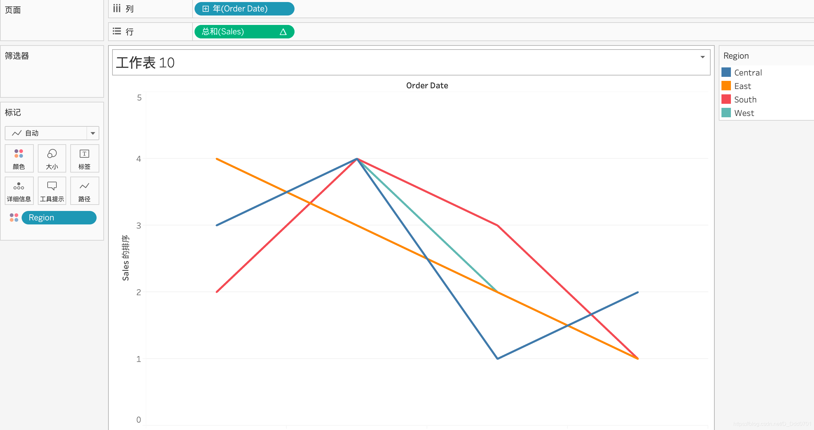

Sales按照排序，4个地区用不同颜色区分，然后计算依据以Region为依据：

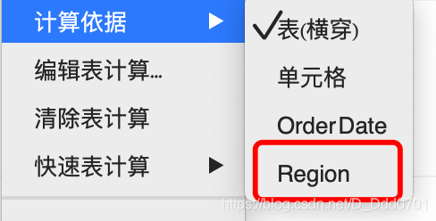
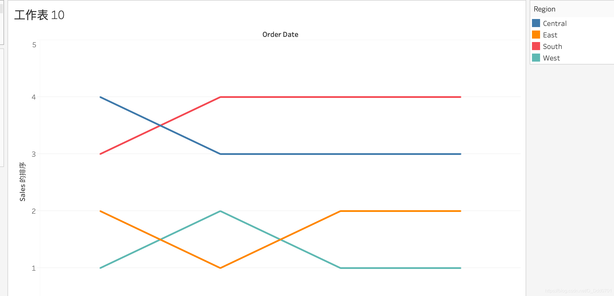

这样就可以绘制出这样一幅图，四个区域在4年内他们的排名情况。

此时，我们用双轴再叠加一个图形上去，行中拖入一个新的Sales，按照相同的处理方式处理，但是在图形上选择圆形：

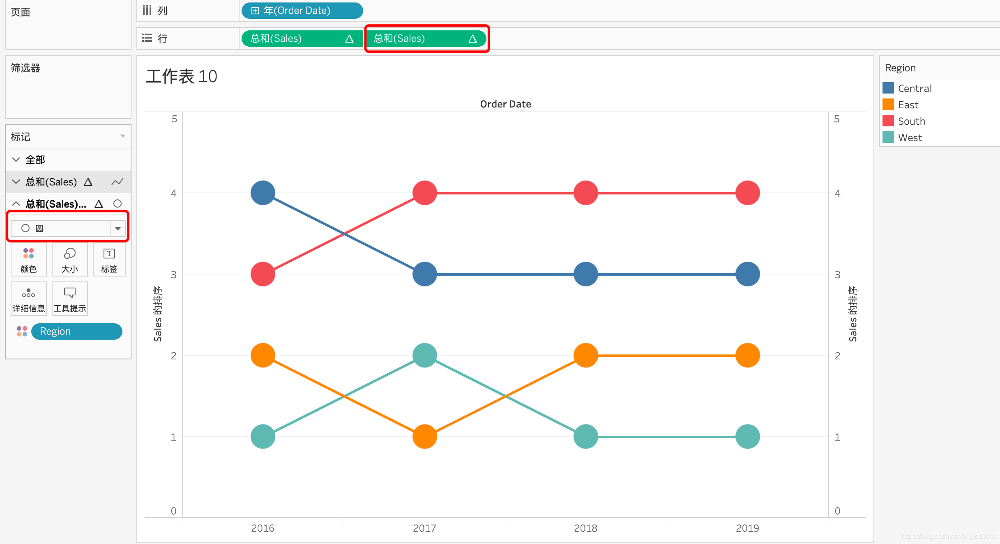

在这张图上，还可以按住command/ctrl，把Sales拖入标签，在图上显示具体的排序:

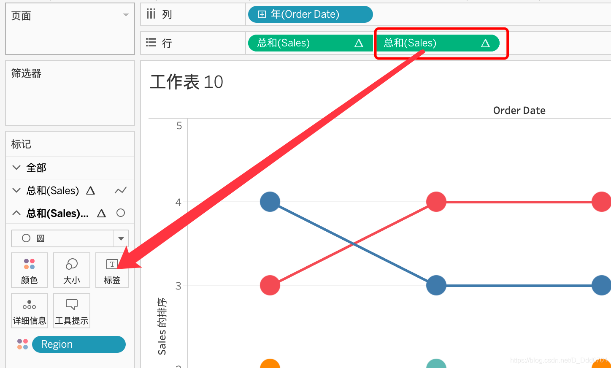

再调整显示的格式为居中：

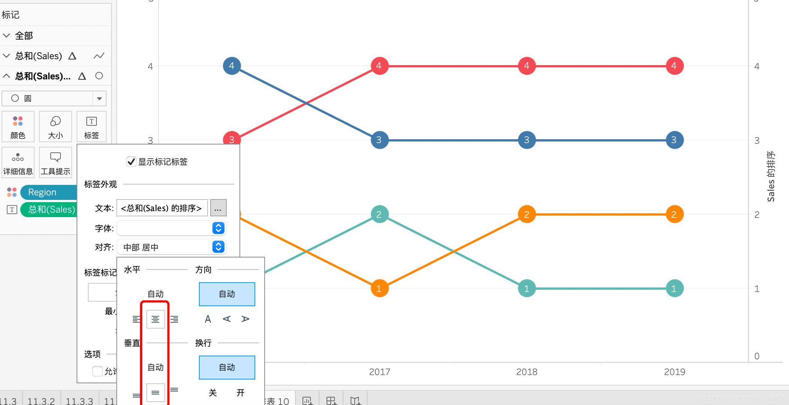

此时，每个区域在每一年的排名情况清晰可见。

还可以按照月份展开：

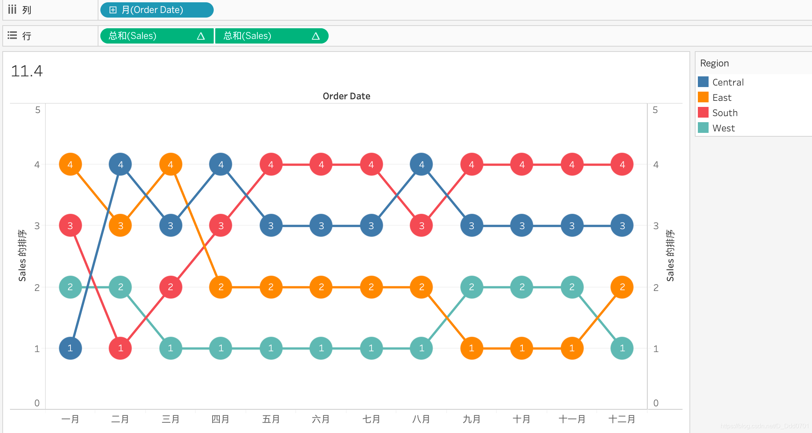

可以看到这里的南方地区高开低走，西部地区一直名列前茅。
## 100%的柱状图对比
先绘制这样一副最基本的图表：

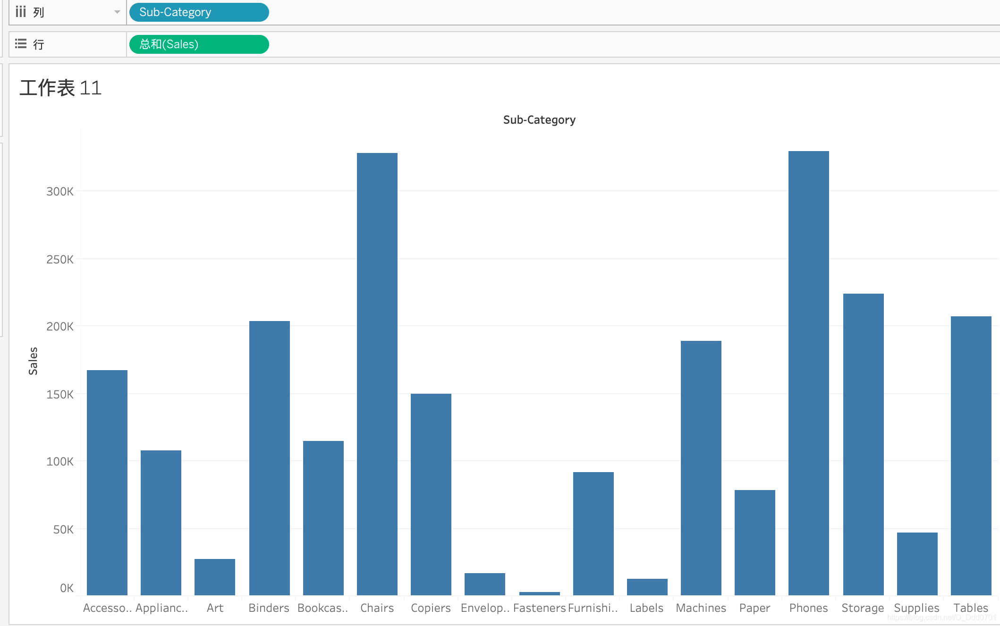

接着以单元格自己为依据，快速表计算设置为百分比，此时每一个柱状图都应该是100%，因为自己占自己的100%。

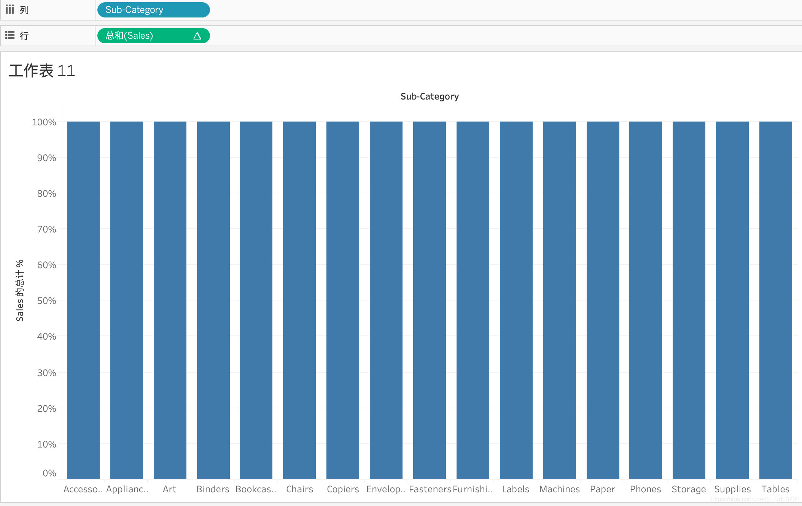

然后把Region拖入颜色，就可以看到同一产品在不同地区的销售情况：

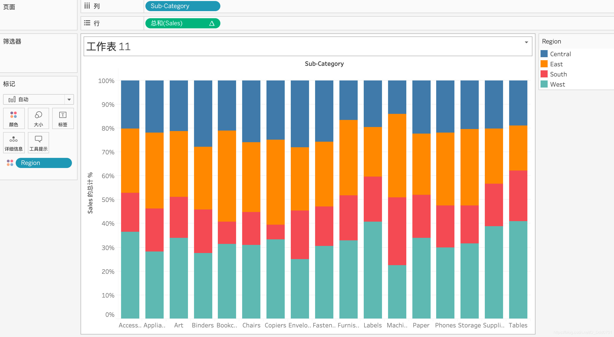

为了更直观显示，可以参考上文，按住command/ctrl把总和拖入标签中，如果看南方地区的话：

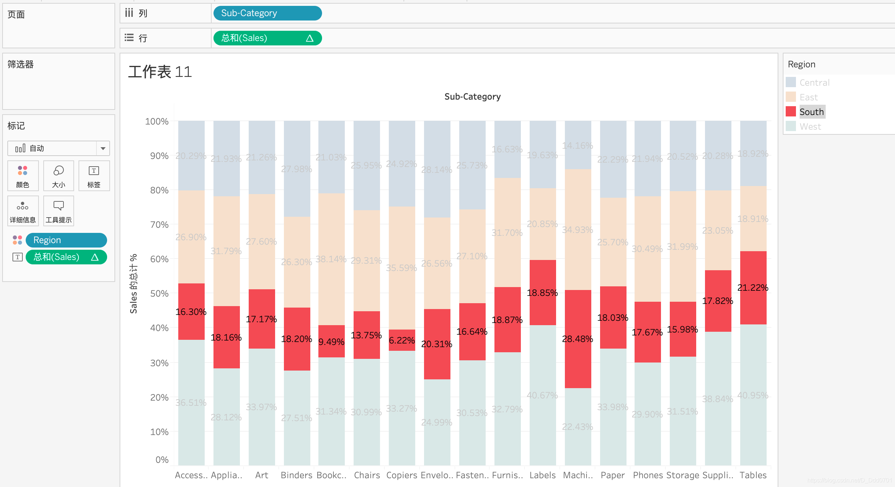

实际南方地区每一次销售的占比都不太理想，所以他在之前图显示高开低走的结果并不意外。