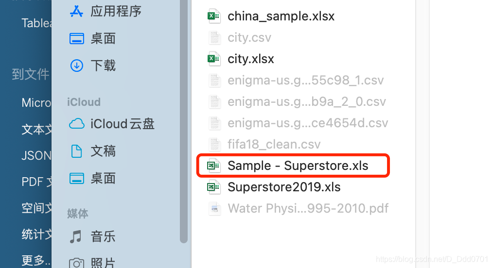
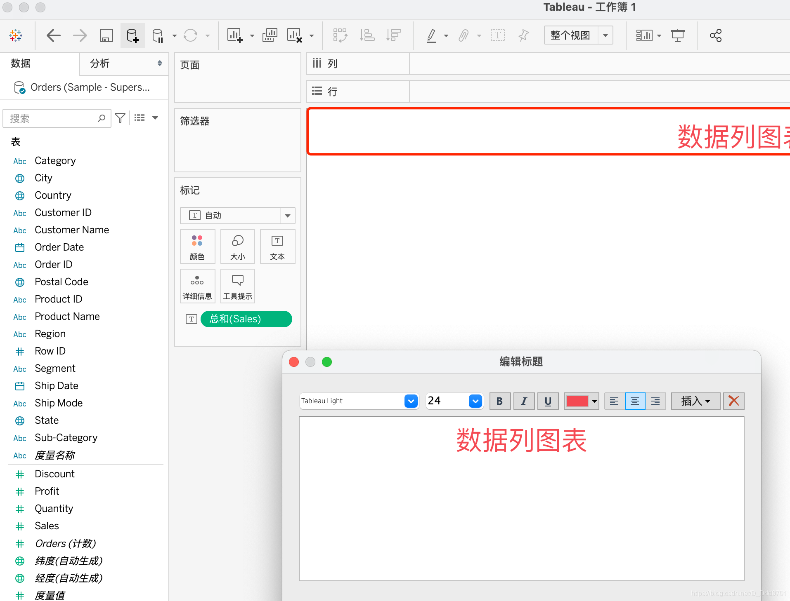
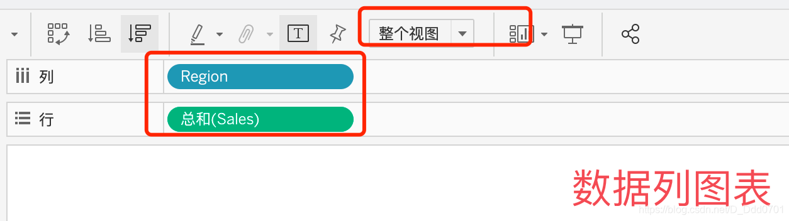
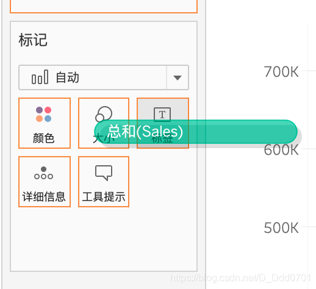
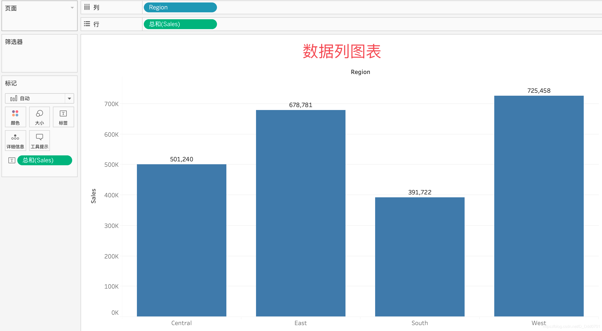
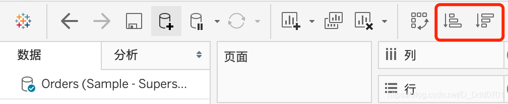

所有的数据都采用`Sample - Superstore.xls`文件的数据

导入数据之后可以双击画布区域上方边框，修改标题名称及格式。

我们期望绘制一个不同地区销售额的柱状图，所以x轴信息（列信息）应该是不同地区，y轴信息（行信息）是销售额。所以，将维度的Region拖移到列上，将度量的Sales拖移到行中，为了让图布满整个画布，选择整个视图：

我们还期望可以在柱状图上显示出具体的销售额，对此，我们需要把Sales拖移到标签处：

我们还可以通过上方的排序按钮对柱状图数据升序/降序排列。

