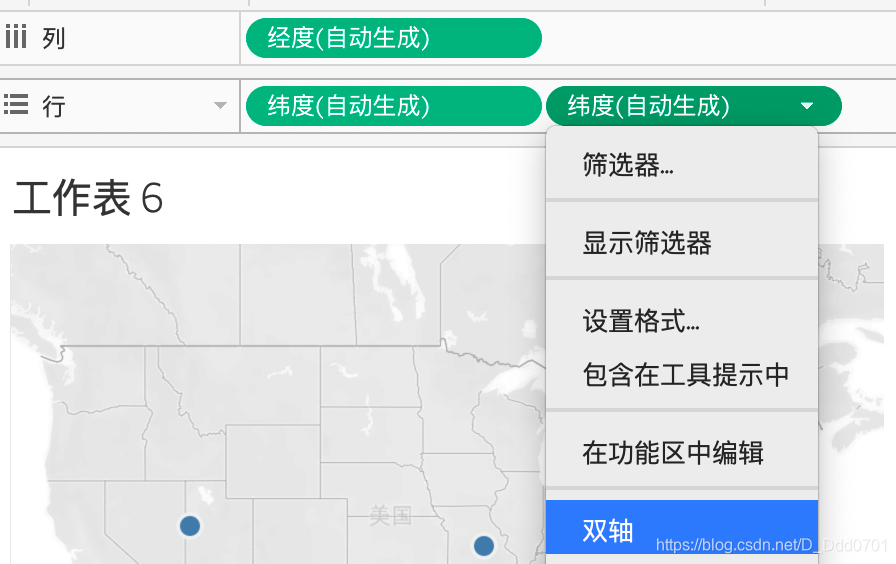

在Tableau中也有可以筛选的语句：

## 创建一个全部字母大写的计算字段

把创建名为Upper的计算字段放入行中，此时所有的Sub-Category字母被大写显示：

## 时间的计算字段

时间的计算字段Tableau已经默认创建完成，点击加号即可把时间细分：

也可以右键在更多中选择自定义：

## 度量值的计算字段

度量值通常也不需要创建计算字段，因为常用的均值、标准差等都已默认设置完成：

例如创建一个名为avg of sale的平均数计算字段：

在总和中我们也可以选择平均值：

数据完全一致。
## 判断条件字段
我们创建一个名为status of profit的条件字段筛选利润大于0品类的：

该字段为布尔型。

接下来创建一个前文的棒棒糖图：

接着把条件字段拖到形状中，选择自定图形，用绿色向上箭头表示利润为正，红色向下箭头表示利润为负：

这样棒棒糖图在判断字段的辅助下有了更丰富的展示。

除此之外，我们可以通过判断字段对二维图表进行更丰富对展示：

把判断字段拖入颜色，即可在二维表格中用不同颜色区分盈利和亏损的品类。

下面做更加复杂的案例，以地图为例：

双击地球标识的数据Country和State：

把判断字段拖入颜色：

这样亏损的州和盈利的周就可以以不同颜色区分开来。

其实还可以增加更多元素：

首先把维度拖入行，双轴显示。这样两张美国地图就被重叠在了一起。然后我们用不同颜色区分各个州销售额Sales的大小。

接着我们把判断字段拖入另一个图的形状框中，并且用不同大小展示Profit情况：

这张图就非常清晰的看到有些州的销售额很高但是利润很低，有些州销售额并不拔尖但是利润非常可观。