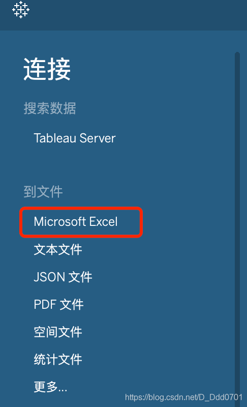
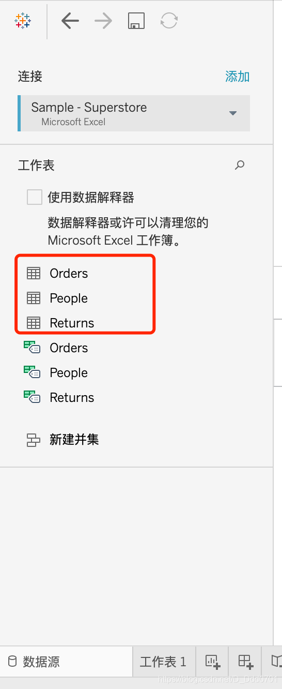
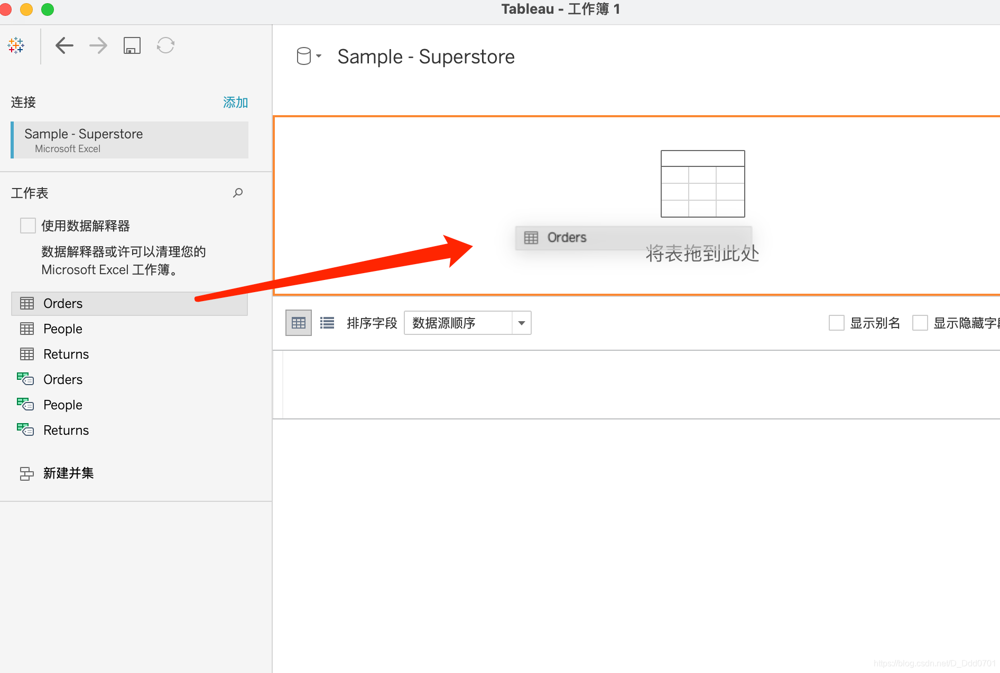
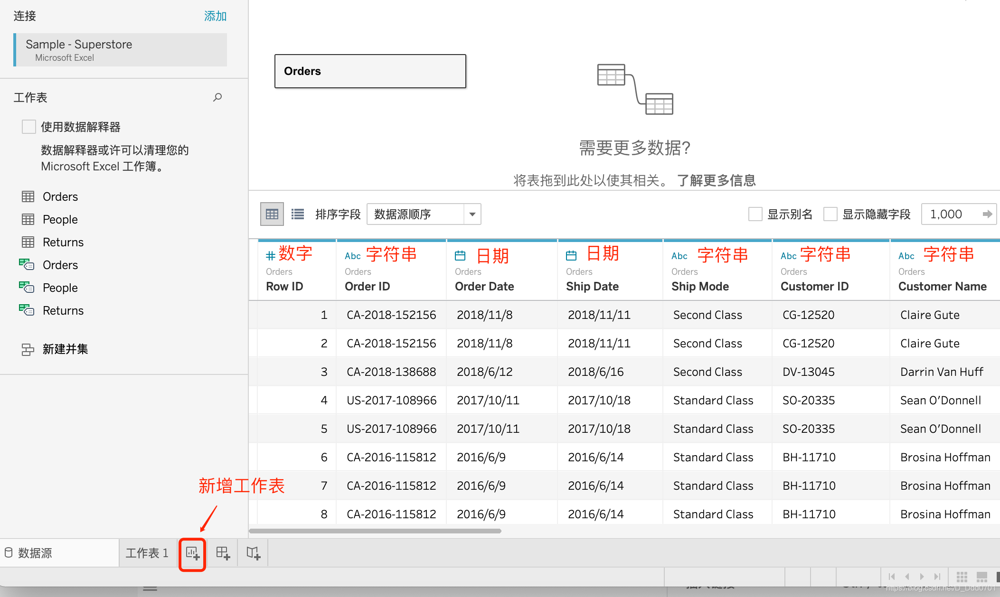
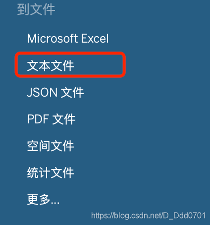
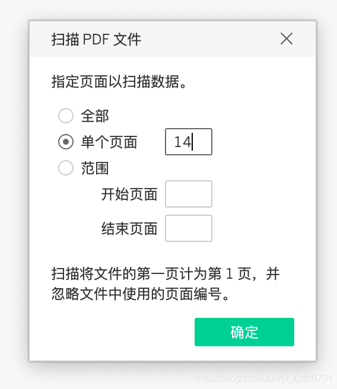
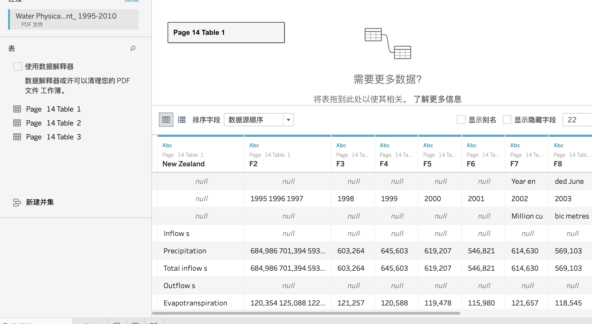
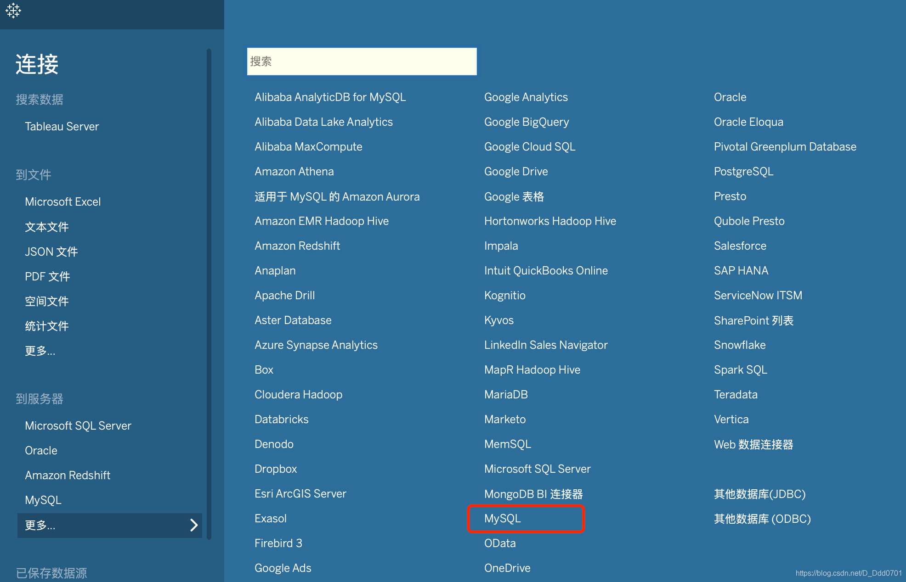

## 连接EXCEL数据源

打开Tableau

插入选中的excel表格

excel中的sheet1，sheet2，sheet3都被显示在了左下角。拖动其中一个到右边区域：

不同的符号代表不同的属性，点击到工作表1，即可对Orders表内的数据进行可视化处理（后面演示）
## 连接CSV数据源

csv文件和excel相同后面操作步骤相同，只是前面需要选择文本文件。

## 连接PDF数据源
有的PDF会有图表，这里面的数据Tableau也可以使用，但是需要注意PDF源文件的图表必须是表格格式导入才行，如果PDF源文件的图表是PNG图片格式，则不可以。

点击PDF后弹出对话框，在对话框输入有表格的那一页PDF即可：

打开的结果如下图：

## 连接MySQL数据源（Desktop功能）

如果是Desktop版，则下方还会有连接到服务器：

以MySQL举例，点击MySQL后，需要根据要求，安装驱动。

[官网操作指引](https://www.tableau.com/zh-cn/support/drivers?edition=pro&lang=zh-cn&platform=mac&cpu=64&version=2020.3&__full-version=20203.20.1110.1623#mysql)，点击官方操作指引，对应自己系统跟着操作指引下载规定的文件安装即可。
