维度的符号是地球logo的就可以绘制地图。
## 符号地图

智能绘制可以直接绘制出符号地图，选中state和country，点击符号地图：

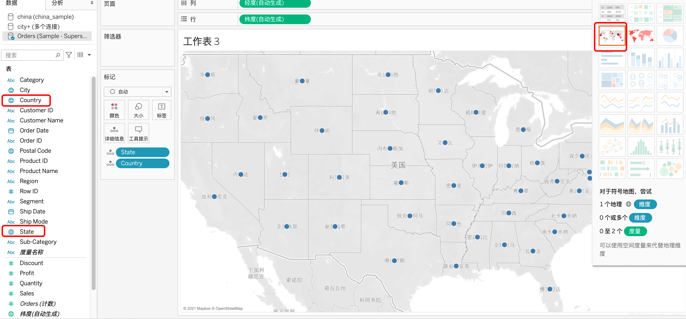

在这张地图的基础上可以利用不同的颜色和大小区分利润和销售额的情况：

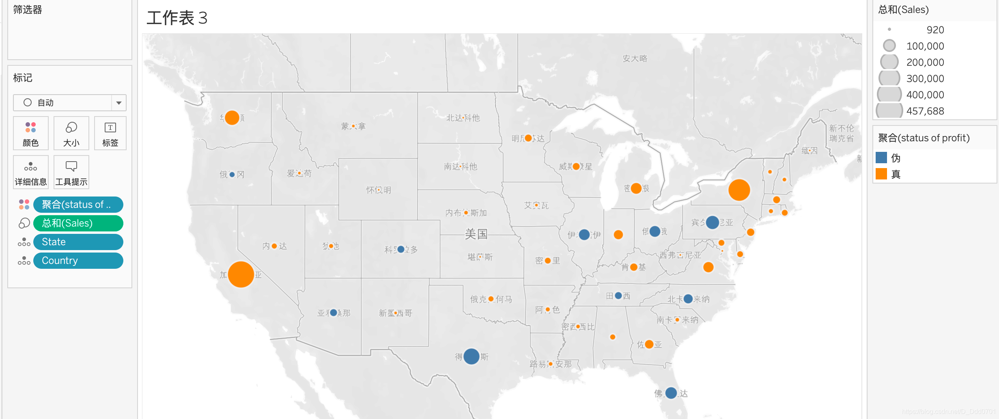

## 地图
符号地图之前demo也有所涉及，所以不再过多的举例。地图是新的重点。
### 美国地图

因为案例所用的数据是美国的营销收据，所以先用该demo中的数据绘制地图。同样的，地图也在智能绘制中可以直接绘制：

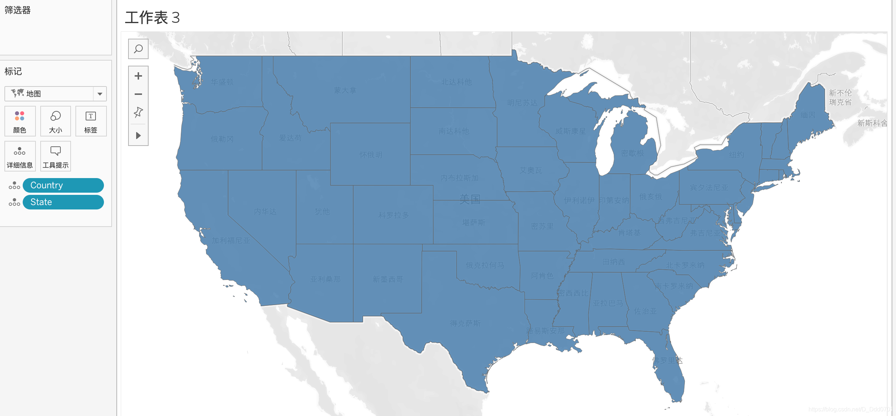

通过颜色的区分，可以判断不同州之间销售的情况：

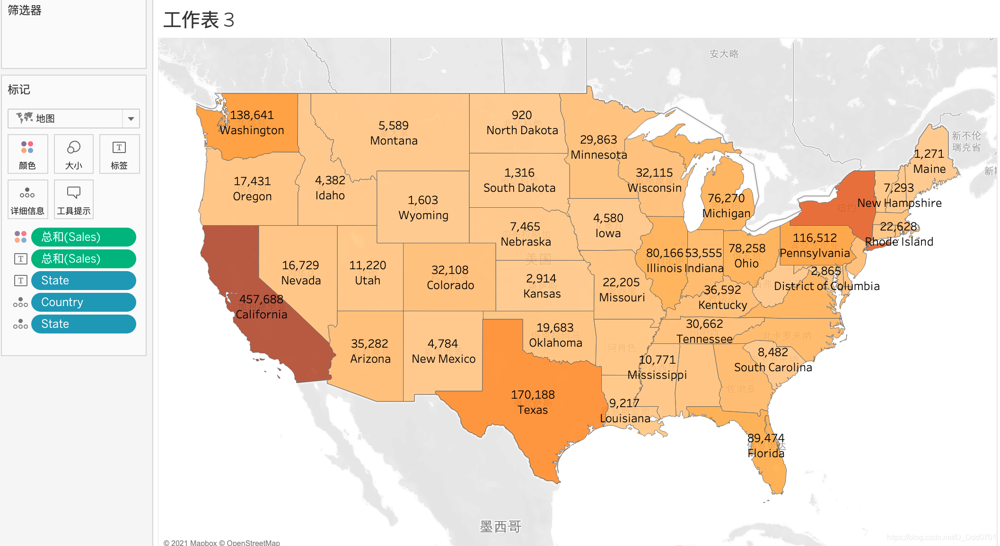

也可以判断各个州之间利润的情况：

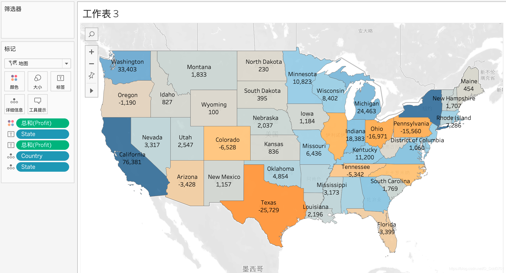

这种地图用颜色取代了符号地图中的点，并且可以显示出具体的数字。

### 中国地图
之前的demo他把不同州的地理信息都载入在里面，如果是中国的地图，则需要自己调整维度的属性。这里引入一份中国地图的数据：

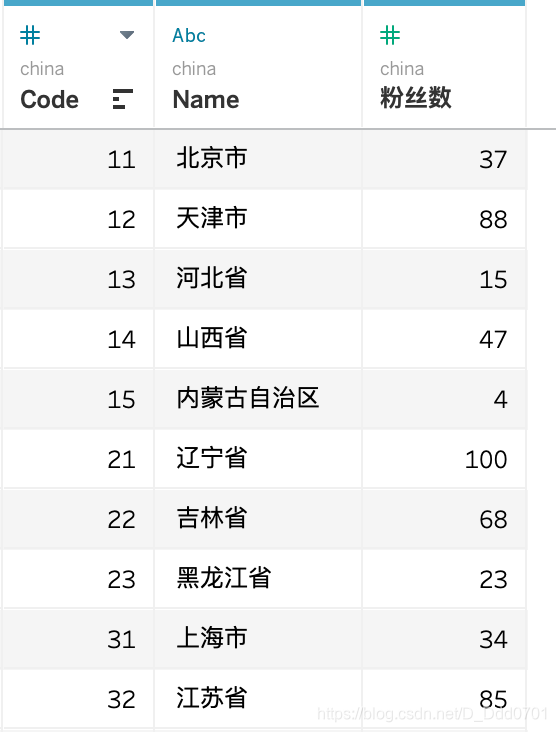

这里的Name字段实际上就是之前案例中的State。此时修改Name的地理角色：

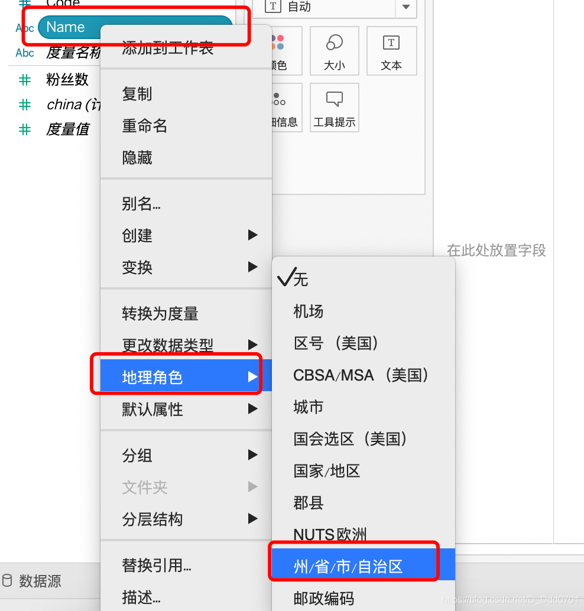

修改完成之后Name从ABC字符串的格式变成了地球logo的地理信息格式。

也可以把Name拖入筛选器筛选指定的省份数据：

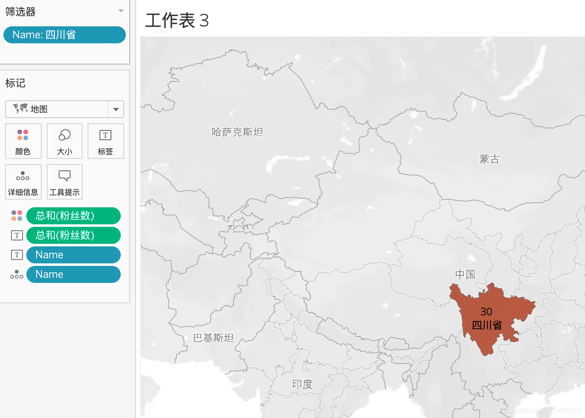

但是这份数据只能看到省份，不能看到下面的市。所以我们这里需要使用到结连数据：

这里准备了一份市的数据：

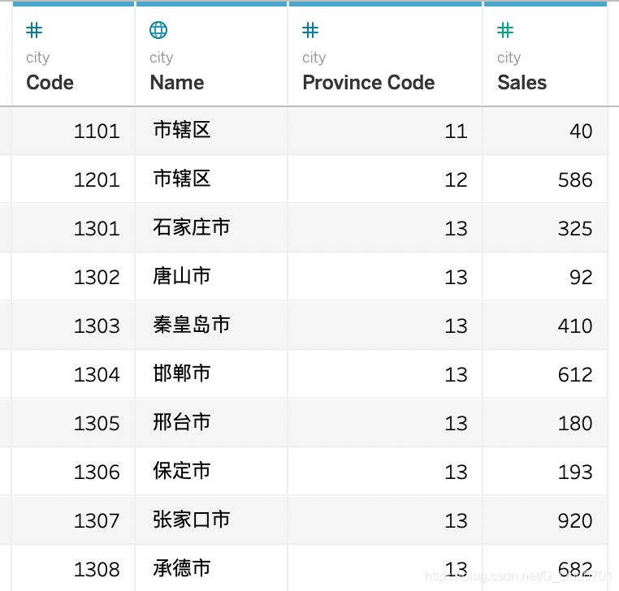

这里的Province Code对应刚省份的Code编码。

载入市数据后，再载入省的数据：

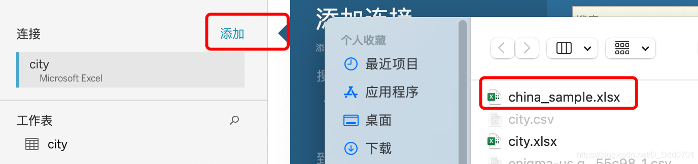

再创建结连关系：

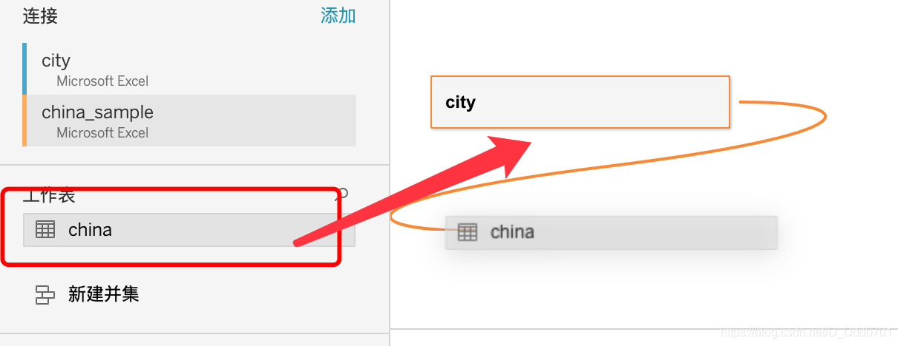
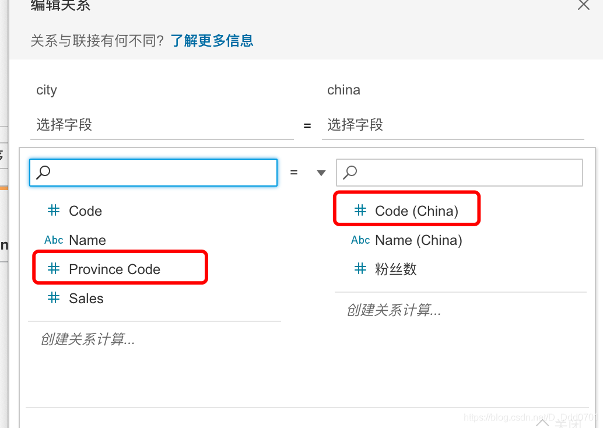

进入画图界面之后可以看到数据源有一个结连数据源：

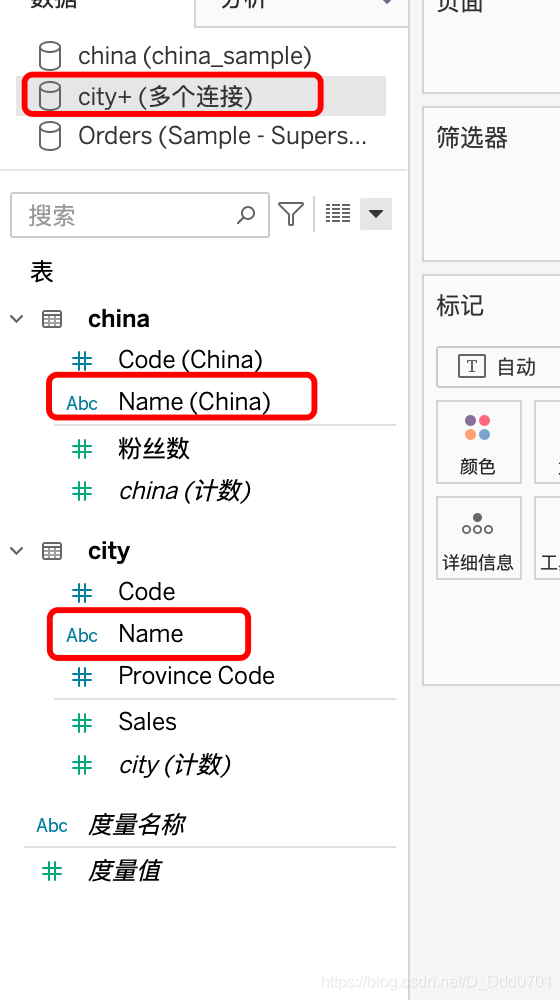

把Name改成地图信息，国家的Name改为州，city的Name改为郡县。利用筛选器选择到四川省：

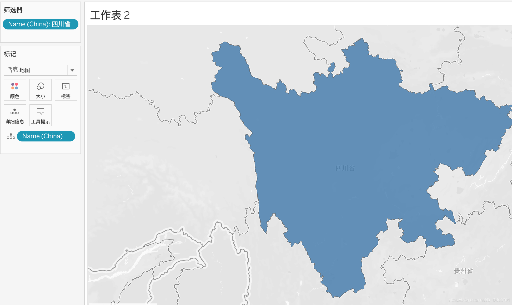

把城市拖入详细信息：

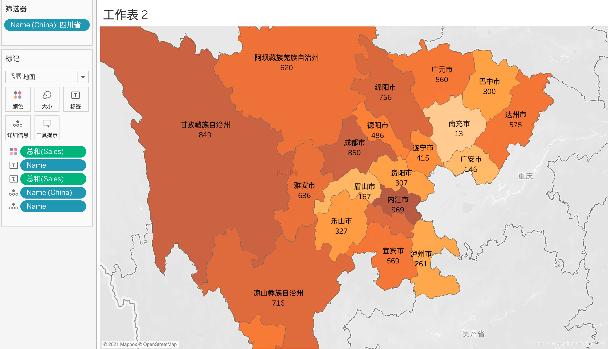
这样，一个拥有市的地图就绘制完成。

也可以用筛选器多选一些来看：

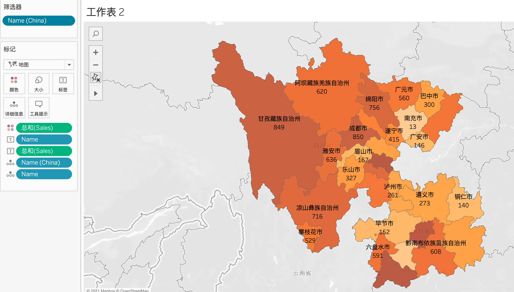

若需要更多的行政区域需要去下载边界信息。