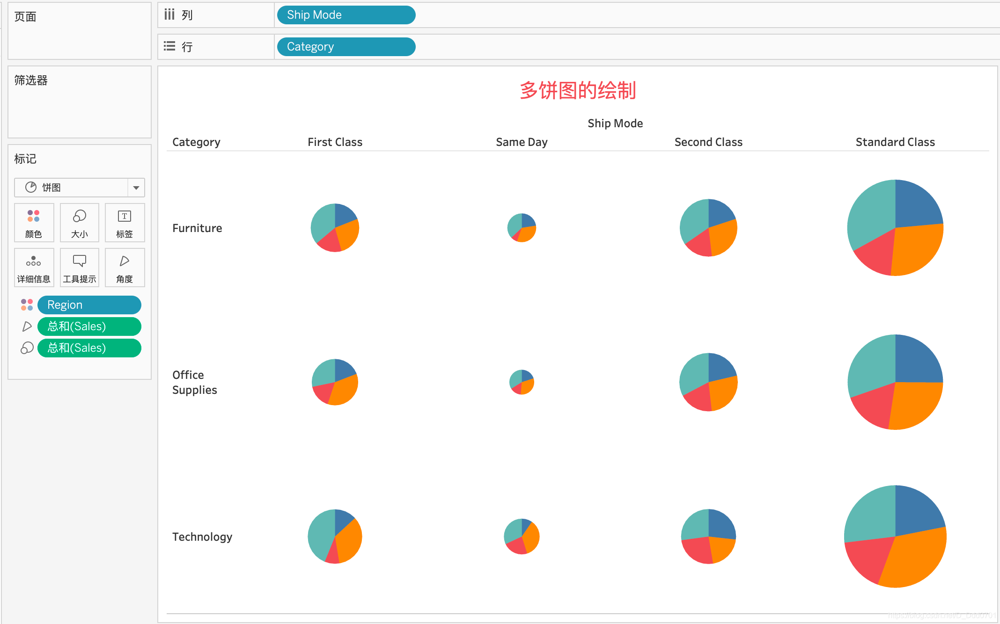
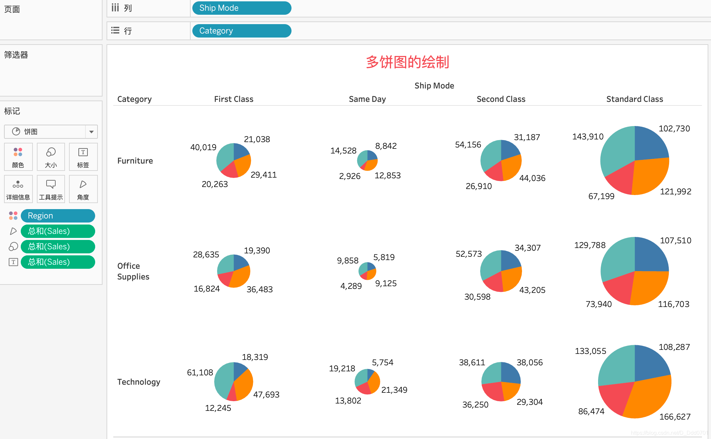
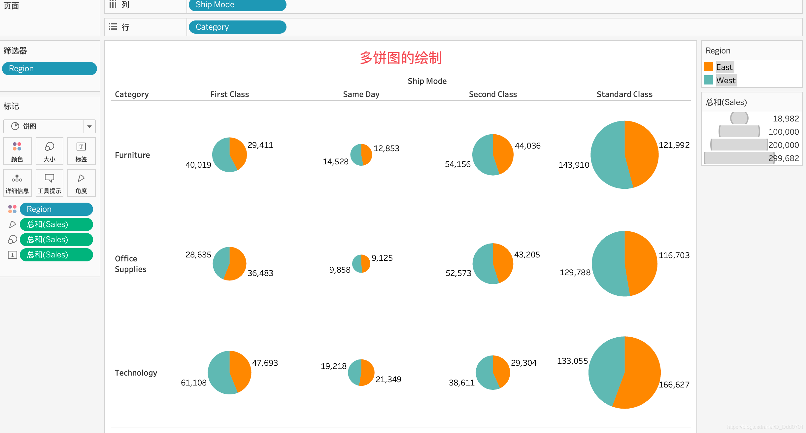

多饼图的绘制是Tableau一个强大的功能。

在饼图的绘制中，我们一直没有在上面的行和列区域放词条，这里我们来实验一下，把Ship Mode列放上去：

可以发现，原先的一个饼图按照不同的Ship Mode被分成了4个，并且每个饼图的大小不一样，饼图大的代表总数占比最多，4个Ship Mode方式中Standard Class是最受欢迎的。并且每个方式中各品类的占比仍然不同。

我们再把Category放在列中看看：

这个图更加清晰的把最开始的一个饼图分成了12个饼图，不同目录的物品他们在各个Ship Mode中的情况清晰可见，还可以增加具体的数字——把Sales拖入标签：

当然，我们也可以点击摘要中的类别，例如选择East和West两个部分来分析：

这两者的差异对比在这样展示的情况下更加直观。