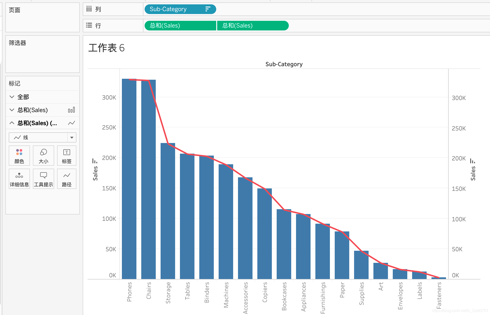
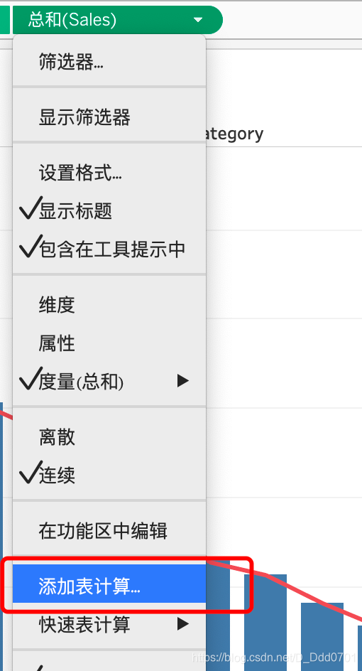
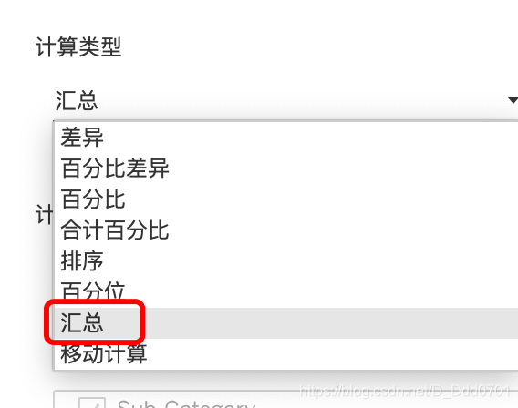
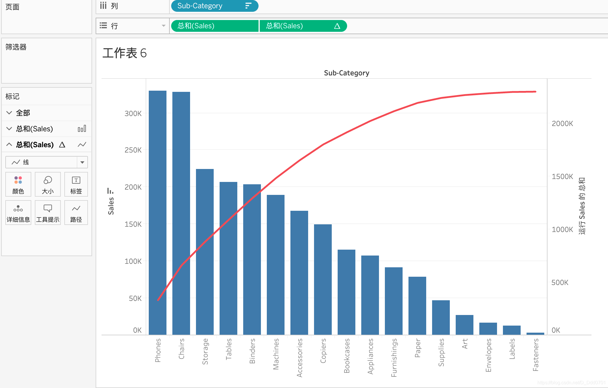
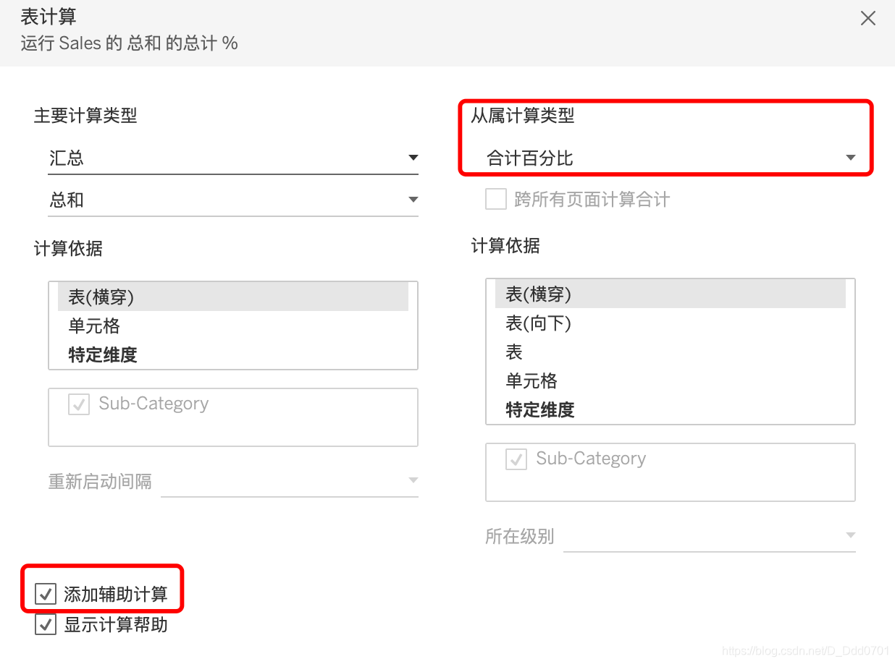
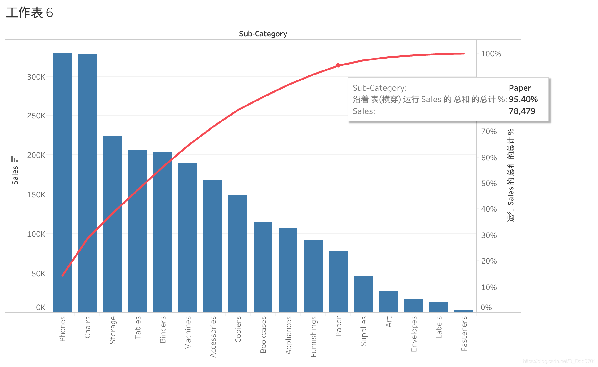
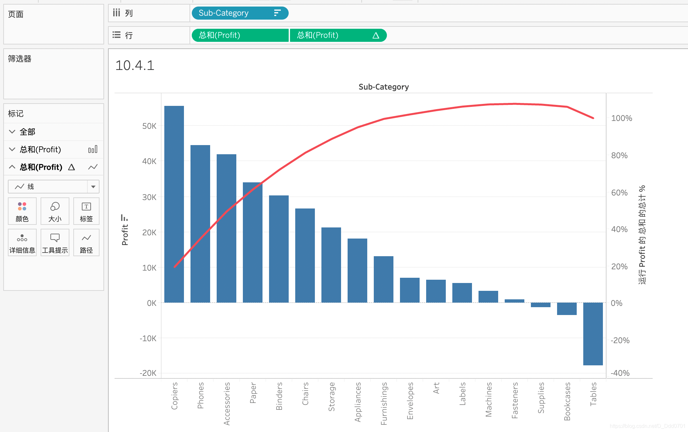

前文在复合图形中有柱状折线图，但是这里的折线只是反应了当前的数据情况，能不能用累加的方法展示呢？例如在B的数值上加上A的数值，在C的数值上加上A和B的数值。

首先在列中拖入两个Sales，双轴显示，一个选择柱状图，一个选择线。

这样只是用折线反应了柱状图的情况。对折线的总和Sales添加表计算：

选择汇总：

可以看到最后几个商品实际上对总销售额贡献微乎其微。如果对2000k这种数据不敏感，可以添加辅助计算，选择用累计百分比的方式展示：

可以看到最后几个产品实际贡献只有不到5个点。

我们用利润同样来绘制这样一幅图：

可以看到，实际上最后几个产品使得总体利润降低了约10个百分点。这会为以后的商业决策提供数据支持。
