## 棒棒糖图

在行中拖入两个Sales，可以绘制下图所示的图表：

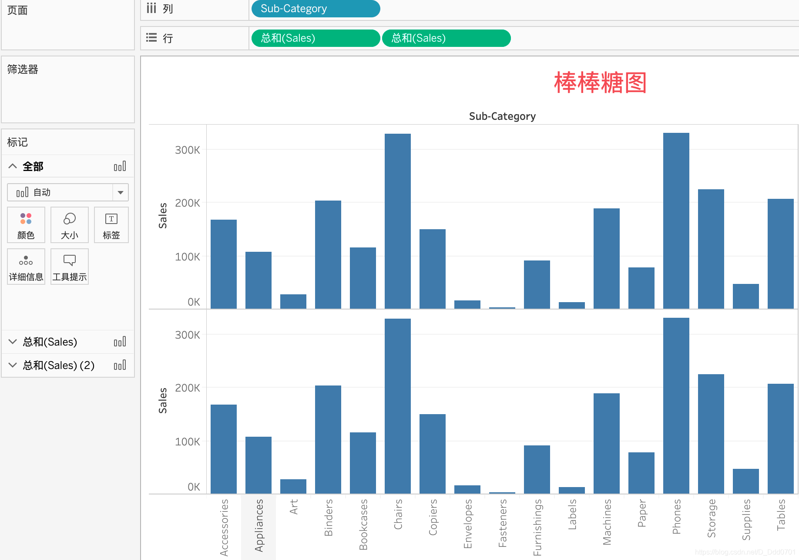

根据前面的内容，选择双轴显示，可以把两个图表合并为一个，合并之后，对Sales选择成条形图：

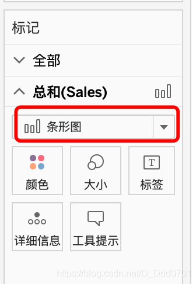

改变大小、排序之后，可以绘制得到棒棒糖图：

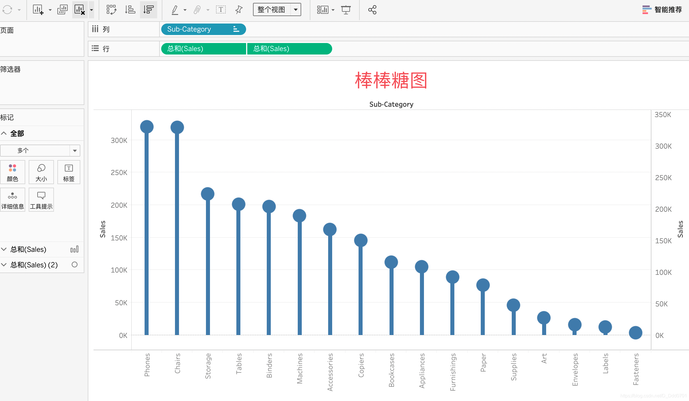

棒棒糖图只是一种图形，实际上可以创造更多奇妙的图：

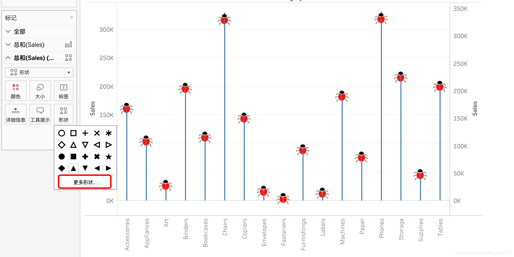

在这里选择更多图形可以把棒棒糖的圆改为其他奇奇怪怪的形状。

## 柱状折线图

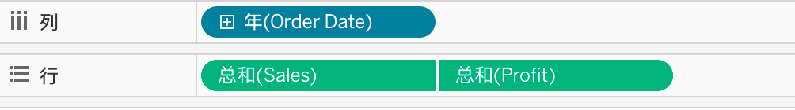

双轴显示，点击年右边的三角，选择为连续的月:

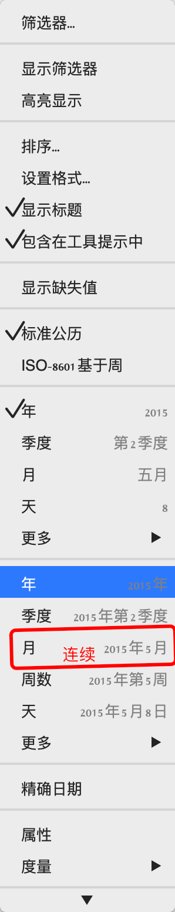

把总和的图形改为条形图：

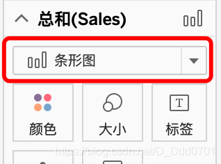
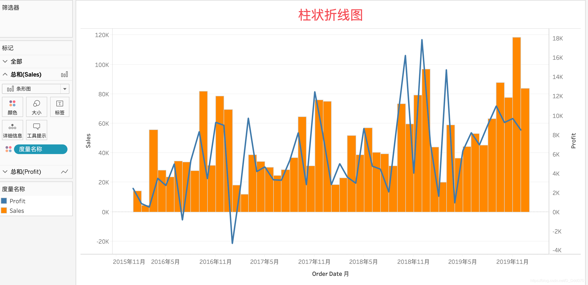

折线图和柱状图的覆盖顺序由行中Sales和Profit顺序决定：

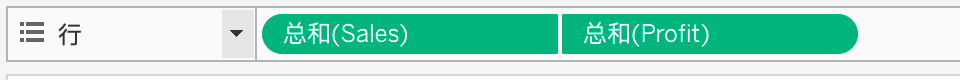

Profit覆盖Sales。
## 柱状点图

绘制的方式类似，这里直接放成品图：

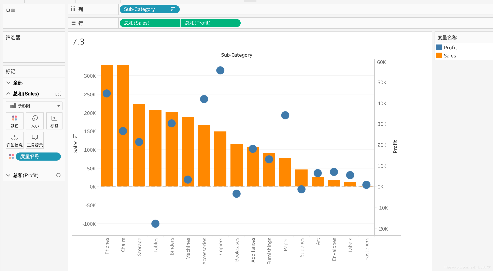

这个图的优点在于排序之后可以非常清晰看到Tables的销售额很高但是利润实际亏很多，Copiers销售额不多但是利润极大。对利润排序之后：

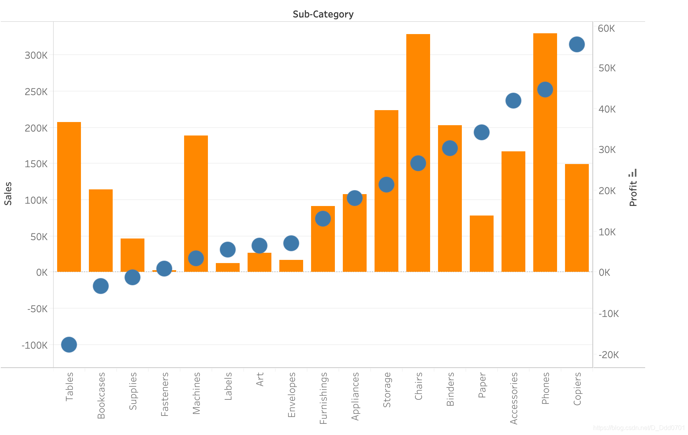

前面三个都是属于卖的多亏的多的产品，那么在下一次进货和销售的决策中，这几类产品是否应该被剔除？这类图可以提供更多的商业思路。

## 复合柱状图

绘制方式类似，选择条形图后改变大小，成品如下图：

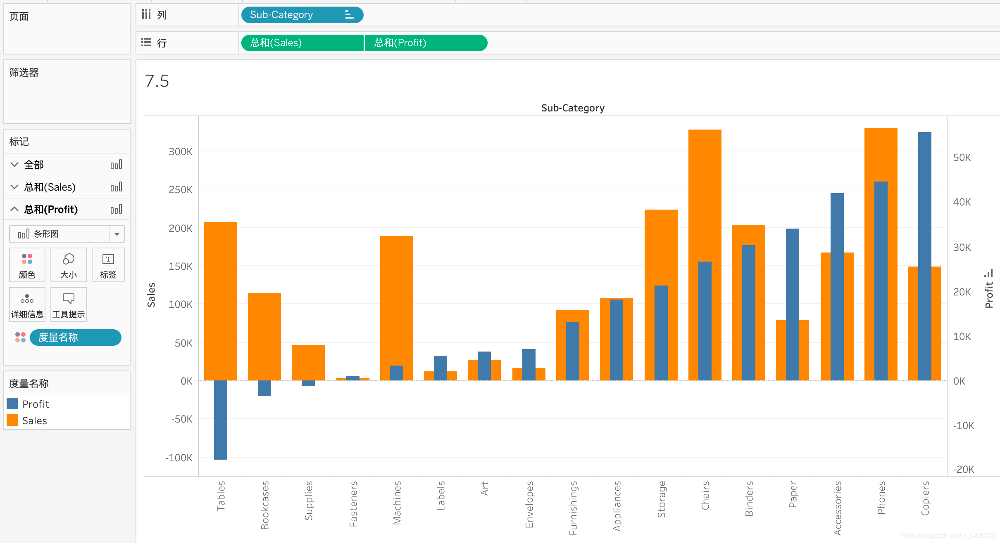

通过排序后该图也可以分析出不同产品利润和销售额之间的关系，对未来销售的产品品类选择提供决策依据。