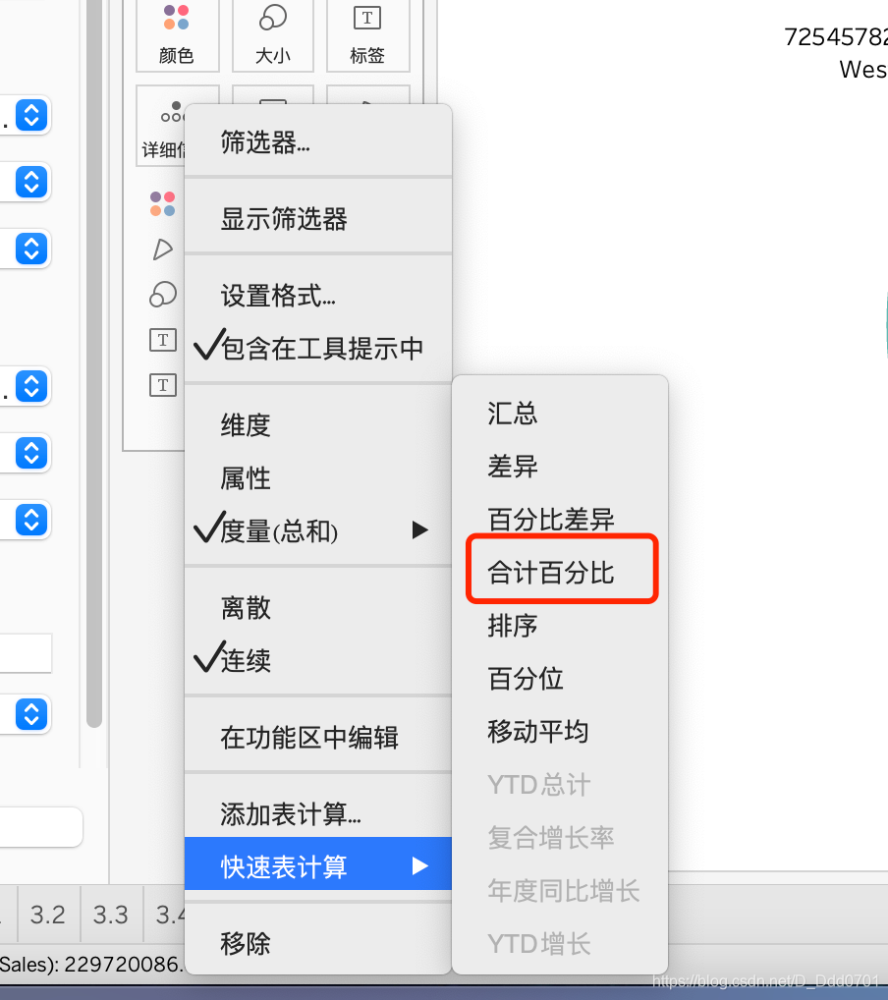

绘制饼图会使用一个非常高效的绘制办法——智能绘制。

点开智能推荐，找到饼图，会发现提示需要多个维度/度量。

按住command/ctrl，同时选中Region和Sales：

这样就可以使用智能绘图绘制饼图。

我们会发现，这里的饼图非常的小，所以我们可以使用布局，从标准改为整个视图。

如果还是觉得偏小，那么可以点击工具栏的大小，手动更改：

此外，如果每一个区域我们要和右侧的摘要对比颜色来判断具体内容是什么，就会显得过于麻烦，此外，我们也期望可以在饼图上显示每一个区域的大小是多少。

我们只需要把Sales和Region拖入到标签即可显示：

但是对比数字还是没有百分比更加直观，所以需要修改数字格式变成百分比显示，右键点击工具栏中的Sale标签：

选择合计百分比即可显示出百分比数量。

如果想要调整小数点位数，则需要右键点击数字，设置格式：

在字段中选到Sales列：

在数字栏改为百分比，并且可以自己设置小数点位数。

