在智能绘制内有折线图：

点到上面会发现他区分了连续数据和离散数据。这一节内容就围绕这两个点展开。

## 连续折线图

绘制折线图的时候，他提示需要一个日期格式，至少一个度量。所以选择Order Date和Sales绘制。按住command/ctrl选中点击智能绘制即可：

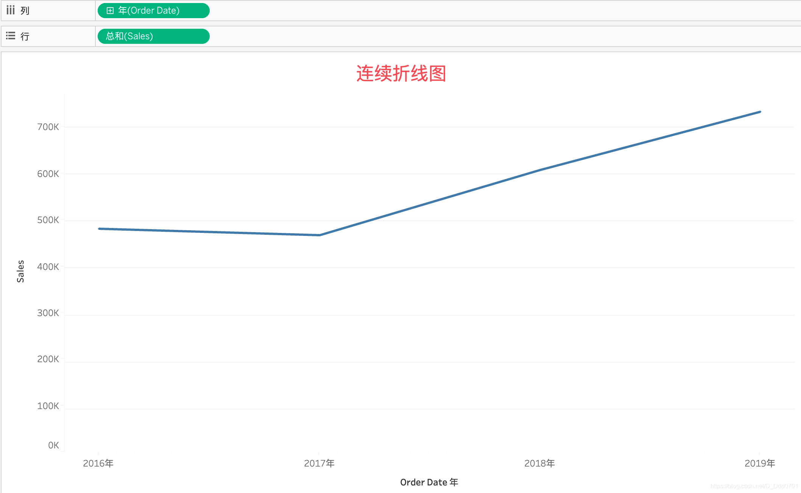

可以看到这里的数据不够丰富，所以增加一个Region颜色：

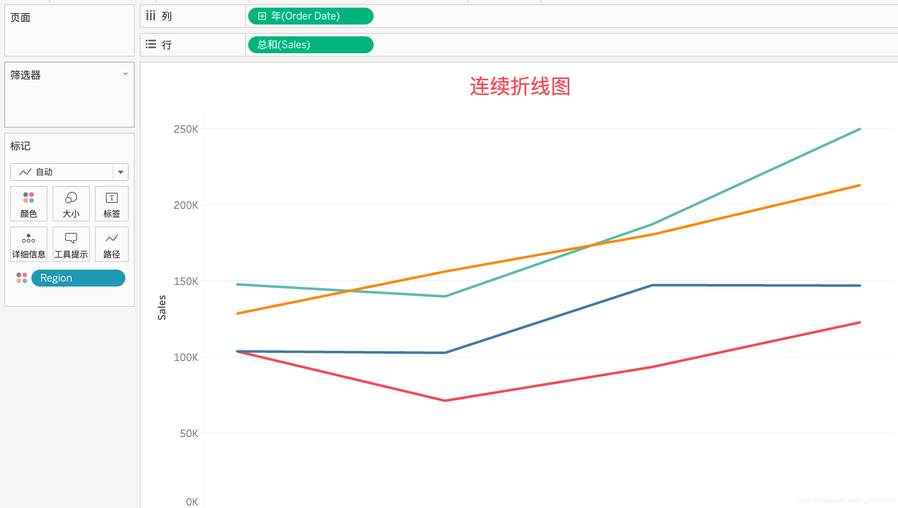

如何要对Sales和Profit进行对比，绘制在同一个折线图上，则只需要把Profit拉到行中：

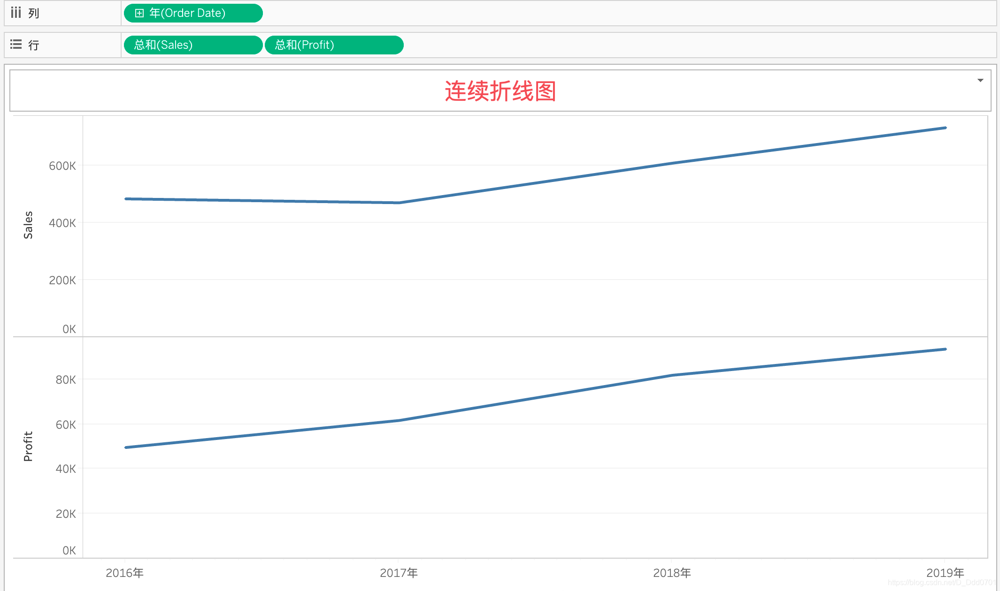

这里其实是上下两个图来展示，我们希望在一个图内展示，此时需要把Profit拉到y轴位置：

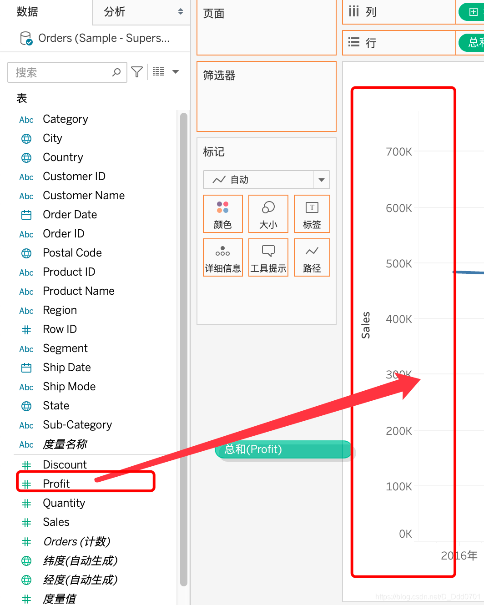
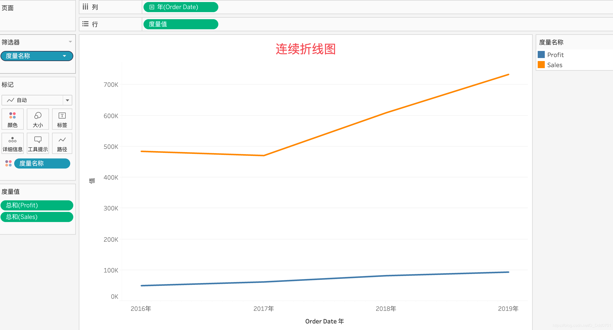

但是这张图存在一个明显问题，Profit和Sales相比太小了，不够明显，此时可以用双轴折线图——把Profit拉到右边区域：

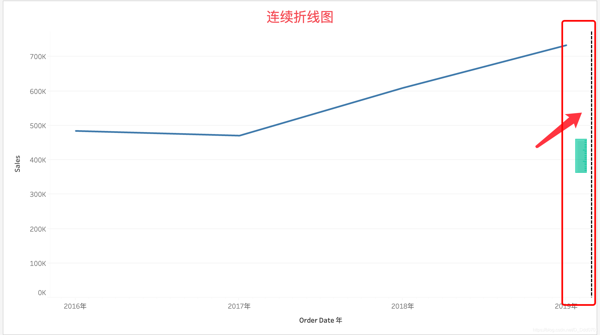
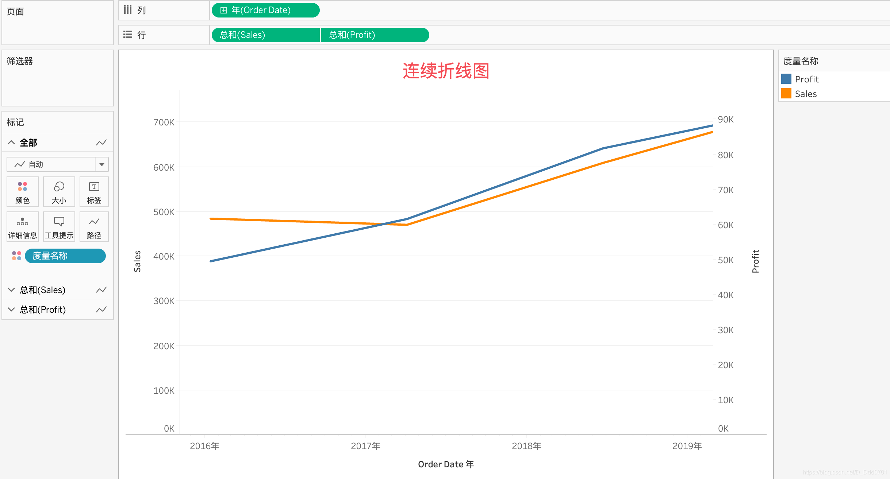

此时两个数据的相对变化会更加清晰。

如果加入Quantity：

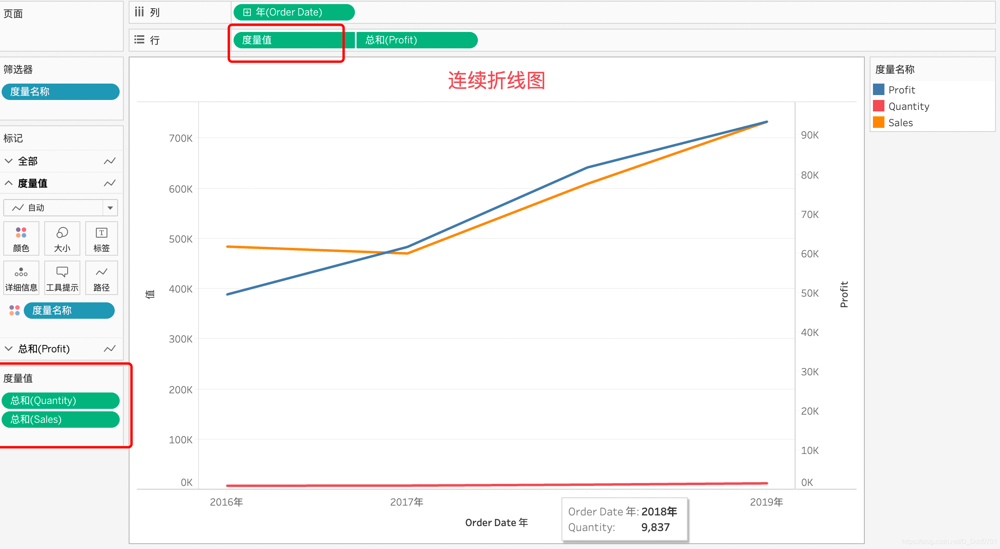

此时两个以上的度量值被打包，形成一个集合单元。
## 离散折线图
同样的方式，智能绘图绘制：

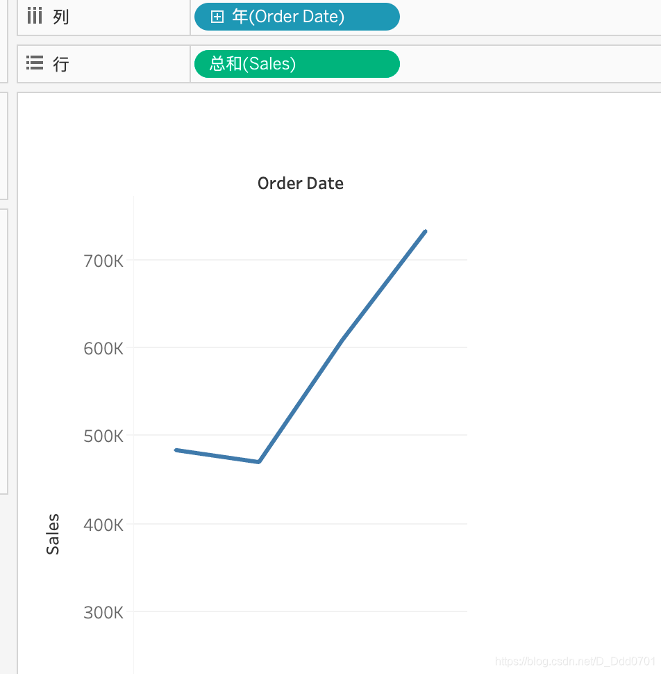

乍一看好像和之前并没有区别。但是细心的看他的年标签已经从绿色变成了蓝色。

点击年旁边的加号，会出现一个季度：

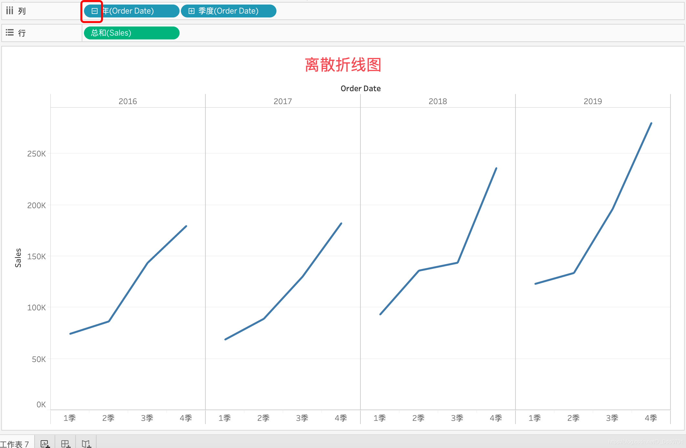

此时离散的多折线图就绘制完成了。这张图对比连续的折线图，可以更加清晰看到每一年四季度的变化趋势。

加入Region颜色，就可以对每个区域的季度变化有更清晰的展示：

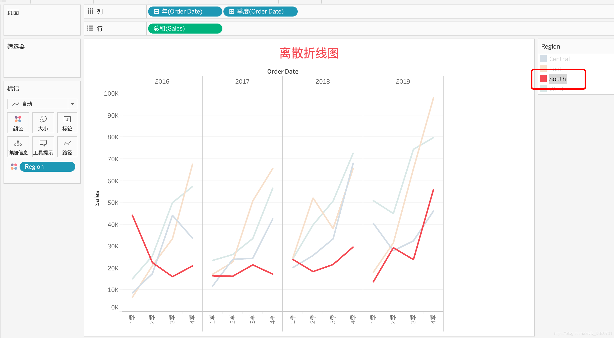
## 离散和连续的具体差别
离散（显示蓝色）即每个点是非黑即白的——例如他是东部地区就一定是东部地区，不会是西部地区。

连续（显示绿色）即每个点是线性变化的——例如数字12345。

对于某些集合，他可以反应为离散，也可以反应为连续。例如数字12345，大于等于3和小于3的数字都是连续的，但是如果单论大于3和小于3这两个属性，他就是离散的。

接下来举一个又是连续又是离散的案例：

Customer ID是一个一个的离散的ID，但是如果是计数，每个ID出现多少次，这是一个连续的数值：

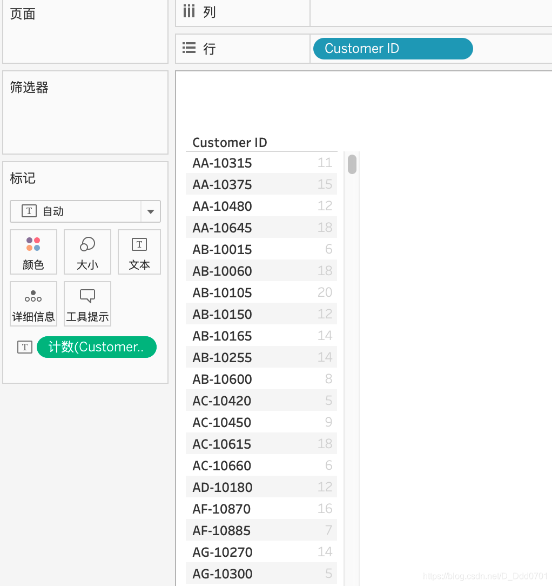

可以用同一个数据绘制出这样的二维图表。