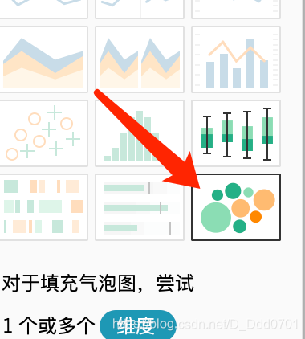
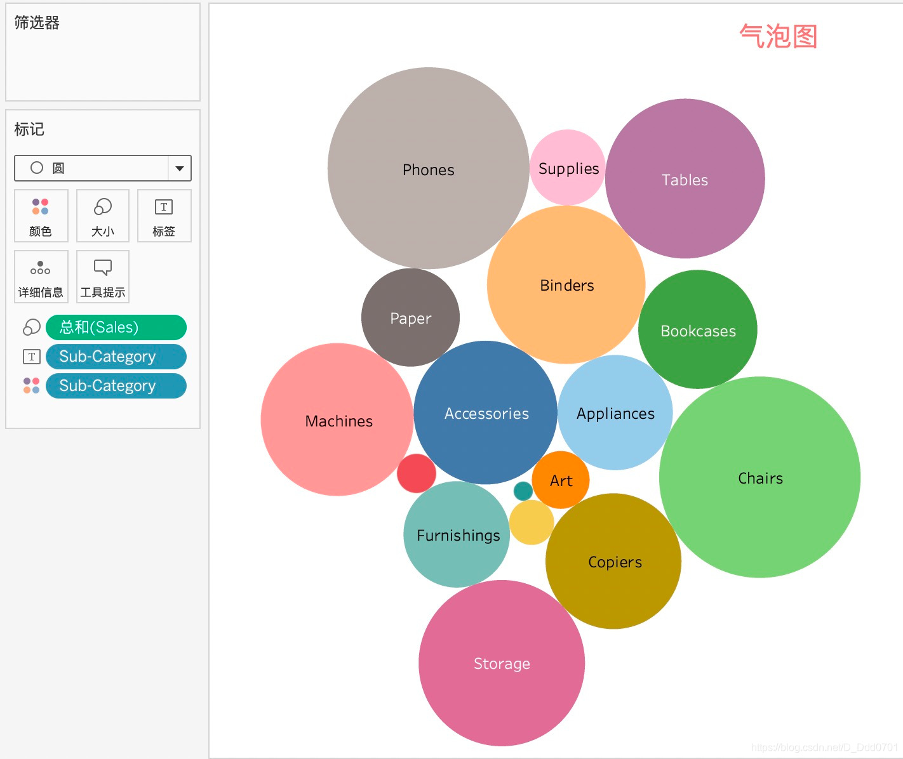
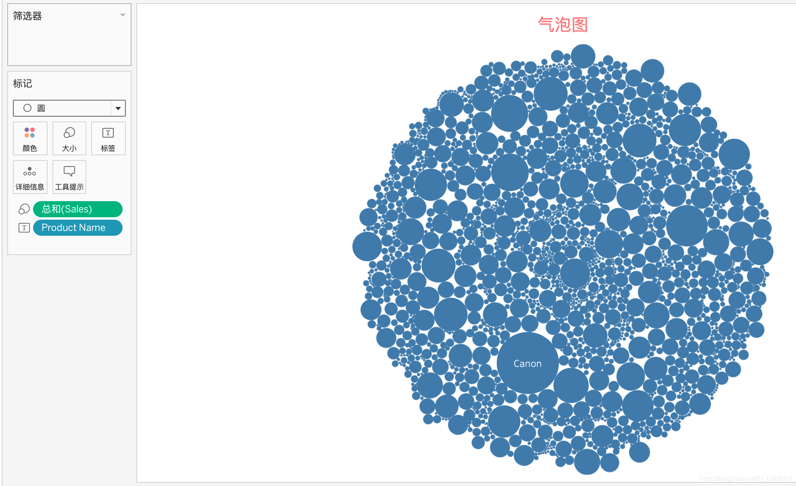
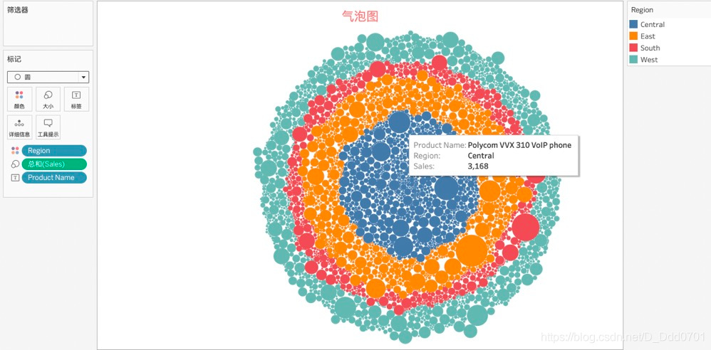

气泡图也是在数图的基础上演变而来的，饼图在数据少于7个的时候会有比较直观的效果，但是数据超过7个，饼图反而会显得比较乱，用数图就会解决这样的问题，然而随着数据量越来越大，数图也会不够用，这个时候就可以使用气泡图。气泡图一样在智能绘图内可以找到。

先以Sales和Sub-Category为例。

这张图上，气泡图和数图给人的感觉类似。如果我们把数据量放大会是如何？接着，以ProductName和Sales为例。

气泡越大，对应的销售额越大。如果还想在这张图上反应出不同地区的销售情况呢？把Region移动到颜色：

Tableau会自动把不同地区归类到一起，并且显示出各个地区的销售情况。对于数据分类大于30个的，选择气泡图会非常形象。