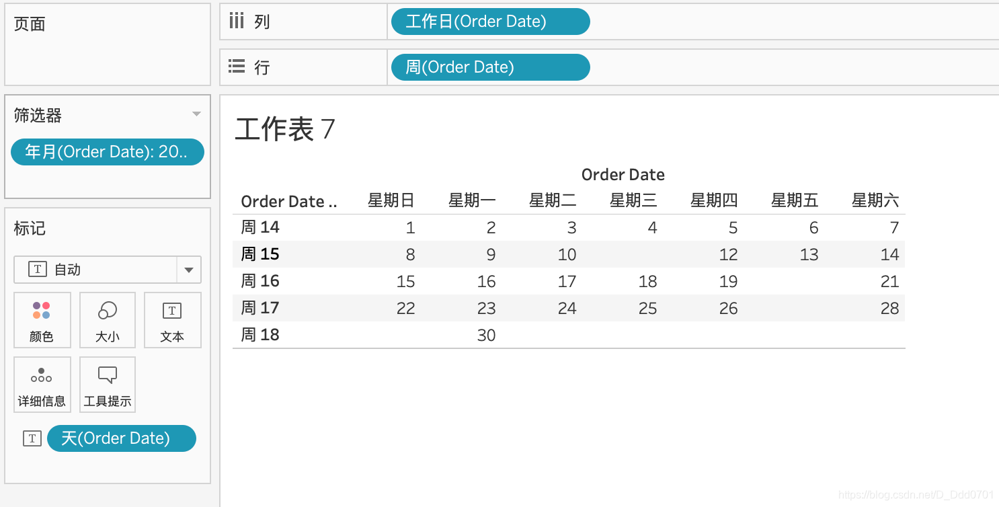
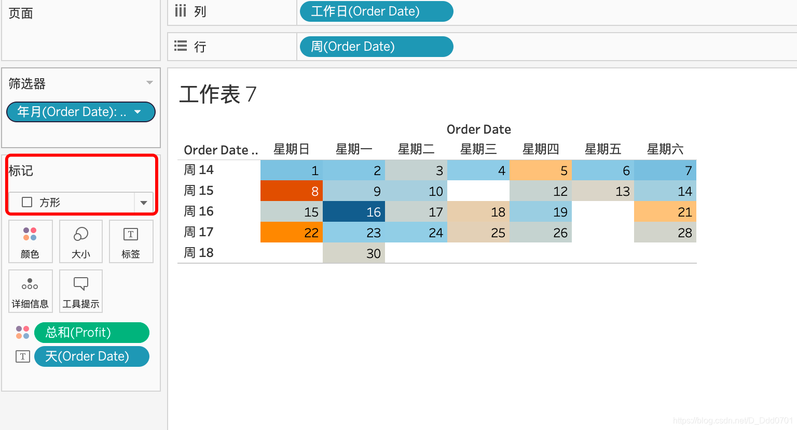
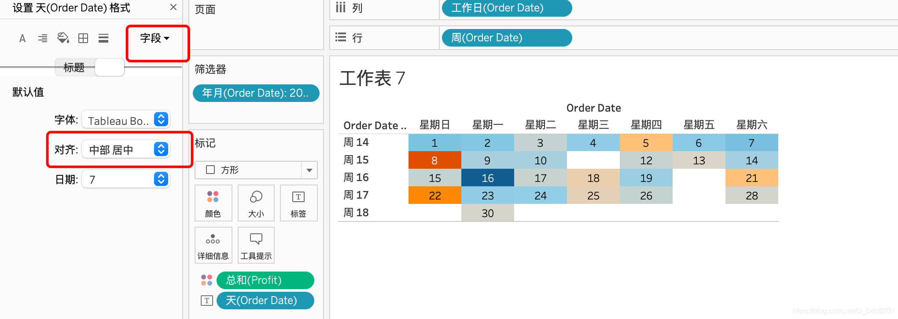
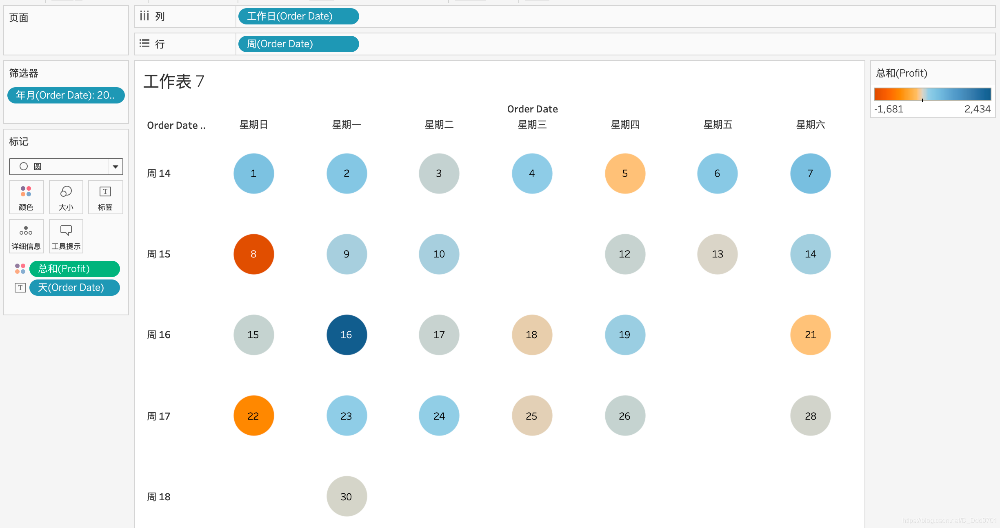

绘制日历图，就要知道日历应该是怎么构成的。

上方应该是周日到周六一周七天，下方应该是日期每个月对应的1-30号。

所以，我们拖入Order Date到列中，自定义显示为工作日。

拖入Order Date到行中，显示周数。

拖入Order Date到筛选器中，筛选方式为年月。

拖入Order Date到本文中，显示天。

这样一个简易的日历就做好了，通过筛选器可以筛选到具体某年某月。

接下来我们可以把利润拖入颜色中，就能看到这个月每一天的利润情况。

还可以对日期的位置进行格式设置，设置为居中——右键点击格式设置，选择到数字对应的「天」，对齐选择为居中。

当然除了方形，我们还可以选择圆形等等自定义图形：

