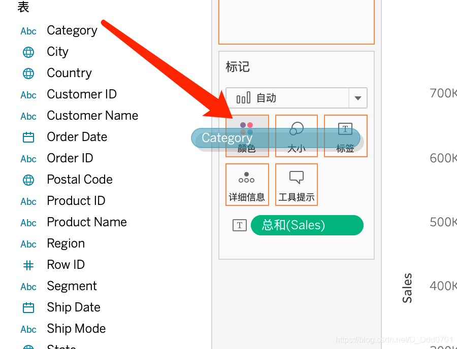

为了更清晰展示销售额中具体的每个类目单独销售额是多少，需要使用堆叠图。只需要把Category拖移到颜色方块：

就可以绘制出堆叠图：

在堆叠图中会自动显示摘要，表示每一个颜色代表什么类别。同时也可以点击摘要选择只要显示的数据，例如，只显示Furniture：

会发现其他的颜色都被淡化，Furniture被更加清晰的显示了出来。

这里还有只保留和排除。只保留的意思是只显示Furniture。

除此之外，左上角的筛选器也显示出了该条件。

按住command/ctrl，就可以选择多个自己指定的数据显示：

同理，在条形图上也可以用堆叠的方式显示：

但是需要注意，如果颜色过多，则会看上去非常混乱，因此在堆叠图的选择上，要尽可能选择颜色数量低于7个的堆叠。