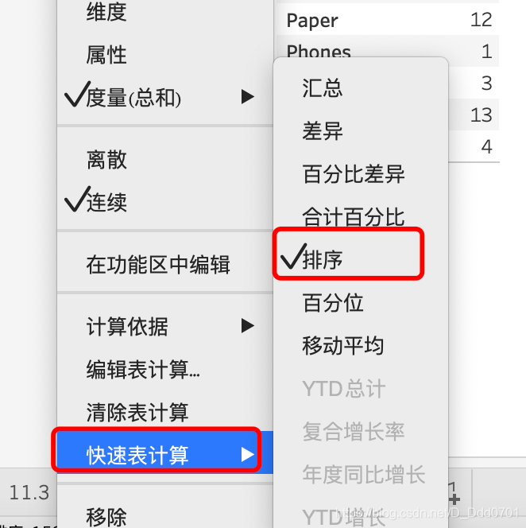
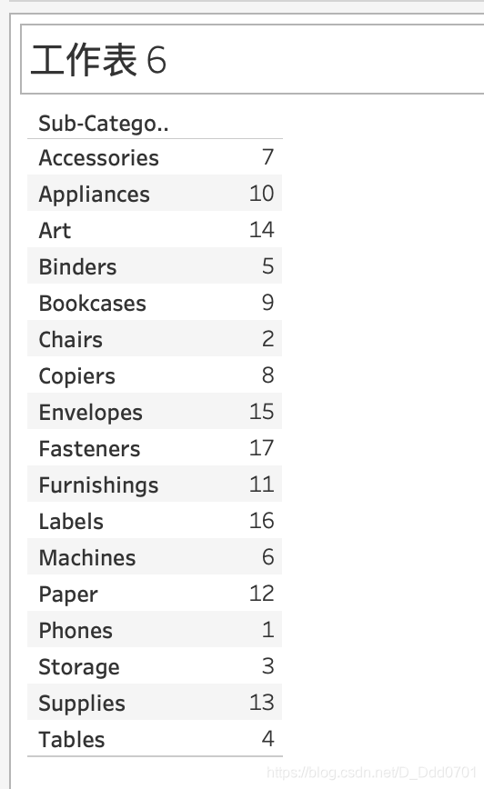

如果要知道某个Sub-Category他的总销售额到底排第几，或者需要找到排第5的品类是什么。应该如何做呢？

点击三角形：

此时，排第几就可以显示出来：

再使用一下差值：

这样就可以看到每一个品类和第一个品类的销售额差值。

也可以看不同年份的：

## 横向100%，纵向平均值

在这张图的基础上，我们就可以看到每一年每一个月的纵向、横向对比：

这里的总和在上方分析——合计——显示行列总和可以设置。

这里的列百分比是按照均值得出来的，而不是算数相加。

当然也可以做累计计算，通过计算表来判断比对销售情况：

还可以用排序，看横向对比：

这张图可以看到，2019年的销售额基本位列第一第二。这种方式比看销售的具体数字更加直观。
## 纵向100%，横向平均值

回到刚才的合计，同样可以横向取平均值，纵向累加，在计算依据中选择向下：

在分析中添加所有小计：

这时就可以得到这样一幅二维表格：

## 小计分区100%
在这里选择区：

这样的话，每一个分区合计都是100%：

## 表计算的差值
在快速表计算中选择差值：

通过对比发现这里的差值实际上是后一个减去前一个所得。跟之前demo的差值有所不同，之前demo都是所有的数据都去和第一个数据做差。如果在这个表要实现这样的差值计算如何做呢？

只要在这里的相对于选择第一个，就可以实现每一个数据和第一列的数据做差计算：

