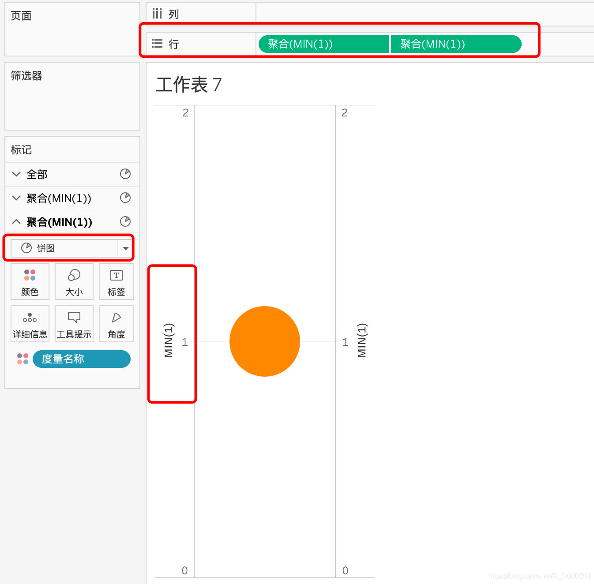
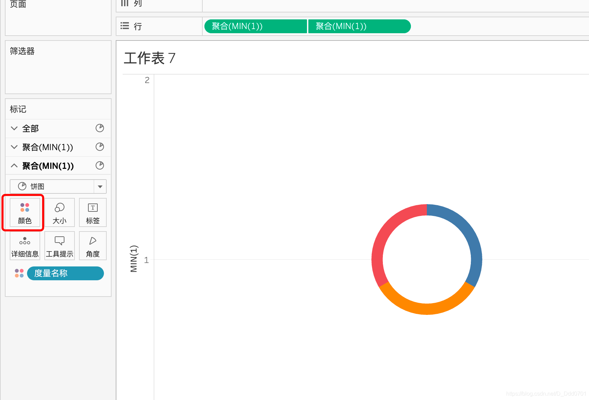
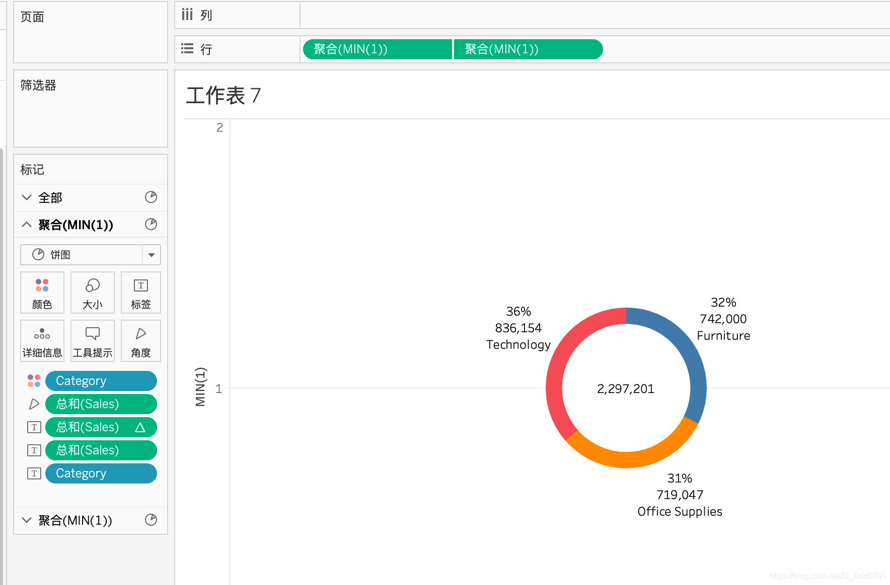
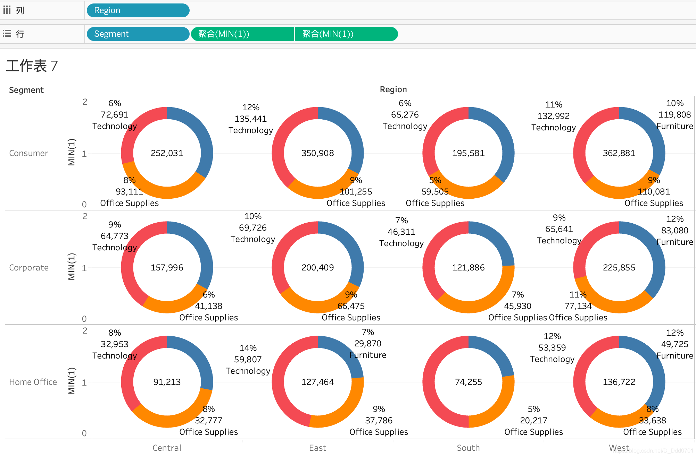

甜甜圈图就是空心饼图。想要在Tableau中绘制空心饼图，我们实际上需要绘制两个饼图，然后双轴合并，缩小一个饼图把它变成白色就行了。

首先在行中输入两个聚合函数min(1)，再双轴合并，饼图显示：

接着，我们对一个min1调整大小，用不同颜色显示不同对Category：

另外一个min1调整大小后把颜色选择为白色：

这样一个甜甜圈图的雏形就画好了，接着我们填入数据：

参考之前绘制饼图的思路，我们可以把这一个甜甜圈图拆分多个：

这样，就可以从多个维度分析这样一组数据之间的关系。