之前的内容都是绘制各类的图表，那如果是一个二维的表格应该如何制作呢？

在行中拖入Sub-Category：

这里所有子分类的数据都是空的，我们可以把销售额填进去——把Sales拖进列文本标签：

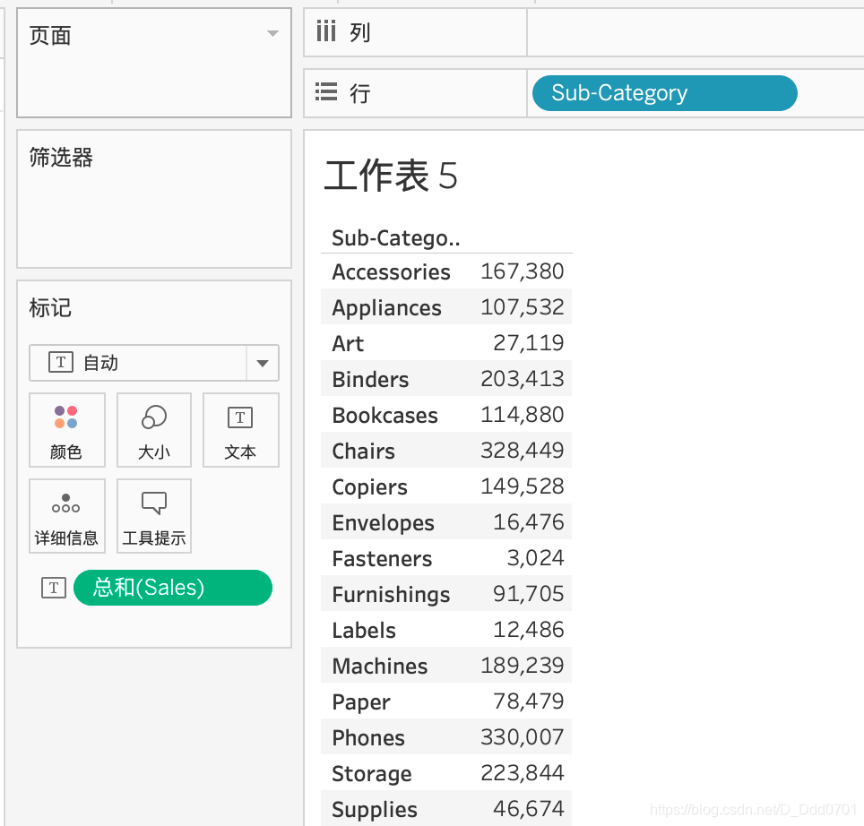

Sales默认为总和，可以调整他的度量为平均数：

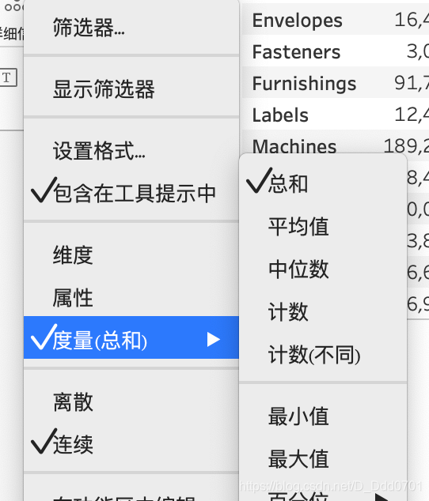

这时，所有的数据会显示为平均数：

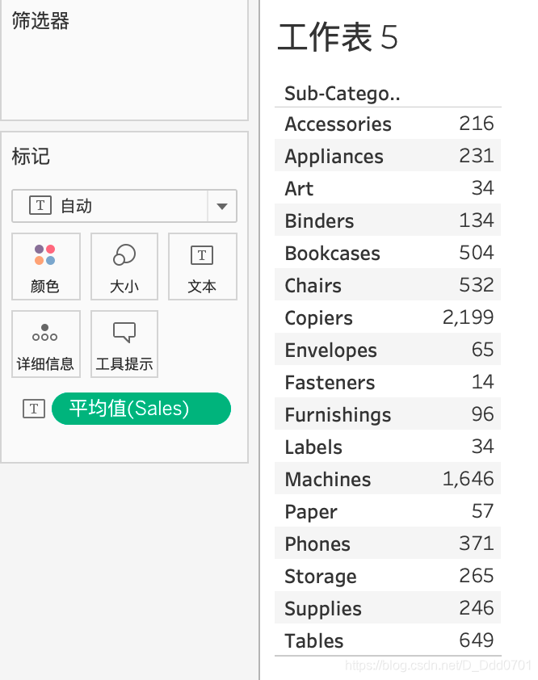

可以再次拖入Sales到文本：

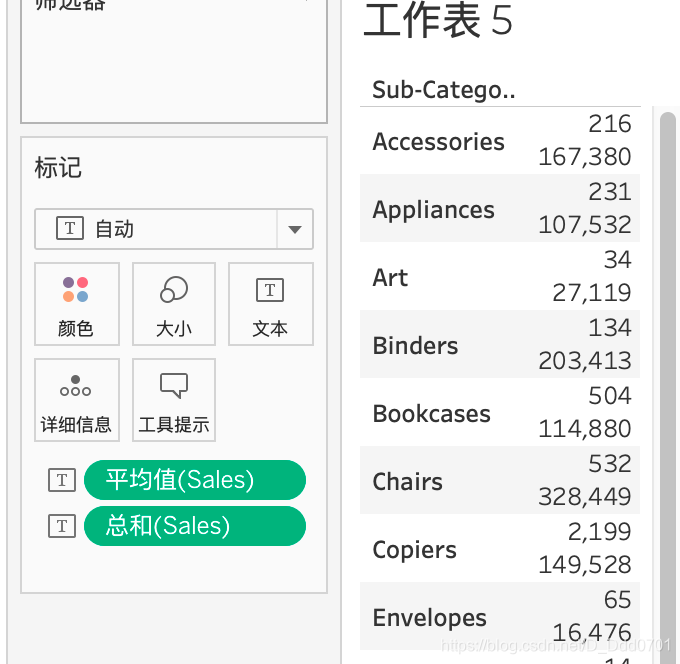

这时就会显示平均值和总和。

那么如何把这些数据按照不同列展开呢？只需要把Sales拖到图表内：

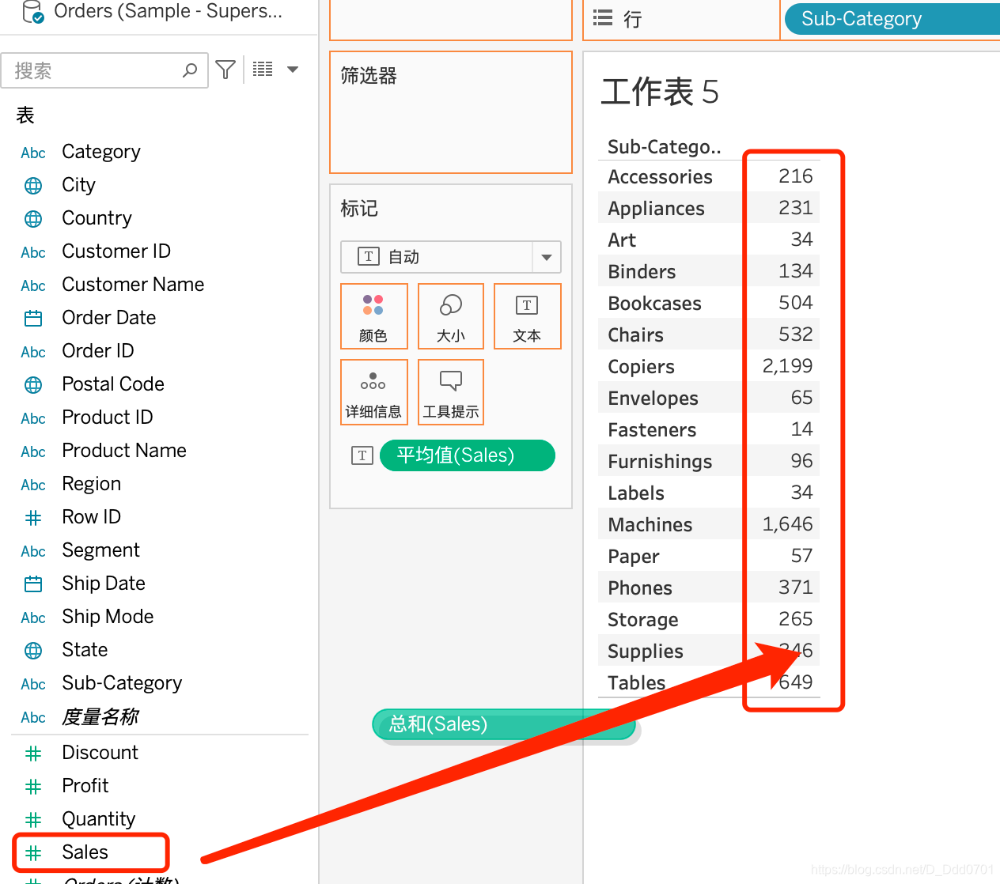
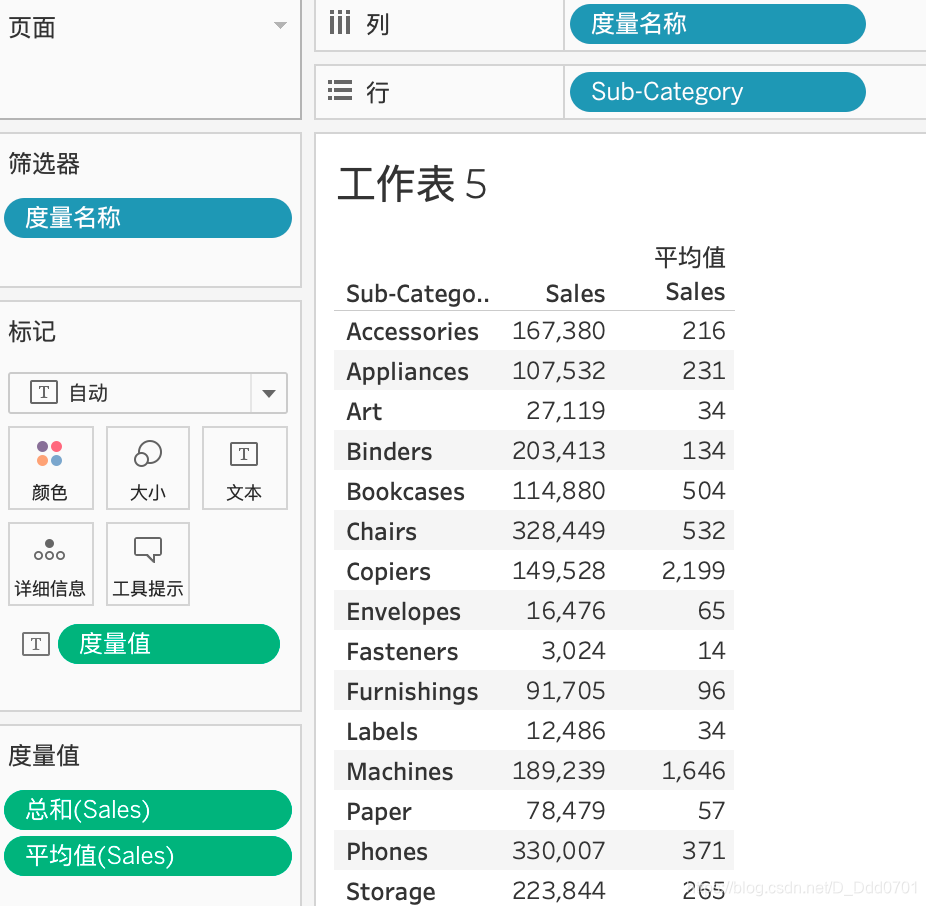

可以看到这张图表就把不同的数据按照不同的列展开。同时，这张图表的筛选器和行都出现了`度量名称`，工具栏显示`度量值`。这其实开启了一个简单的操作方法。在左边可以看到有度量名称和度量值的可拉选项：

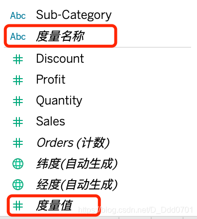

直接把这两个拉到对应的位置：

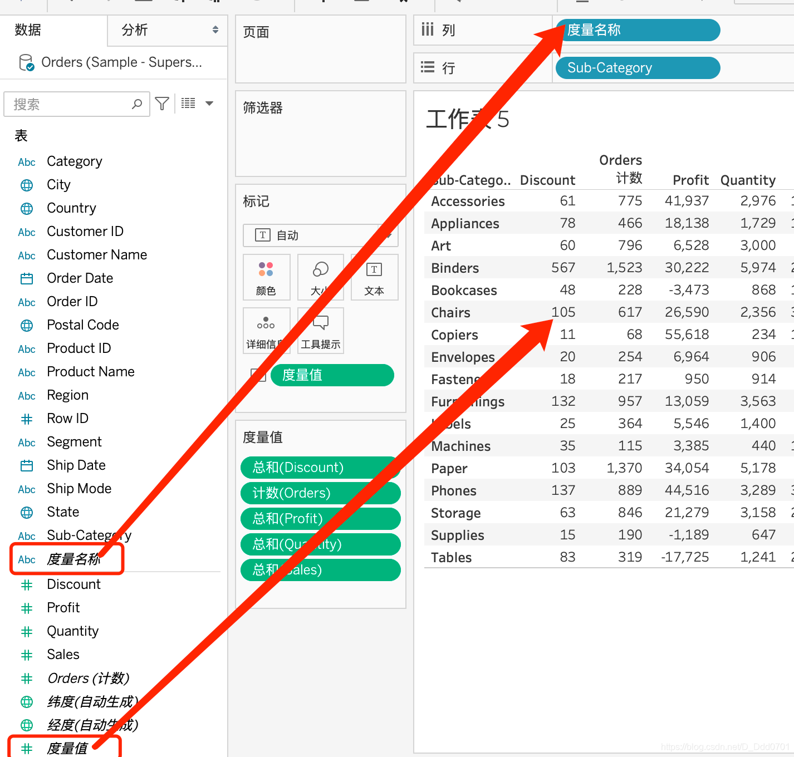

此时所有的度量值都会在二维表格中显示。可以拖拽度量值中的选项，取消显示某一栏，这时会左上角会开启筛选器，右键可以点开编辑选项：

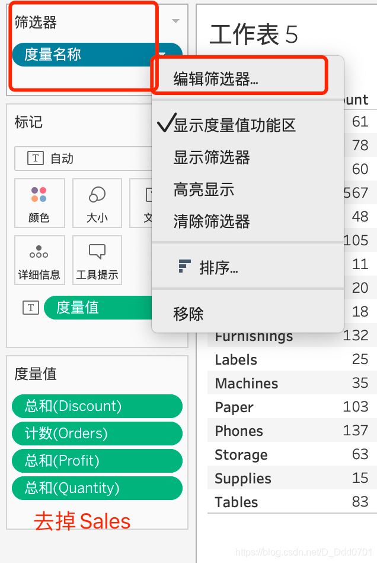
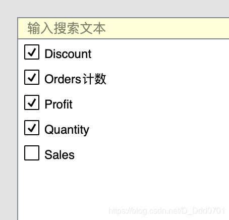

可见，系统默认将所有度量值都放在一起，如果取消某一个，相当于在度量值这个集合内进行了筛选。当然，对于每一列度量值都可以进行排序。

如果把度量值和度量名称放在行列上呢？——系统会自动绘制出相关的柱状图：

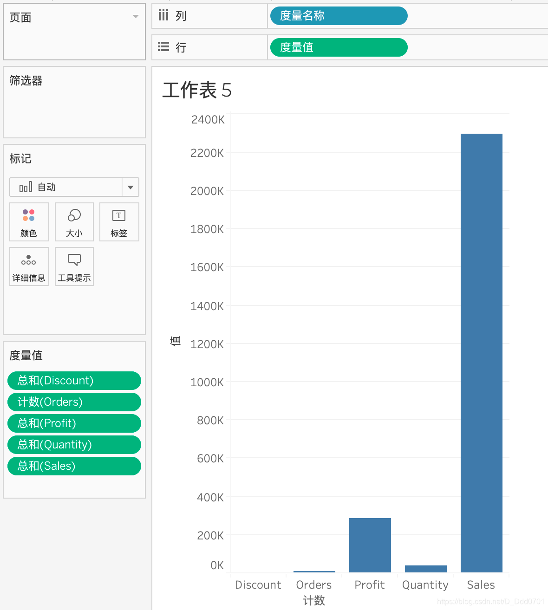