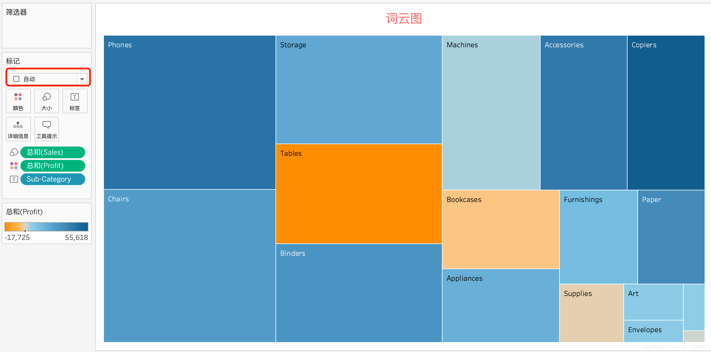
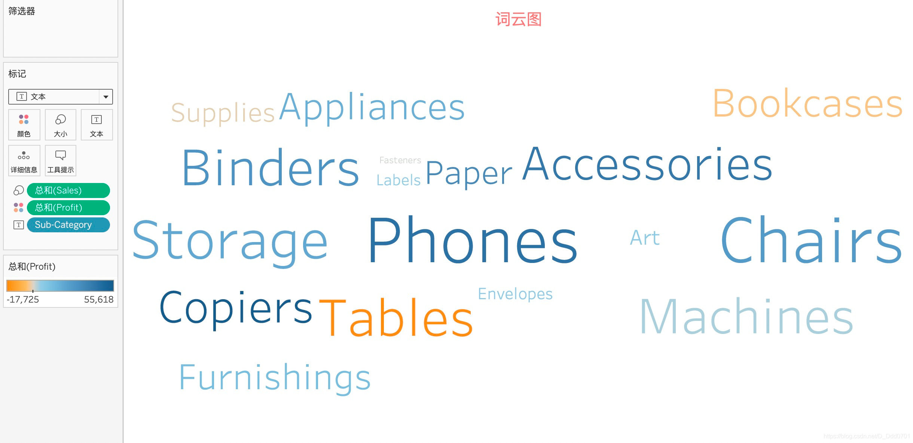
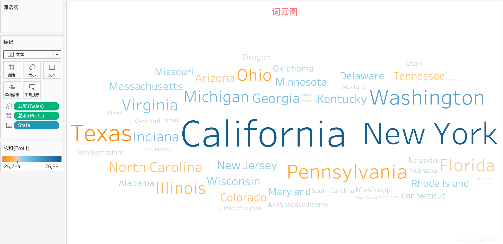

词云图是在TreeMap的基础上做出来的。首先我们制作Sales和Sub-Category的树状图，并且用颜色反应利润：

点击红框位置下拉框，选择文本：

可以发现，文字大的代表销售额多，颜色偏黄则代表利润越低甚至为负。Tables的销售额大，但是利润为负，这和之前数图的结论一致。

我们再用词云图看一看不同州的利润情况：

根据词云图可以分析得到，加州和纽约分别位于美国的西、东海岸，利润和销售额都最大，德州销售额虽然大，但利润很低。