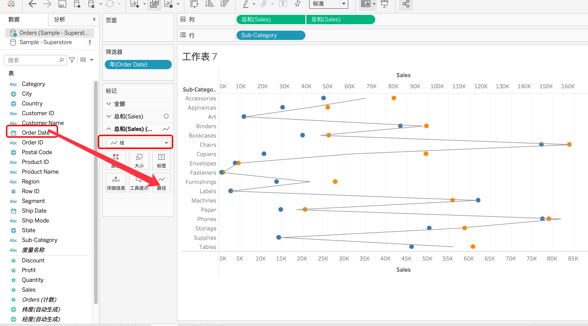

在列中拖入两个Sales，双轴显示。

把Order Date拖入筛选器，按年选择，以2016和2018年为例。

把Order Date拖入颜色，区别2016和2018年。

但是这张图不同的点对比起来还是很混乱，这时，我们把图形改为线，把Order Date拖入路径，调整大小：

这样，这张图就非常清晰的展示了2016和2018年不同子分类的销售两两对比情况，大部分2018年销售额都比2016年的提高，也有一些原地打转甚至开倒车。