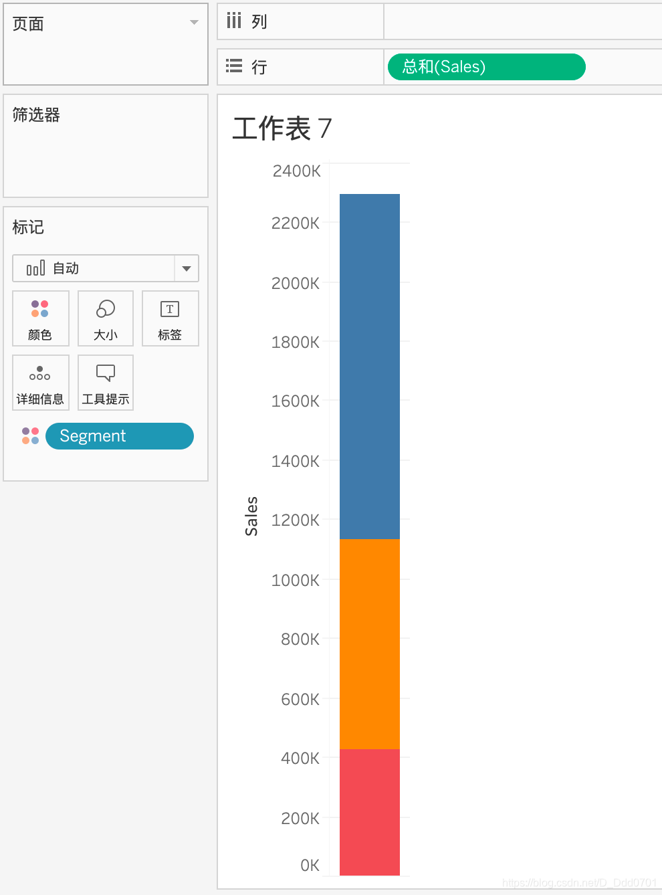
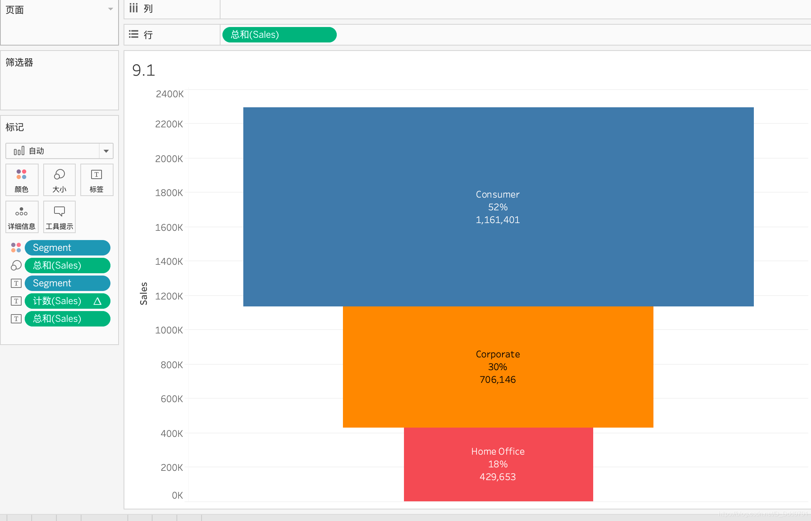
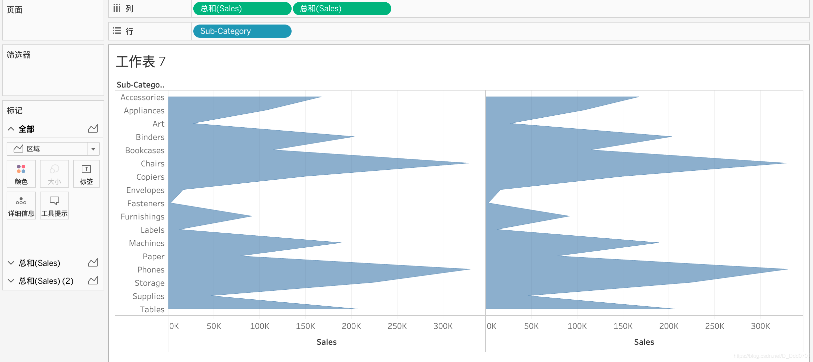
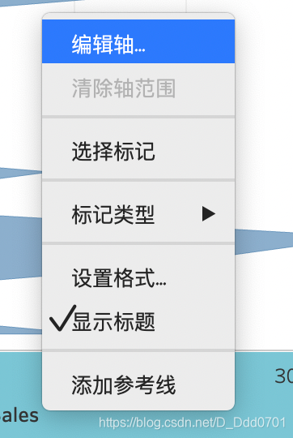
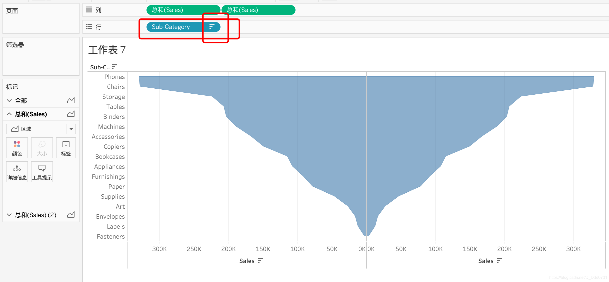
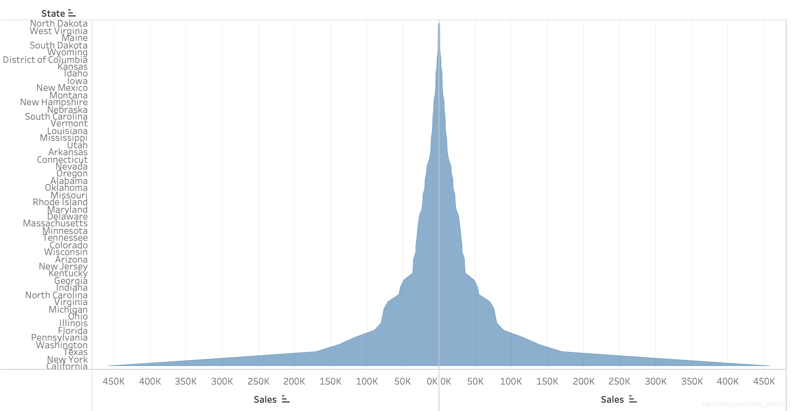

可以在Sales中显示不同Segment的销售额情况，为了更加直观反应各个Segment所占比重，可以采用前文用过的方式：

这就是烟囱图的雏形。接下来绘制另一个烟囱图。

拖入两个Sales进入列中，并且图形转换为区域。

右键选择编辑轴——倒序。

再对所有的Sub-Category排序。

这样一个烟囱图就制作完成了。他的本质就是对一个图形的镜像。通过这种图就可以非常清晰的看到销售额大的种类和小的种类。

用同样的方法也可以绘制各个州的销售情况：

在图上清晰对比得到，加州、纽约州和德州的销售额非常高。