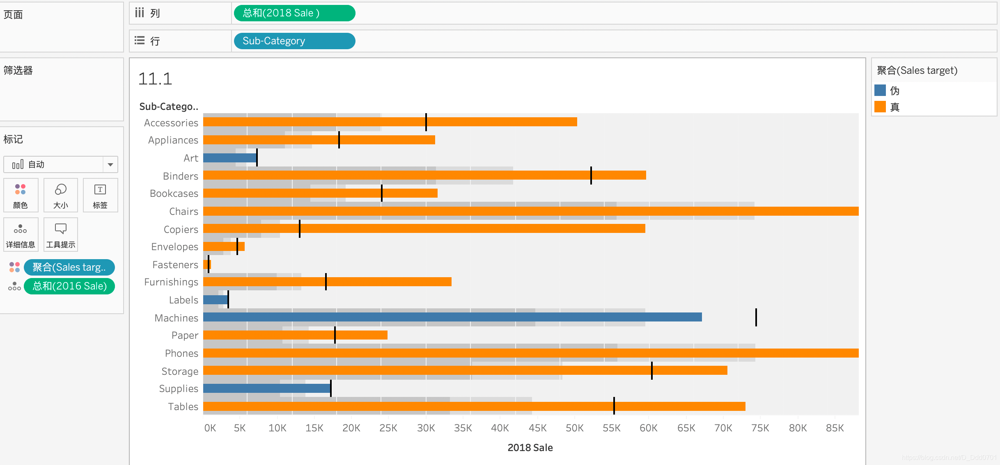

子弹图用来比较两组信息，其中一组作为标准，另一组用来显示是否实现目标，或与目标间的差异。

可以用只能推荐绘制子弹图。用2016年和2018年销售额举例。

创建字段：

按住command/ctrl同时选中字段，再选中Sub-Category，点击智能绘图绘制子弹图。

这个图有如下构成元素：

深色段：前60%数据所处的位置。

浅色段：前80%数据所处的位置。

黑色线：100%数据所处的位置。

深蓝色柱形：2018年的数据。

可以看到，大部分的销售额都是2018年大于2016年。为了搞清楚具体的情况，我们再设计一个T/F条件字段，用不用颜色区别出2018年利润大于2016年利润的类别。

可以清楚的看到，有4个类别2018年销售额不急2016年。

当然，这个60%和80%数据只是默认值，也可以在编辑参考线处修改：

把它修改成75%和90%：

