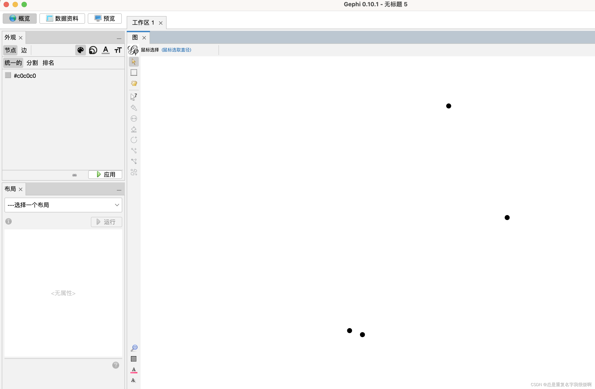

## 键盘输入
首先新建一个工程。

点击数据资料。

选中节点和添加节点，即可添加对应节点。并且在概览中可以看到添加的节点。

## 导入CSV文件
手动输入只能应付较少节点和边的情况，通常数据都是放在excel表格中，此时使用csv文件导入会更加便捷。但是需要注意，必须把csv文件编辑成gephi能识别的形式，可以使用python的pandas库进行数据处理工作。

这里手动编辑了一个描述边的csv文件：

在数据资料部分，点击导入电子表格，找到创建好的.csv文件，选择导入即可。

此时，在概览可以看到导入的图：

## 直接在概览界面鼠标点击创建
创建新工程文件后，点击创建节点，在画布区双击即可创建一个节点。

接下来选择画点下面的功能，选择画边

先选中一个源节点，再选中一个目标节点，即可在两点见创立一个连线。

## 自己创建一个红楼梦关系网络图

创建这样一个人物关系.csv文件。然后倒入gephi。

然后在布局，选择第一个搅拌一下。

然后再选择第三个，把他展开。

然后可以在左侧外观部分，进行外观调整。得到下图，重要的节点变大，重要的边颜色更深。

调整完布局之后，进入预览，调整变和节点的属性，优化细节，可以得到下图：

导出为png格式图片：

## 用一个Web of Science上的数据创建一个有向关系图
这里有一份Web of science上2019-2022年3年来有关混凝工艺的一些研究报道数据。该数据包括研究人员，研究类型，国籍，研究内容等多个关联内容。

导入Gephi后，即可绘制关系网络图。这个图表示了不同的研究人员之间研究的共性。（外观后面再介绍如何调整）
