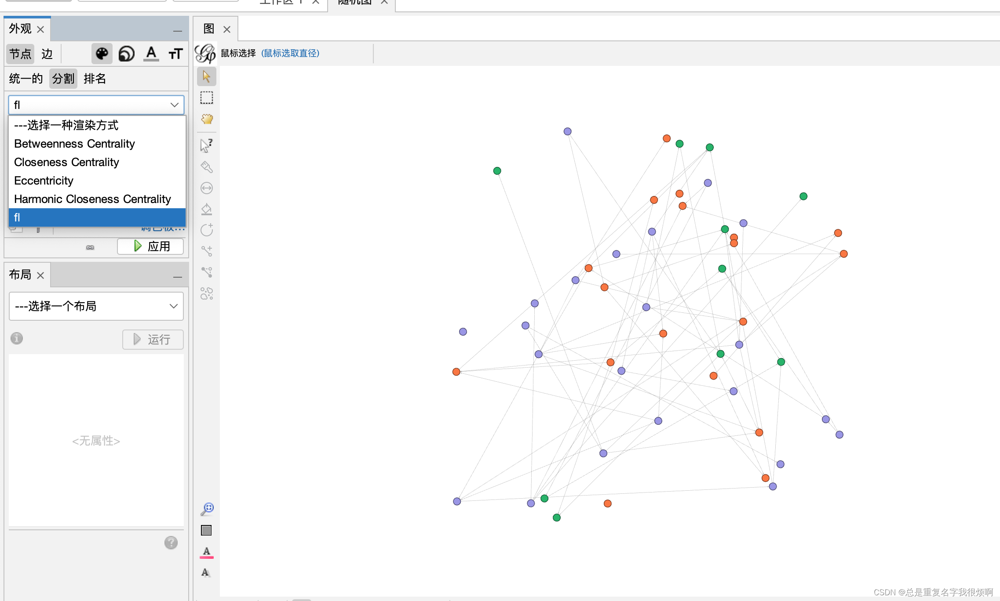

Gephi整个操作界面如下，可分为外观、布局样式、统计、过滤。

## 外观设置（排名）
排序可以比较Gephi中边和节点，对二者进行操作，包括节点的颜色、大小，节点标签的颜色、大小；边的颜色，标签颜色、大小。

选择外观-节点-颜色-排名-度，点击应用刷新图。

可以发现，连线多的节点，颜色深，连线少的节点，颜色浅。

当然，也可以双击颜色条，自定义颜色

节点的大小也可以手动调整，边多的节点大，边少的节点小。

节点标签的颜色也可以显示，首先打开T，显示节点标签，然后在标签界面操作即可。

当然， 标签的尺寸也可以在旁边再进行调整。

对边的操作类似。

## 布局设置（自动美化点线图形）
整个布局一共有12个，前6个是主要布局工具，后6个是辅助布局工具。

选择一个布局，下方感叹号按钮可以查看布局的介绍。点击运行，布局即可生效。

### Force Atlas & Force Atlas2（力布局）
总的思路是模仿物理中物质分布，实现力平衡的状态。

相关参数介绍：

> Force Atlas

- Inertia(惯性)：值愈大，图的摇摆幅度越大。
- Repulsion strength(斥力强度)：每个节点排斥其他节点的强度，值越大，节点的距离越大。
- Attraction strength(吸引强度)：连接节点之间的吸引力的强度，值越大，有连接的节点越被拉近。
- Gravity(重力)：值越小，图越分散；值越大，图越压缩。
- Speed(速度)：布局运动的速度，值越大，图的布局速度越快。

> Force Atlas2
- Scaling(缩放)：节点的斥力强度，值越大，斥力越大，图越稀疏。
- Stronger Gravity(更强的重力)：一个已经定义好的较强的重力。
- Gravity(重力)：自定义的重力值，可以比“更强的重力”更强。
- Dissuade Hubs(劝阻Hubs)：只有输入的边会被推到边缘。
- LinLog模式：线性和对数模式的切换。
- Prevent Overlap(防止重叠)：可以把重叠的节点展开。
- Tolerance(Speed）/容差（速度）：布局速度的选取，较小的数值速度较慢，但精度更高。

### Fruchterman Reingold（圆布局）
自动把节点排列成一个圆形。该布局算法遵循两个简单的原则，即有连接的节点互相靠近和无连接的节点互相排斥。相关参数介绍：
- Area(区)：定义图形的幅度，值越大图越大，也越稀疏。
- Gravity(重力)：定义重力值，值越大重力越强，节点越被中心吸引。
- Speed(速度)：定义布局的速度，值越大布局速度越快，但也越不精确。

### OpenOrd（改进力布局）
这个相关的介绍资料较少，使用起来，适合处理节点较多的图；对于节点较少的图形，运行起来效果并不是很好。

### Yifan Hu（音译：胡一凡布局）
力引导布局的改进版。该布局算法中，将一个节点与它远处一簇节点之间的斥力当作此节点与一个超节点间的斥力来计算，从而大大减少了计算量，使得总计算复杂度下降，可处理几十万个节点规模的图。

**相关参数**
>Yifan Hu
- Optimal Distance(最佳距离)：值越大，整个图的尺寸越大。
- Relative Strength(相对强度)：值越大，节点越稀疏；值越小，节点越紧密。

>Yifan Hu 比例
- Yifan Hu比例布局的参数与Yifan Hu布局的参数相同，实际上这两个布局所起到的作用是相同的，扩展(收缩布局的参数只有比例因子，比例因子的设置方法如下：
- 如果比例因子为1，那么图不会放大也不会缩小。
- 如果比例因子大于1，那么图会放大，且值越大，放大的比例越大。
- 如果比例因子小于1，那么图会缩小，且值越小，缩小的比例越大。
- 如果比例因子为负数，那么在放大或缩小的同时，也会从上下、左右两个方面颠倒图形。

### 交叠
主要防止标签的重叠。具体参数如下：
- speed(速度)：布局速度。一般都是速度越快，布局越差
- ratio(节点边距) ：间距为1的时候，节点会连在一起，随着间距增大，节点变的越来越分开。当简间距小于1的时候，允许节点重叠。
- margin(幅度)：增加幅度半径。当幅度为0的时候，没有余量；幅度增大节点分离越大，负的幅度的时候允许重叠。

### 扩展&收缩
扩展、收缩布局是对原始图的按照比例的扩展和收缩，两者唯一的参数是Scale facto因子。

Scale factor取值有以下几种情况：
- 因子=1，不扩展，不收缩。
- 因子>1，扩展，值越大，扩展越大。
- 因子<1，收缩，值越小，越收缩。
- 因子为负数： 在扩展和收缩的同时，进行图形的颠倒。

### 旋转
可以将图形从整体上进行顺时针或者逆时针的旋转，从而进行布局。唯一的参数是Angle(旋转角度，旋转角度可以是正的，也可以是负的值。

### 标签调整
主要可以防止标签的重叠，参数包括Speed(速度，决定了布局的速度；Include Node size(包括节点大小)：是否使得重叠的节点分散。

### 随机布局
在一个Space size(空间大小的参数)上进行随机的布局。

## 统计
点击运行即可完成统计，完成统计后右侧圆圈可以点击查看统计报告。

### 平均度
计算每个节点的度，并统计相同度的节点数量
> 有向图：所有点的度数总和/节点数*2   
> 无向图：所有点的度数总和/节点数

在图上能够，看出每个度所占的百分比，能够看到每种度用不同颜色标示

通过这个可以看出哪些节点的度高，反应出连接他的点就多，就越关键

### 平均加权度
- 有向图：取得每个点的边，如果该边的源为该节点，那么该边的权重为加权出度，反之亦然。计算出每个点的加权出度，入度和度。其实平均度是平均加权度的一个特例，平均度的每条边的权重为1。加权度为加权出度和入度的总和。计算同样入度出度的节点个数。
- 无向图：取得每个点的边，将边的权重求和，即为该点的加权度。

> 有向图：加权度总和／２x节点数   
> 无向图：加权度总和／节点数

### 网图密度
> 无向图：边数x2 /（节点数x节点数-节点数）   
> 有向图：边数 /（节点数x节点数-节点数）

大概理解：（节点数x节点数-节点数）这个计算出最多的连接边数(不包含连自己)  ，用实际边数除以最大可能边数，即为密度，结果越大表示图中节点连接越紧密。

### 点击次数
计算2个值authority和hub

每个节点入度的比值。简单的，就是总的节点的入度和，除以该节点入度和，体现节点重要性，被链接的多，说明入度多，就更加重要
> authority  

计算每个引入（指向该节点）该节点（有入度的节点）的节点的hub(初始为1)总和，用该值除以所有点的authority值
> hub

计算每个引入（指向该节点）该节点（有出度的节点）的节点的 authority (初始为1)总和，用该值除以所有点的 hub 值

### 网络直径
目前看应该是所有节点之间的平均路径长度。

## 分割和模块化

### 模块化
从结果上看是一种聚类算法，原理尚未看到相关资料介绍。

### 统计带来分割窗口的更新
点击模块化统计，运行后，左侧外观-节点-分割可选择Modularity Class，点击应用可以对图窗口内的有向图进行聚类。

并且，模块化后的数据会写入数据的节点表格中。

### 自己输入聚类结果

在数据中手动添加一列fl，输入123作为三类代表。

然后回到概览界面，选择分割，即可通过fl列进行聚类分析。

因此，实际上可以在外部使用其他的聚类分析算法，利用有/无监督学习模型把不同节点的类别进行定义，然后把有聚类标签的csv文件导入Gephi即可实现在Gephic上的聚类可视化分析。

## 过滤

### 通过过滤查找一个节点
查看数据，以找到id为960的节点为例。注意，这里需要手动插入一列，示例取名为Node，并且把id的数据复制到Node里，这样才可以在过滤界面按照Node查询。

在过滤-属性-等于，找到Node列，输入960，点击选择，即可筛选Node为960的节点。若是选择过滤，则只会显示Node为960的节点。

也可以使用正则表达式的方式查找，例如查找952-956,962-966的节点，输入正则表达式9[5,6][2-6]，点击确定，选择。

