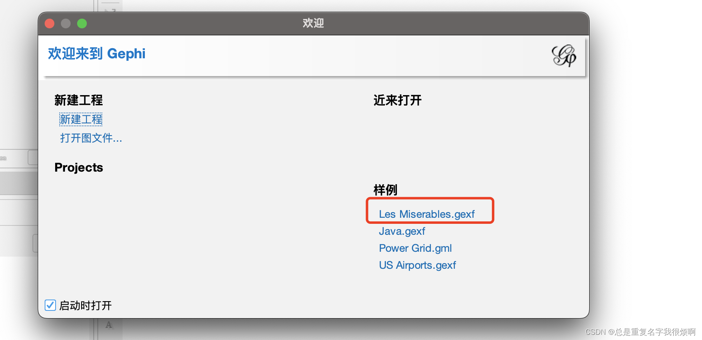
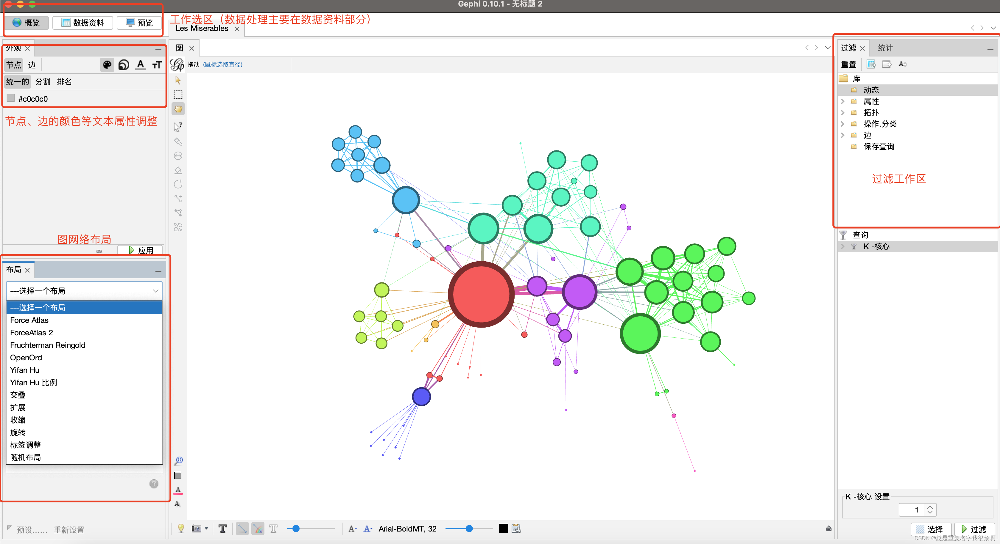
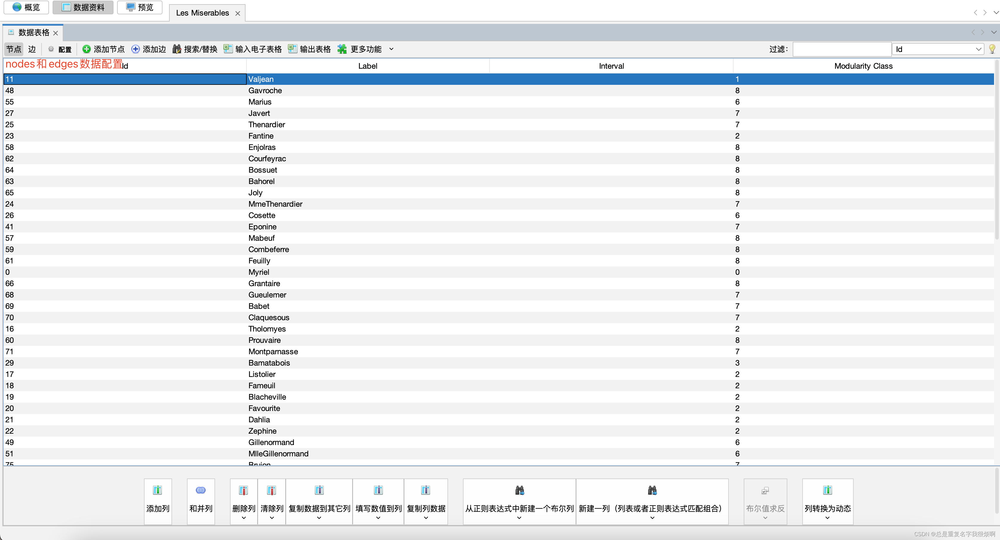
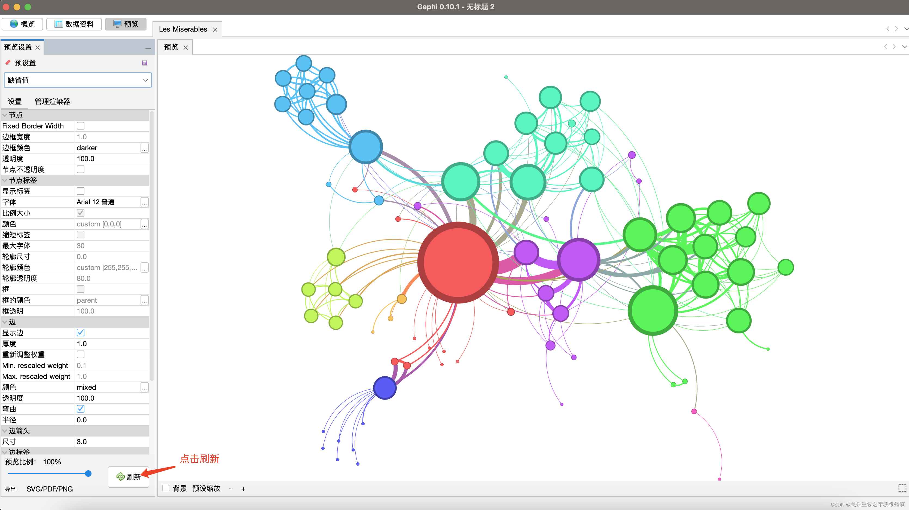

在论文写作和数据分析时，我们时常需要做信息的关联分析。例如舆论传播（A发布消息引爆舆论 - B，C，D转发，结果C的转发造成了舆论的进一步发酵）这样的舆情分析；科研成果下沉（A在Nature发表了重磅研究结果，B，C两大巨头纷纷入局，B在A的基础上发表了10篇成果，C在A的基础上发表了5篇，其中C发表的某一篇被工业界广泛引用，被EFGH...使用）。在做这样分析时，需要绘制关系网络。在这里，做一个Gephi的使用教程。

## 下载
下载链接：[Gephi官网](https://gephi.org/)，注意苹果电脑需要区分是ARM架构还是x86架构(Intel)

## 操作界面介绍
为了方便介绍，这里使用自带的数据：

进入之后默认在概览页面，整个页面功能区介绍如下。（概览主要是对数据进行可视化操作）

数据资料部分主要是边和节点的数据操作。（数据资料主要是对数据进行处理）

预览部分是对最后输出的图形进行后期美化和输出控制。

这样，概述-数据-预览，就是一个完整的数据可视化流程。