## 节点移动
首先生存一副随机静态图用作demo。
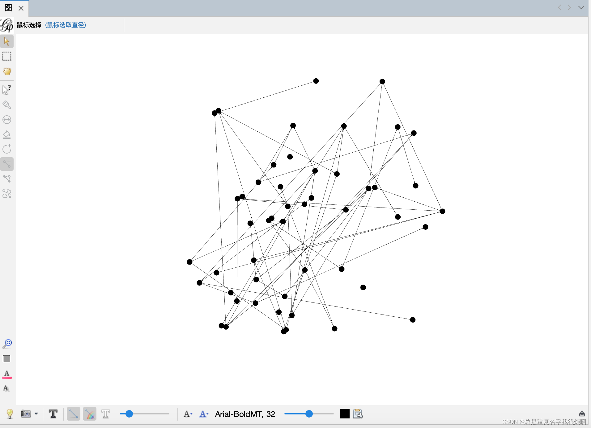
选择左侧的手套按钮，然后点击图窗体内的节点，拖动即可移动节点位置。
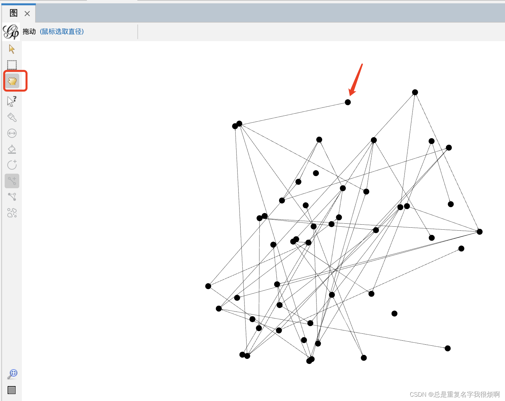
此外，按住鼠标右键可以移动整个图形，滑动鼠标滚轮可以放大和缩小图形。
## 节点放大&缩小
### 单个节点的放缩
选中缩放模式，然后单击选中节点，拖动即可放大缩小选中节点。
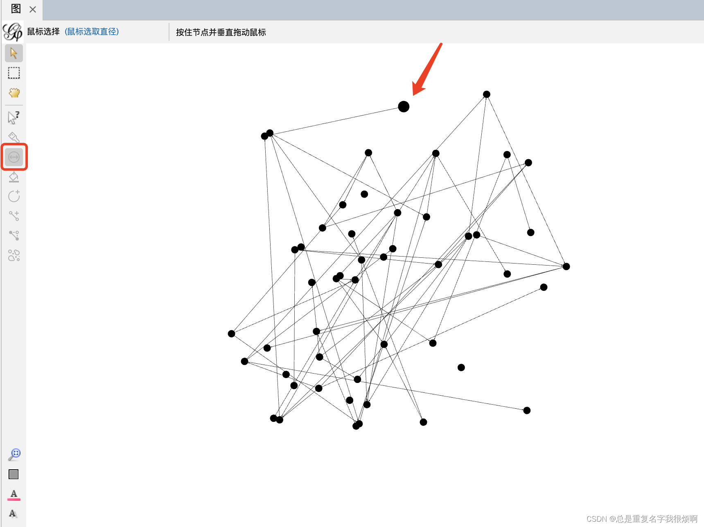
### 部分节点的放缩
首先选择矩形工具，然后在图窗口框选需要放缩的节点。
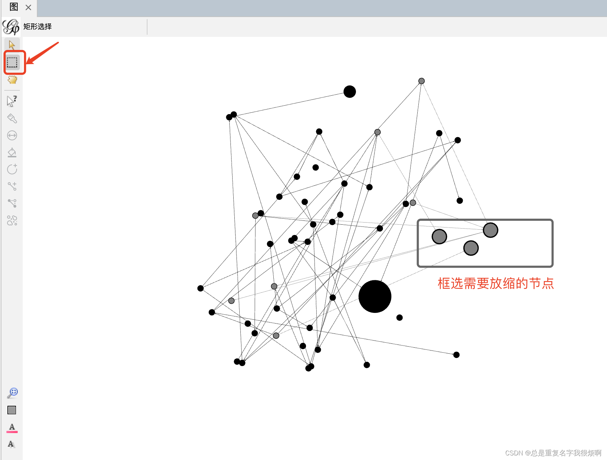
然后选择放缩按钮，重复对单个节点放缩的操作即可实现对选中节点的整体放缩。
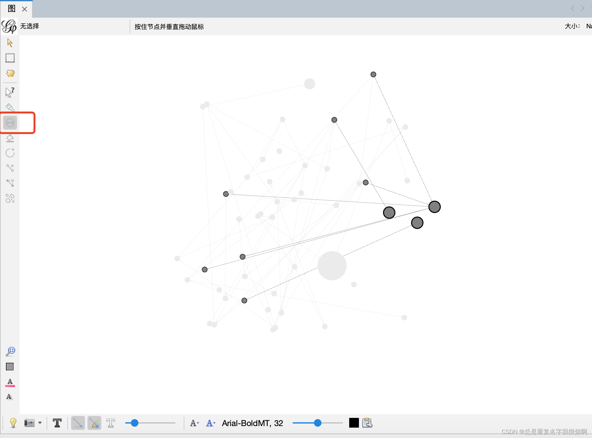
### 全部节点的放缩
在左侧可视化操作栏，外观-节点-大小-统一的，即可设置所有节点的大小，点击应用，即可刷新设定的节点大小。
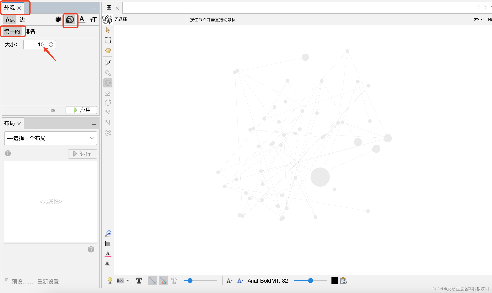
## 调整节点颜色
### 单个节点颜色
工具栏选择笔工具，上方可以设置需要的颜色。
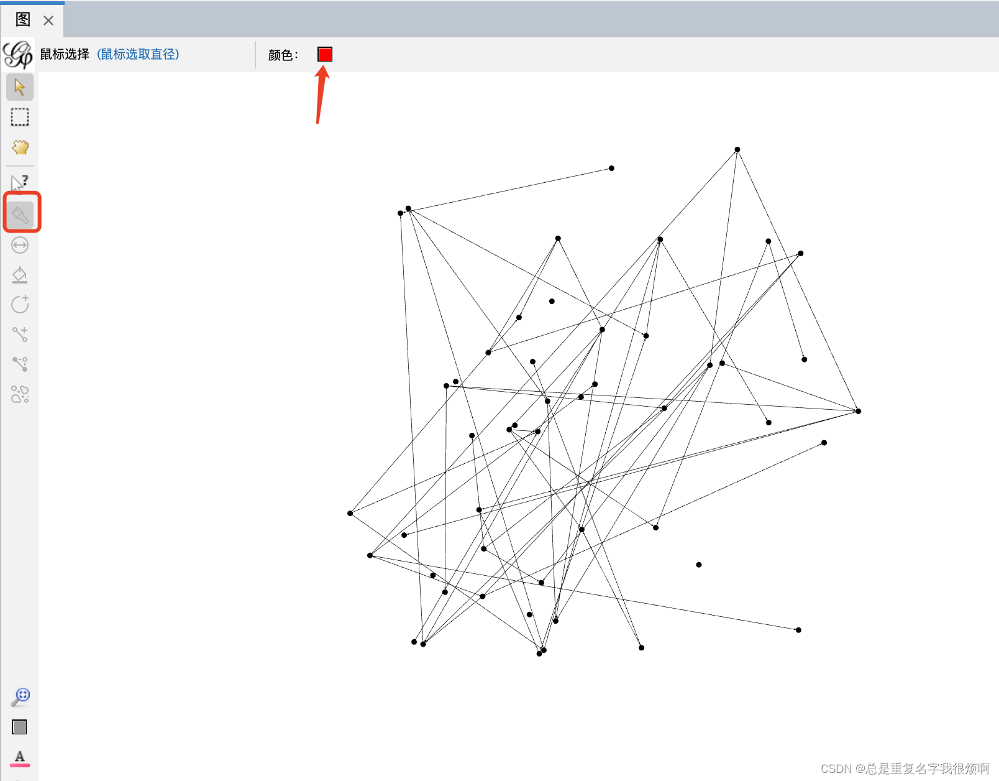
然后对一个节点不停的点击鼠标左键，颜色会逐渐向设定颜色靠近。
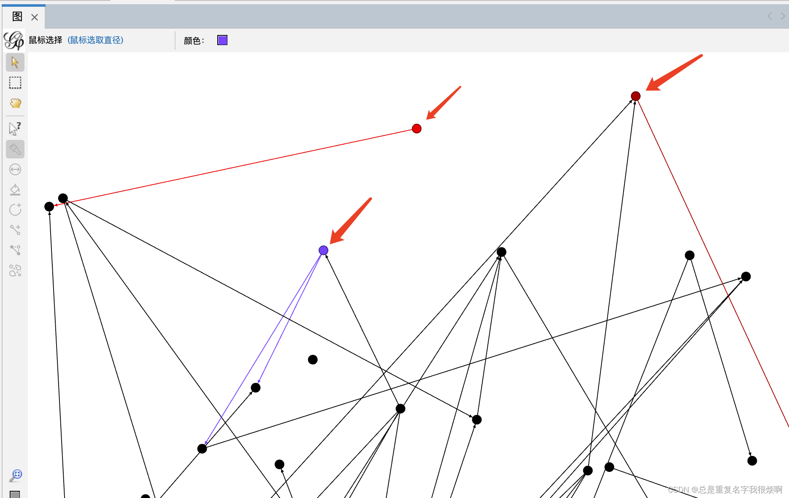
### 部分节点颜色
和操作部分节点大小一致，首先矩形工具框选需要操作的节点，然后选择笔工具，调整颜色，对框选的某一节点不断点击鼠标左键，即可实现框选内节点颜色调整。
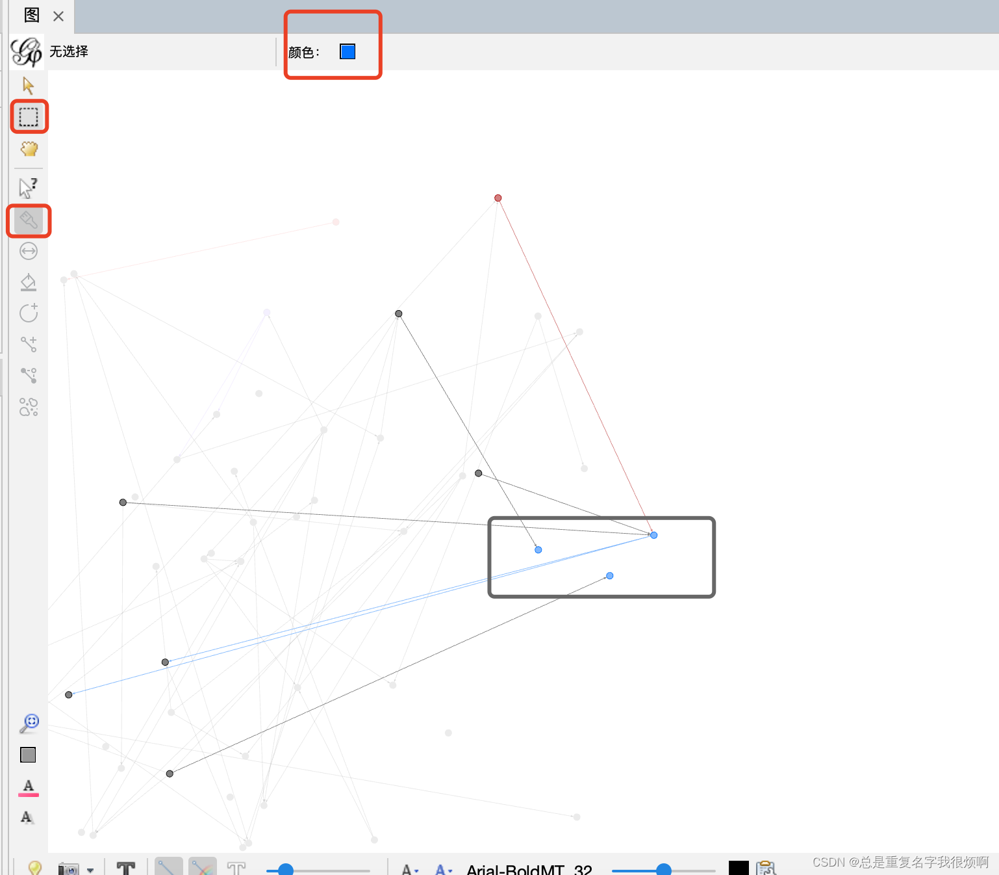
此外，还可以通过选择左侧颜料桶按钮，选择需要的颜色，然后鼠标点击一个节点，会将该节点和与其连接的节点全部变换成统一颜色。
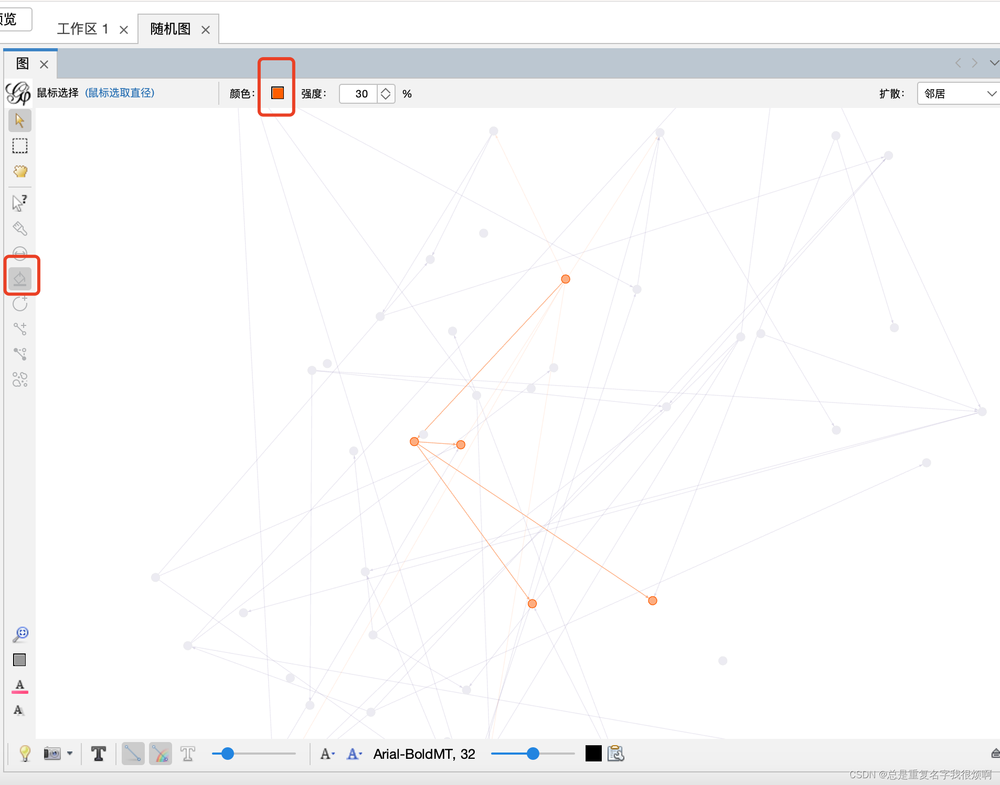
### 全部节点颜色
外观-节点-统一的-节点颜色，即可设置统一颜色，点击应用可刷新。
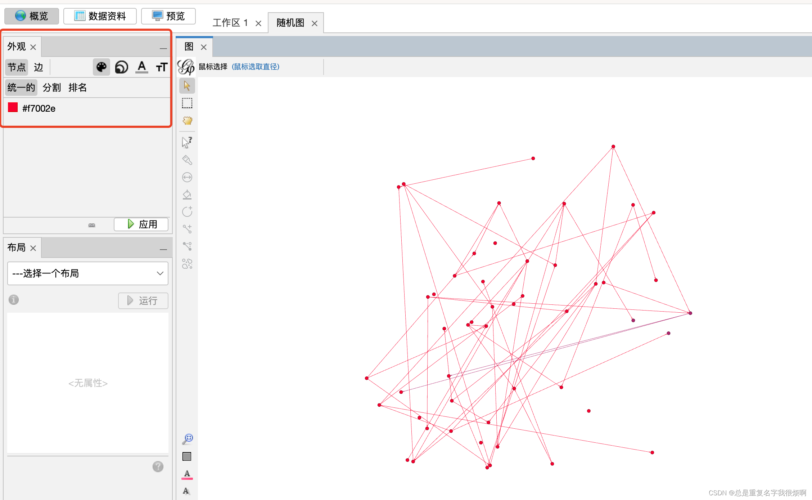
## 边粗细调整
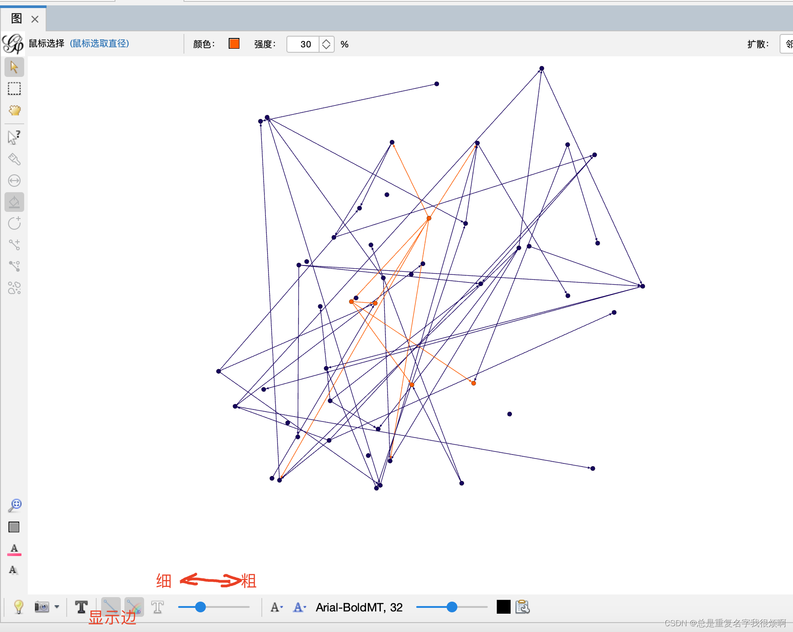
## 节点标签编辑
Gephi默认关闭节点标签显示，若要显示标签，选择下方T图标，即可打开。
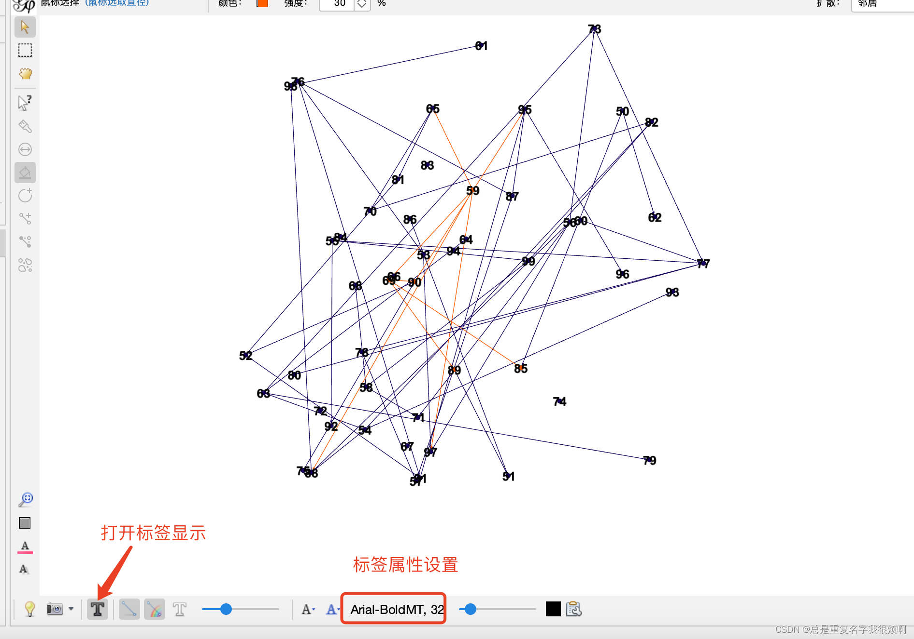
需要注意，在概览中进行标签的设置，在预览中是无法同步的，因此在预览中还需要重新设置。

## 节点属性编辑
选择左侧问号箭头按钮，点击节点即可编辑节点属性，包括节点的位置，尺寸，颜色，标签的尺寸，颜色和显示内容等。
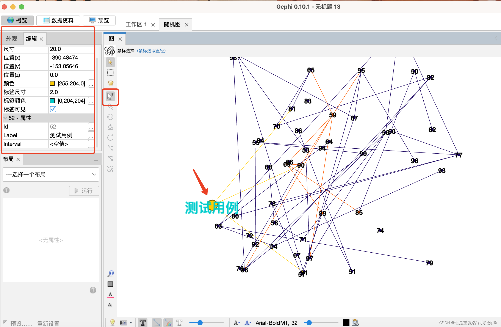