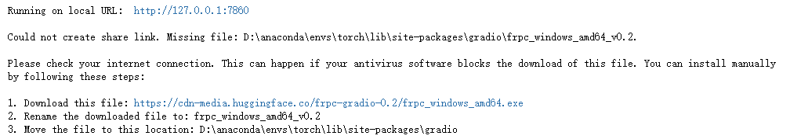
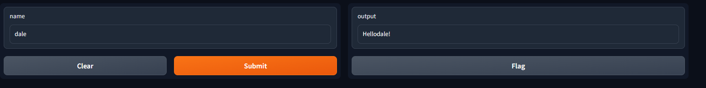

```python
import gradio as gr

def greet(name):
    return 'Hello' + name + '!'

# 主逻辑greet，输入文本，输出文本
demo = gr.Interface(fn=greet, inputs='text', outputs='text')
gr.close_all()
# share=True让我们除了在本地可以看，也可以创建一个public url
demo.launch(share=True)
```


注意，这个public url只有3天有效期，如果想要永久访问，需要去hugging face space部署。

