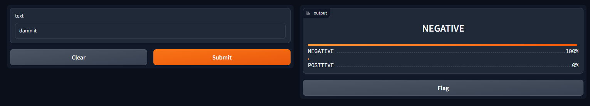

```python
import gradio as gr
from transformers import pipeline

pipe = pipeline('text-classification')

def clf(text):
    result = pipe(text)
    label = result[0]['label']
    score = result[0]['score']
    res = {label:score, 'POSITIVE' if label == 'NEGATIVE' else 'NEGATIVE': 1-score}
    return res

# 文本分类输入是本文，输出是label
demo = gr.Interface(fn=clf, inputs='text', outputs='label')
gr.close_all()
demo.launch(share=True)
```

