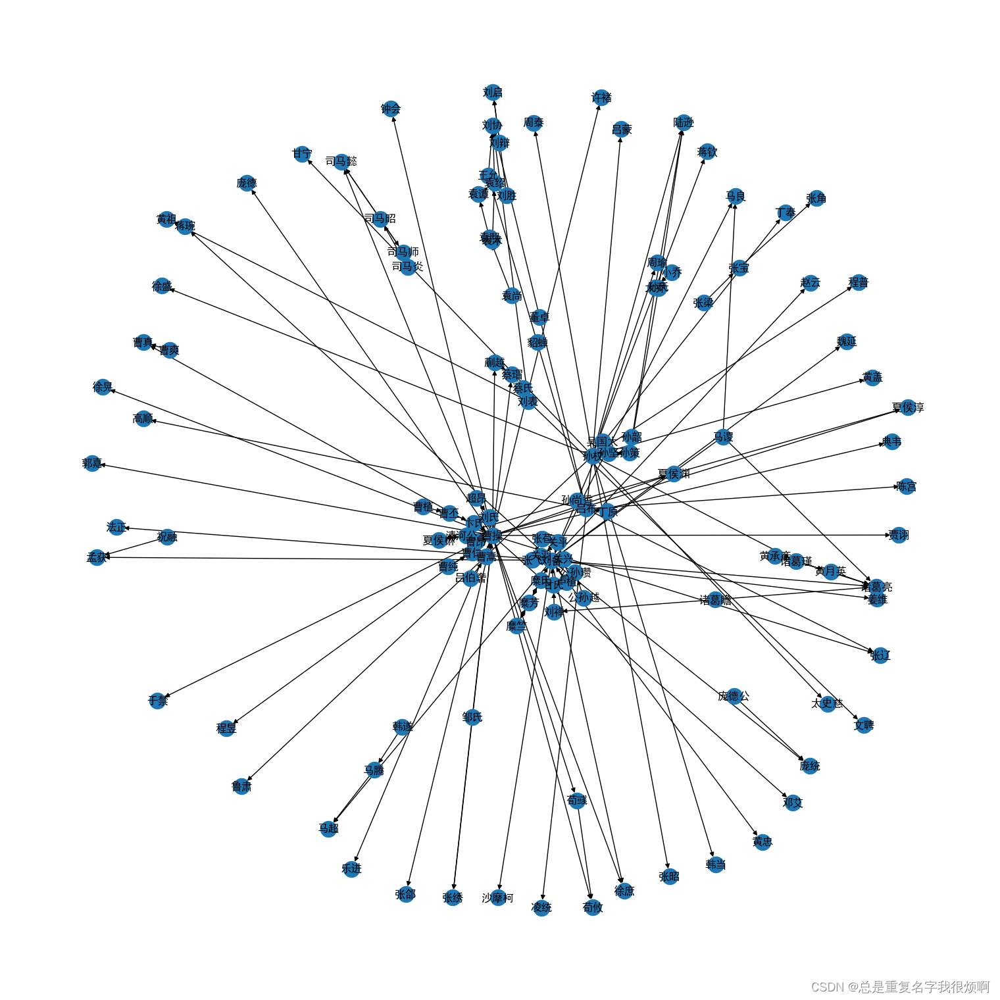
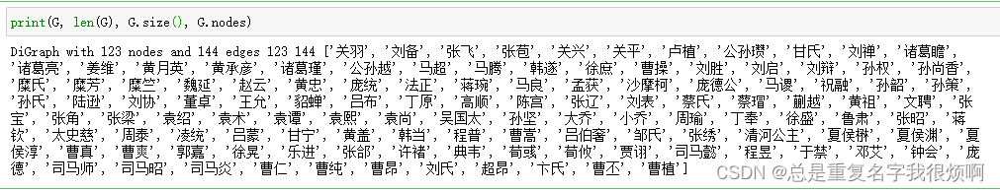
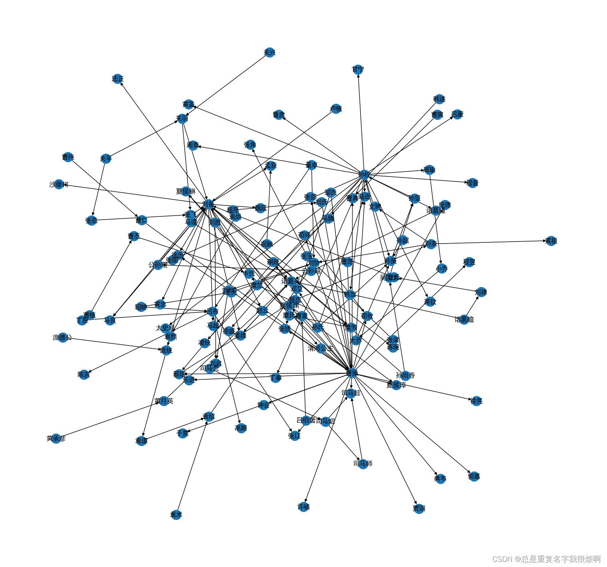

> 数据来源：http://www.openkg.cn/dataset/ch4masterpieces
```python
df = pd.read_csv('data(广东外贸外语大学)/三国演义/triples.csv')
df.head()
```

## 通过连接表edge list创建图

```python
# 创建有向图
G = nx.DiGraph()
edges = [edge for edge in zip(df['head'], df['tail'])]
G.add_edges_from(edges)
G.edges('关羽')
>> OutEdgeDataView([('关羽', '刘备'), ('关羽', '张飞')])
```

## 可视化

```python
pos = nx.spring_layout(G, seed = 123)
plt.figure(figsize=(15,15))
nx.draw(G, pos=pos, with_labels = True)
```



## 查看全图参数

```python
print(G, len(G), G.size(), G.nodes)
```



## 保存并载入邻接表

```python
for line in nx.generate_adjlist(G):
    print(line)
    break
```

```python
# 将邻接表导出为本地文件 grid.edgelist
nx.write_edgelist(G, path='grid.edgelist', delimiter=":")

# 从本地读取grid.edgelist邻接表
H = nx.read_edgelist(path='grid.edgelist', delimiter=":")

# 可视化
pos = nx.spring_layout(H, iterations=3, seed = 5)
plt.figure(figsize=(15,14))
nx.draw(G, pos=pos, with_labels = True)
```

