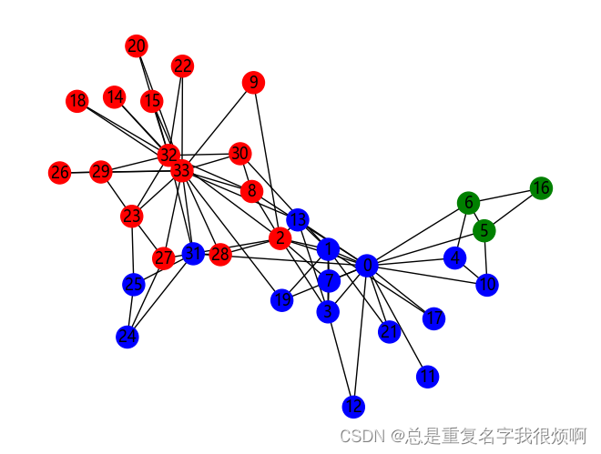

```python
import networkx as nx
import matplotlib.pyplot as plt
import warnings
warnings.filterwarnings('ignore')

plt.rcParams['font.sans-serif'] = ['Microsoft YaHei']
plt.rcParams['axes.unicode_minus']=False

G = nx.karate_club_graph()

from networkx.algorithms import community
communities = community.label_propagation_communities(G)

node_groups = []
for com in communities:
    node_groups.append(list(com))

color_map = []
for node_id in G:
    if node_id in node_groups[0]:
        color_map.append('blue')
    elif node_id in node_groups[1]:
        color_map.append('red')
    else:
        color_map.append('green')

nx.draw(G, node_color = color_map, with_labels=True)
```

