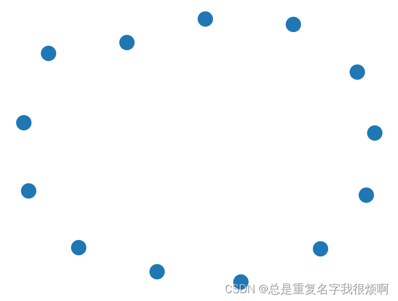
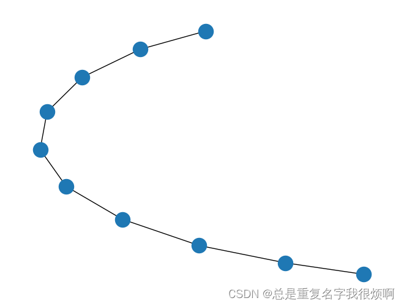
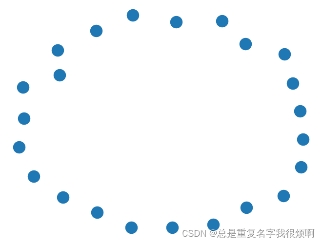
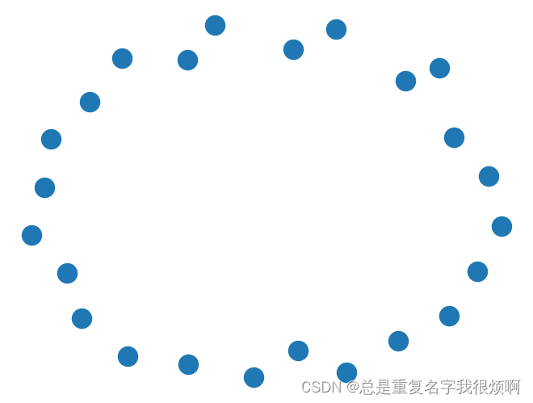

## 创建空图

```python
G = nx.Graph()
nx.draw(G)
```
## 添加单个节点

```python
# 节点可以是中文英文字符串
G.add_node('刘备')
G.add_node('Tommy')
G.add_node('1')
G.nodes
>>NodeView(('刘备', 'Tommy', '1'))
```

## 添加多个节点

```python
G.add_nodes_from(['诸葛亮','曹操'])
G.add_nodes_from(range(100,105))
G.nodes
>>NodeView(('刘备', 'Tommy', '1', '诸葛亮', '曹操', 100, 101, 102, 103, 104))
```

## 添加带属性的节点

```python
G.add_nodes_from([
    ('关羽',{'武器':'青龙偃月刀','武力值':90,'智力值':80}),
    ('张飞',{'武器':'丈八蛇矛','武力值':85,'智力值':75}),
    ('吕布',{'武器':'方天画戟','武力值':100,'智力值':70})
])
G.nodes
>>NodeView(('刘备', 'Tommy', '1', '诸葛亮', '曹操', 100, 101, 102, 103, 104, '关羽', '张飞', '吕布'))
```

## 可视化

```python
nx.draw(G)
```



```python
# 创建另一个首尾相连的path graph
H = nx.path_graph(10)
nx.draw(H)
```



```python
# 把H节点添加到G中
G.add_nodes_from(H)
G.nodes
>>NodeView(('刘备', 'Tommy', '1', '诸葛亮', '曹操', 100, 101, 102, 103, 104, '关羽', '张飞', '吕布', 0, 1, 2, 3, 4, 5, 6, 7, 8, 9))
```

```python
nx.draw(G)
```



```python
# 把H整张图作为一个节点添加到G中
G.add_node(H)
G.nodes
>>NodeView(('刘备', 'Tommy', '1', '诸葛亮', '曹操', 100, 101, 102, 103, 104, '关羽', '张飞', '吕布', 0, 1, 2, 3, 4, 5, 6, 7, 8, 9, <networkx.classes.graph.Graph object at 0x00000240BE5625B0>))
```
```python
nx.draw(G)
```



## Note
任何可哈希的对象，比如字符串、图像、XML对线甚至另一个Graph都可以作为节点。通过这种方式可以多模态的构建图网络。