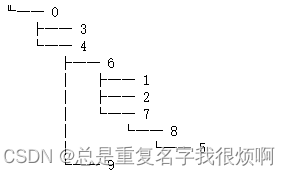
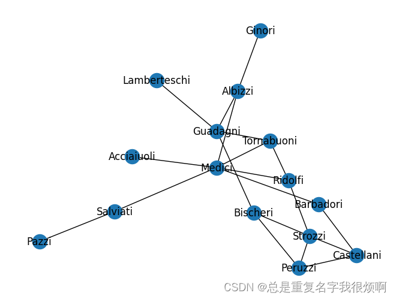
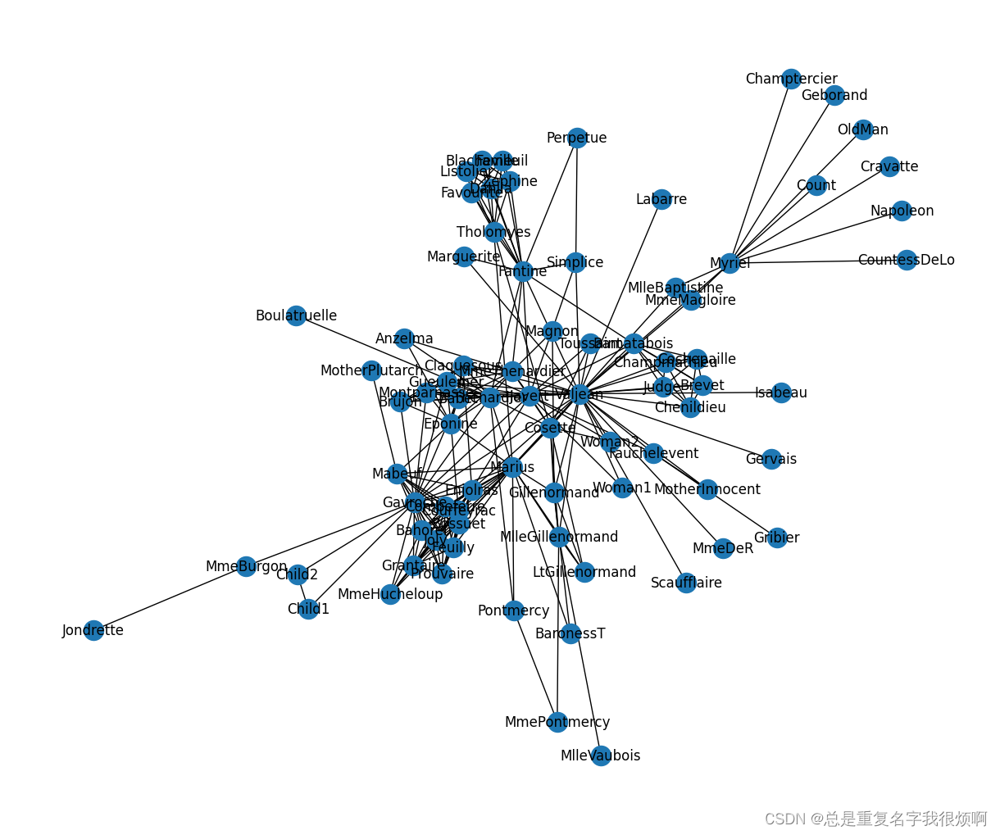
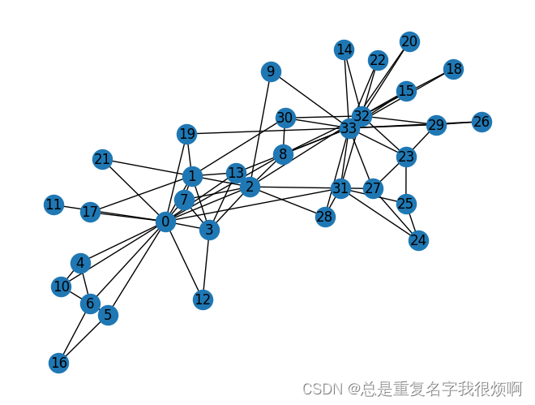

|图名称| 代码 |
|--|--|
| 全连接无向图 | `G = nx.complete_graph(7) ` |
| 全连接有向图 | `G = nx.complete_graph(7, nx.DiGraph()) ` |
| 环状图 | `G = nx.cycle_graph(5) ` |
| 梯状图 | `G = nx.ladder_graph(5)` |
| 线性串珠图 | `G = nx.path_graph(15) ` |
| 星状图 | `G = nx.star_graph(7)` |
| 轮辐图 | `G = nx.wheel_graph(7) ` |
| 二项树 | `G = nx.binomial_tree(5) ` |
| 二维矩形网络 | `G = nx.grid_2d_graph(3,5) ` |
| 多维矩形网络 | `G = nx.grid_graph(dim=(2,3,4))` |
| 二维三角形网络图 | `G = nx.triangular_lattice_graph(2,5)` |
| 二维六边形蜂窝图 | `G = nx.hexagonal_lattice_graph(2,3)` |
| n维超立方体 | `G = nx.hypercube_graph(4)` |
| 钻石图 | `G = nx.diamond_graph()` |
| frucht图 | `G = nx.frucht_graph()` |
| 房子图 | `G = nx.house_graph()` |
| 封顶房子图 | `G = nx.house_x_graph()` |
| 彼得森图 | `G = nx.petersen_graph()` |
| krackhardt图 | `G = nx.krackhardt_kite_graph()` |
| 随机图 | `G = nx.erdos_renyi_graph(10,0.5)` |
| ## 无标度有向图（20%的节点拥有80%的连接） | `G = nx.scale_free_graph(100)` |
| 社交网络图（拳击俱乐部） | `G = nx.karate_club_graph()` |
| 社交网络图（雨果悲惨世界） | `G = nx.les_miserables_graph()` |
| 家庭图 | `G = nx.florentine_families_graph()` |
| 社群聚类 | `G = nx.caveman_graph(4,3)` |
| 树图 | `tree = nx.random_tree(n=10, seed=0)` |

> 常见的代码demo

```python
# 树
tree = nx.random_tree(n=10, seed=0)
print(nx.forest_str(tree,sources=[0]))
```


```python
# 家庭图
G = nx.florentine_families_graph()
nx.draw(G, with_labels=True)
```



```python
# 雨果悲惨世界小说人物关系
G = nx.les_miserables_graph()
plt.figure(figsize=(12,10))
pos = nx.spring_layout(G, seed=10)
nx.draw(G, pos, with_labels=True)
```



```python
# 空手道俱乐部样例数据集
G = nx.karate_club_graph()
nx.draw(G, with_labels=True)
```

