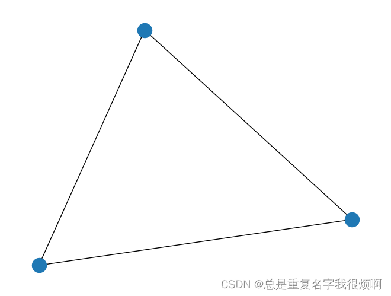
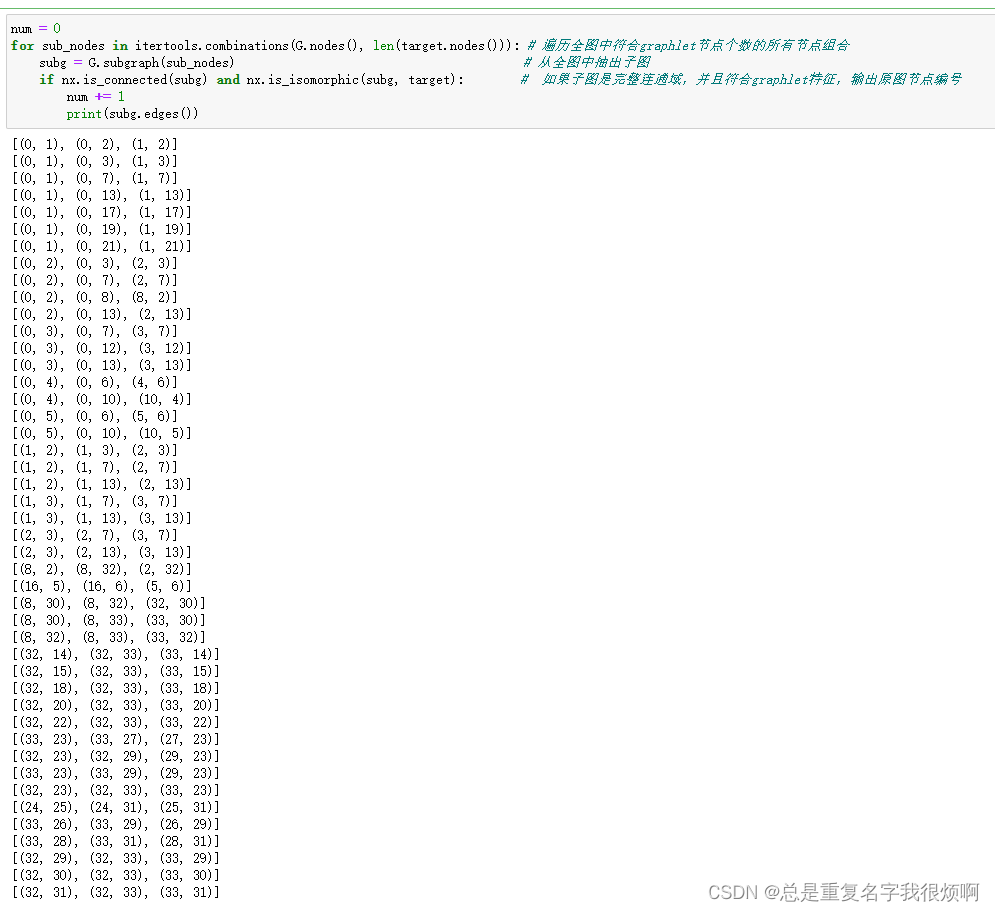

> 导入空手道俱乐部图

```python
G = nx.karate_club_graph()
plt.figure(figsize=(10,8))
pos = nx.spring_layout(G, seed=123)
nx.draw(G, pos, with_labels=True)
```

> 指定Graphlet

```python
target = nx.complete_graph(3)
nx.draw(target)
```


> 匹配Graphlet，统计个数。

```python
num = 0
for sub_nodes in itertools.combinations(G.nodes(), len(target.nodes())): # 遍历全图中符合graphlet节点个数的所有节点组合
    subg = G.subgraph(sub_nodes)                                         # 从全图中抽出子图 
    if nx.is_connected(subg) and nx.is_isomorphic(subg, target):        #  如果子图是完整连通域，并且符合graphlet特征，输出原图节点编号
        num += 1
        print(subg.edges())
```

