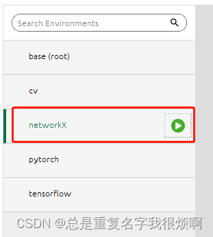

Anaconda环境安装jupyter notebook。以下所有操作都是在jupyter中进行。建议在anaconda中创建一个新的独立虚拟环境，取名networkX。


在jupyter notebook中输入以下代码，完成相关依赖的初步安装，后续有需求会单独说明。
```python
!pip install numpy pandas matplotlib tqdm networkx scipy -i https://pypi.tuna.tsinghua.edu.cn/simple
```

运行nx.__version__可以查看networkx的版本。这一步如果没有报错，则说明安装成功。

```python
import networkx as nx
import matplotlib.pyplot as plt
nx.__version__