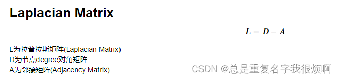
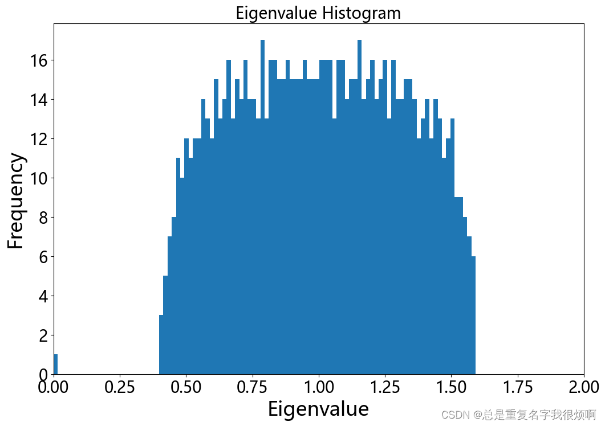

拉普拉斯矩阵常见的有两种，一种是普通拉普拉斯矩阵L，一种是归一化拉普拉斯矩阵Ln，具体计算公式如下：




> 创建图

```python
n, m = 1000, 5000 # 1000个节点，5000个连接
G = nx.gnm_random_graph(n, m, seed=5040)
```


> 计算邻接矩阵

```python
# 邻接矩阵
A = nx.adjacency_matrix(G)
A.shape
```
**注意这里的A是一个非常稀疏的矩阵，可以用`A.todense()`变成稠密矩阵。**

## 计算拉普拉斯矩阵L和节点degree对角矩阵D
```python
# Laplacian Matrix
L = nx.laplacian_matrix(G)

# 对角矩阵D
D = L + A
D.todense()
```

## 计算归一化拉普拉斯矩阵Ln和特征值分解
```python
L_n = nx.normalized_laplacian_matrix(G)
```


> 特征值分解

```python
e = np.linalg.eigvals(L_n.A)
max(e), min(e)
>>(1.5924617911776022, -2.3557437655170784e-16)
```

> 直方图可视化

```python
plt.figure(figsize=(12,8))
plt.hist(e, bins=100)
plt.xlim(0,2)

plt.title('Eigenvalue Histogram', fontsize=20)
plt.ylabel('Frequency', fontsize=25)
plt.xlabel('Eigenvalue', fontsize=25)
plt.tick_params(labelsize=20)
plt.show()
```
