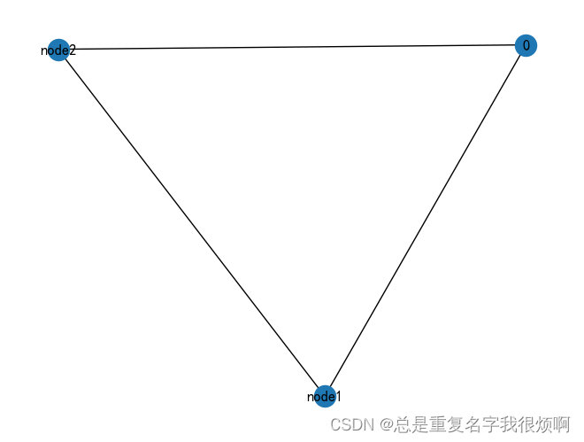

```python
# 无向图
G = nx.Graph()
G.is_directed()
>> Flase

H = nx.DiGraph()
H.is_directed()
>> True
```
首先创建节点

```python
# 创建单个节点
G.add_node(0, features=5, label=0, tezheng2=2)
# 创建2个节点
G.add_nodes_from([
    ('node1',{'feature1':1, 'feature2':2, 'feature3':3}),
    ('node2',{'feature1':4, 'feature2':5, 'feature3':6}),
])
G.number_of_nodes()
>>3
```

```python
for node in G.nodes(data=True):
    print(node)
>>(0, {'features': 5, 'label': 0, 'tezheng2': 2})
('node1', {'feature1': 1, 'feature2': 2, 'feature3': 3})
('node2', {'feature1': 4, 'feature2': 5, 'feature3': 6})
```

## 创建单个连接

```python
# 0节点和node1节点之间创建连接
G.add_edge(0, 'node1', weight=0.5, like=3)
```

## 创建多个连接

```python
G.add_edges_from([
    ('node1','node2',{'weight':0.3, 'like':5}),
    ('node2',0,{'weight':0.1, 'like':8})
])
```

```python
# 可视化
nx.draw(G, with_labels=True)
```



## 节点连接数(Node degree)

```python
node_id = 'node1'
G.degree[node_id]
>>2

for neighbor in G.neighbors(node_id):
    print('Node {} has neighbor {}'.format(node_id, neighbor))
>>Node node1 has neighbor 0
Node node1 has neighbor node2
```
