首先定义一个画图的辅助函数，方便后续绘制。
```python
# 定义可视化辅助函数
def draw(G, pos, measures, measure_name):
    nodes = nx.draw_networkx_nodes(G, pos, node_size=250, cmap=plt.cm.plasma,
                                   node_color = list(measures.values()),
                                   nodelist=measures.keys())
    nodes.set_norm(mcolors.SymLogNorm(linthresh=0.01, linscale=1, base=10))
    # labels = nx.draw_networkx_labels(G, pos)
    edges = nx.draw_networkx_edges(G, pos)
    
    # plt.figure(figsize=(10,8))
    plt.title(measure_name)
    plt.colorbar(nodes)
    plt.axis('off')
    plt.show()
```
导入无向图和有向图

```python
# 导入无向图
G = nx.karate_club_graph()
pos = nx.spring_layout(G, seed=675)

# 导入有向图
DiG = nx.DiGraph()
DiG.add_edges_from([(2, 3), (3, 2), (4, 1), (4, 2), (5, 2), (5, 4), 
                    (5, 6), (6, 2), (6, 5), (7, 2), (7, 5), (8, 2), 
                    (8, 5), (9, 2), (9, 5), (10, 5), (11, 5)])
```

> 无向图如下:

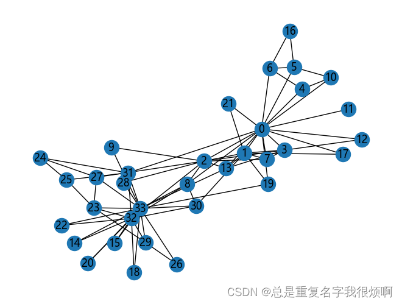

> 有向图如下：

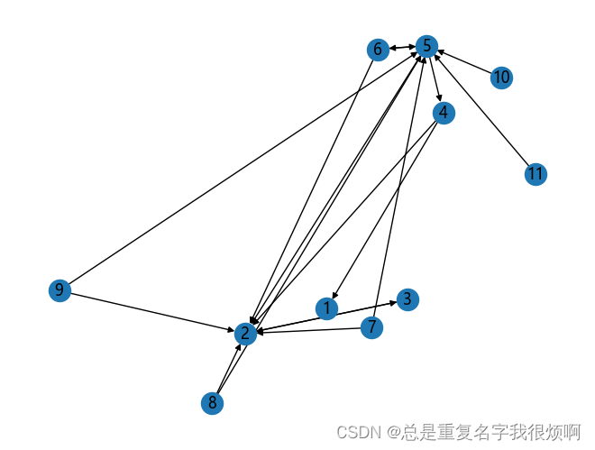

## Node Degree
通过连接度可视化，颜色黄说明这个和这个点先连接的点越多。
```python
# 无向图
draw(G, pos, dict(G.degree()), 'Node Degree')
```
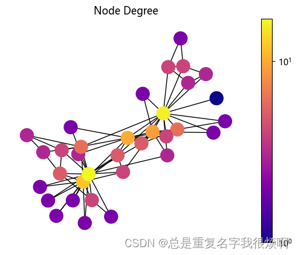

## Degree Centrality
实际上这个绘制和Degree是差不多的。因为只关注了连接度这一个指标。
```python
# 无向图
draw(G, pos, nx.degree_centrality(G), 'Degree Centrality')

# 有向图，分in和out两个方向
draw(DiG, pos, nx.in_degree_centrality(DiG), 'in Degree Centrality')
draw(DiG, pos, nx.out_degree_centrality(DiG), 'out Degree Centrality')
```
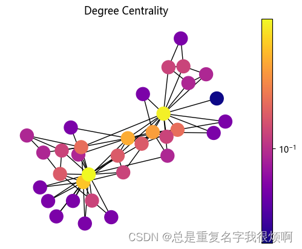
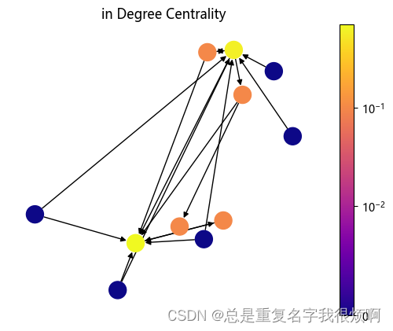
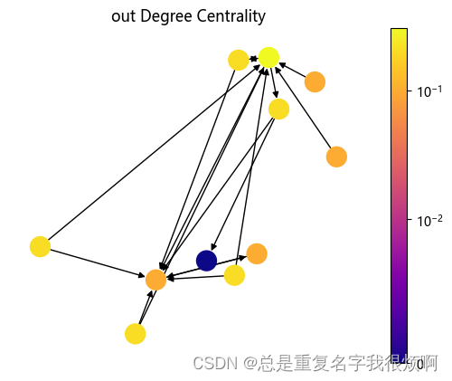

## Node Degree分析
绘制一个随机无向图：

```python
G = nx.gnp_random_graph(100, 0.02, seed=10374196)
pos = nx.spring_layout(G, seed = 10)
nx.draw(G ,pos)
```

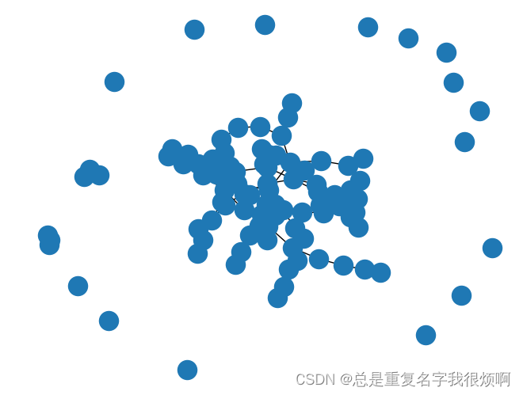

### 最大连通域子图
我们会发现这样一幅图内，有的点是连接的，有的点是分散的，因此我们可以找出最大连接子图：

```python
Gcc = G.subgraph(sorted(nx.connected_components(G), key = len, reverse = True)[0])
pos = nx.spring_layout(Gcc, seed = 10396953)
nx.draw_networkx_nodes(Gcc, pos, node_size=20)
nx.draw_networkx_edges(Gcc, pos, alpha=0.4)
```

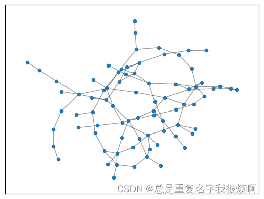

当然这样的图不够美观，可以进一步优化：

```python
plt.figure(figsize=(12,8))
pos = nx.spring_layout(Gcc, seed = 10396953)

options = {
    'font_size':12,
    'node_size':350,
    'node_color':'white',
    'edgecolors':'black',
    'linewidths':1,
    'width':2
}

nx.draw_networkx(Gcc, pos, **options)

plt.title('Connected components of G', fontsize=20)
plt.axis('off')
plt.show()
```

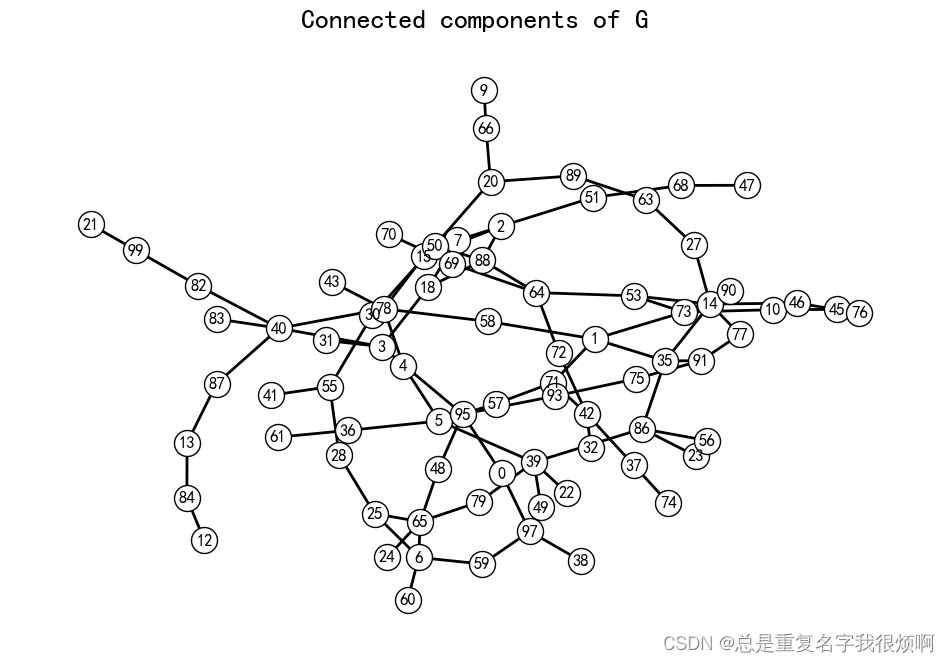

### 每个节点的连接数(degree)
用G.degree()可以查看节点连接的情况：

```python
G.degree()
```

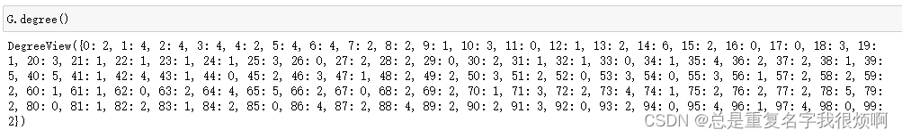

由于这个G.degree输出的结果比较混乱，因此我们需要统计后完成可视化工作。

```python
# 梯子图
plt.plot(degree_sequence, 'b--', marker='o')
plt.title('Degree Rank Plot', fontsize=20)
plt.ylabel('Degree', fontsize=25)
plt.xlabel('Rank', fontsize=25)
plt.tick_params(labelsize=20) # 坐标轴文字大小
plt.show()
```

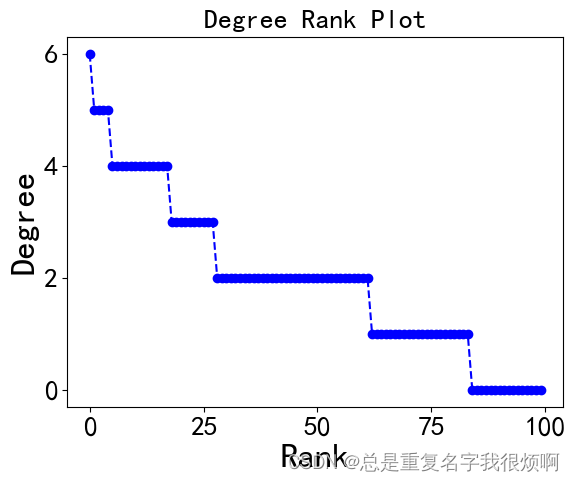

```python
# 直方图
X = np.unique(degree_sequence, return_counts=True)[0]
Y = np.unique(degree_sequence, return_counts=True)[1]

plt.bar(X, Y)

plt.title('Degree Histogram', fontsize=20)
plt.ylabel('Number', fontsize=25)
plt.xlabel('Degree', fontsize=25)
plt.tick_params(labelsize=20) # 坐标轴文字大小
plt.show()
```

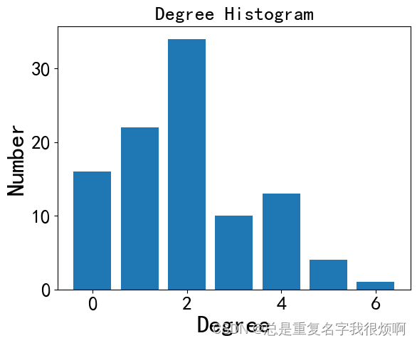

## Eigenvector Centrality 
这是一个很常规的思想：如果一个节点和他相邻的节点都很重要，那这个节点也很重要。
```python
# 无向图
draw(G, pos, nx.eigenvector_centrality(G), 'Eigenvector Centrality')

# 有向图
draw(DiG, pos, nx.eigenvector_centrality_numpy(DiG), 'Eigenvector Centrality')
```

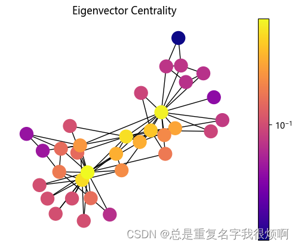
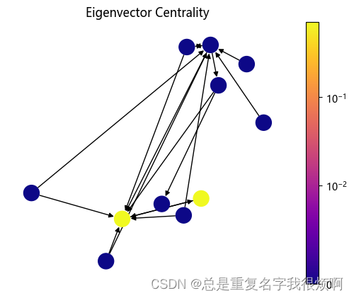

## Betweenness Centrality
间重要度表示这个点是不是处于交通要道，一夫当关万夫莫开的位置。
```python
# 无向图
draw(G, pos, nx.betweenness_centrality(G), 'Betweenness Centrality')

# 有向图
draw(DiG, pos, nx.betweenness_centrality(DiG), 'Betweenness Centrality')
```
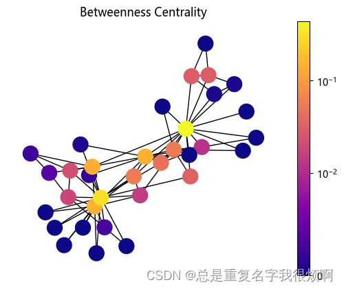
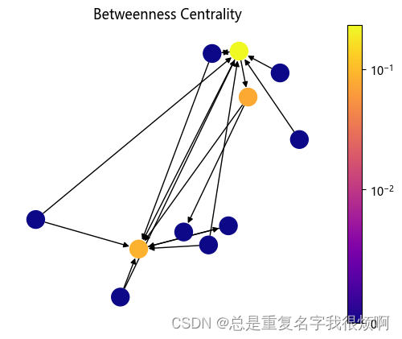

## Closeness Centrality
如果一个点到哪都近，那他的最近距离重要度就越高。

```python
draw(G, pos, nx.closeness_centrality(G), 'Closeness Centrality')
```
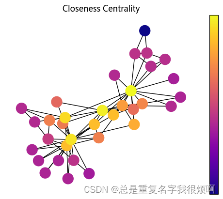

## PageRank
PageRank在传统图机器学习里有举足轻重的影响，因此后续会对PageRank的论文做精读，理解他的核心思想和贡献（敬请期待）。

```python
draw(DiG, pos, nx.pagerank(DiG, alpha=0.85), 'PageRank')
```
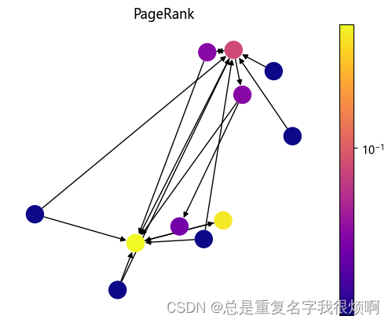

此外，绘制一个简单的无向图
```python
G = nx.star_graph(7)
nx.draw(G, with_labels = False)
```
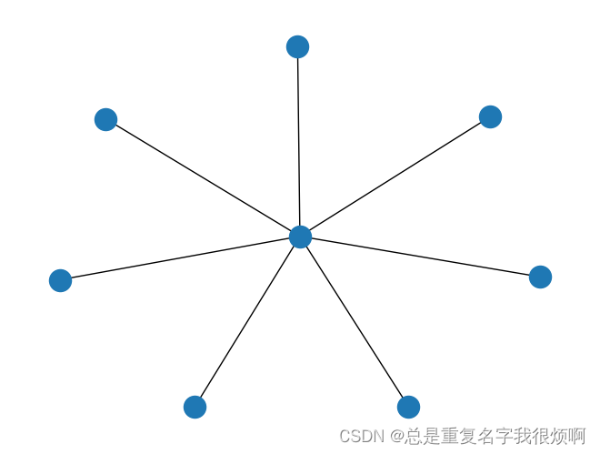

计算PageRank重要度：

```python
pagerank = nx.pagerank(G, alpha=0.8)
```
注意，PageRank只能计算有向图，所以对无向图使用这样的工具后，会自动转化为有向图。

```python
pagerank
>>{0: 0.4583348922684132,
 1: 0.07738072967594098,
 2: 0.07738072967594098,
 3: 0.07738072967594098,
 4: 0.07738072967594098,
 5: 0.07738072967594098,
 6: 0.07738072967594098,
 7: 0.07738072967594098}
```

## Katz Centralily
假如两个节点没有共同好友，那么这个时候共同好友个数、交并比都是0，但实际上这两个节点可能存在一定的联系。因此在这种情况，需要看全图信息。往往用卡姿系数(Katz index)来表示，他表示节点u和节点v之间长度为k的路径个数。
```python
# 无向图
draw(G, pos, nx.katz_centrality(G, alpha=0.1, beta=1.0), 'Katz Centrality')

# 有向图
draw(DiG, pos, nx.katz_centrality(DiG, alpha=0.1, beta=1.0), 'Katz Centrality')
```
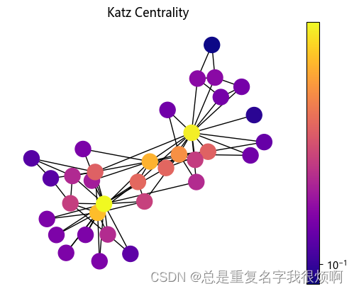
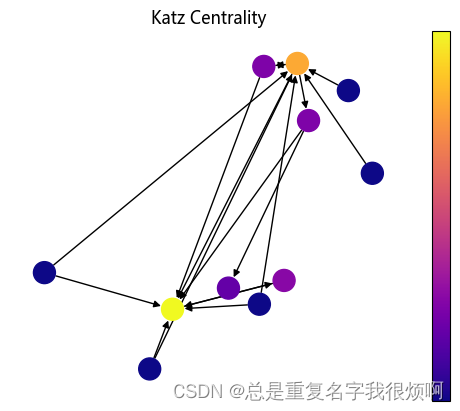

可以用邻接矩阵的幂来计算katz index。

```python
# 计算主特征向量
L = nx.normalized_laplacian_matrix(G)
e = np.linalg.eigvals(L.A)
print('最大特征值',max(e))

# 折减系数
beta = 1/max(e)

# 创建单位矩阵
I = np.identity(len(G.nodes))

# 计算Katz Index
S = inv(I - nx.to_numpy_array(G)*beta) - I
```
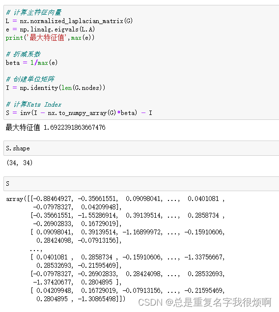

## HITS Hubs and Authorities

```python
h, a = nx.hits(DiG)
draw(DiG, pos, h, 'DiGraph HITS Hubs')
draw(DiG, pos, a, 'DiGraph HITS Authorities')
```

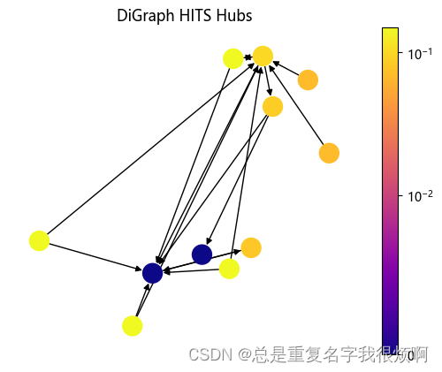
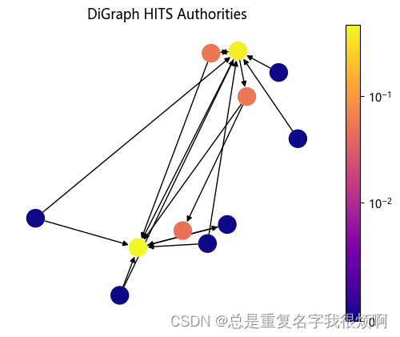

## Clustering Coefficient
越抱团取暖的点，他的聚集系数就越大。
```python
draw(G, pos, nx.clustering(G), 'Clustering Coefficient')
```
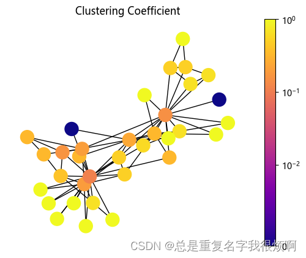

## Briges
如果某个连接断掉，会使连通域个数增加，则该连接是brige，brige连接不属于环的一部分。例如上图右侧蓝色的，如果断开连接，那么整张图的连通域变成2个，所以他的连接属于brige。
用代码工具可以直接检测brige节点。
```python
list(nx.bridges(G))
```

## Common Neighbors & Jaccard Coefficient & Adamic Adar Index
领域关系的相关代码实现如下：
```python
# Common Neighbors
sorted(nx.common_neighbors(G, 0, 4))

#  Jaccard Coefficient
preds = nx.jaccard_coefficient(G, [(0,1), (2,3)])
for u, v, p in preds:
    print(f'{u} , {v} -> {p:.8f}')

#  Adamic Adar Index
preds = nx.adamic_adar_index(G, [(0,1), (2,3)])
for u, v, p in preds:
    print(f'{u} , {v} -> {p:.8f}')
```
