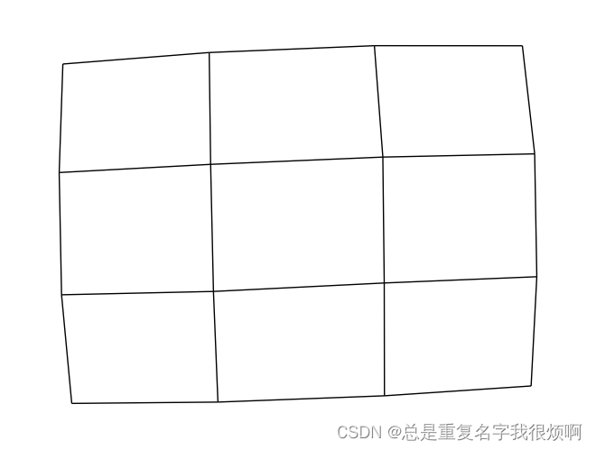
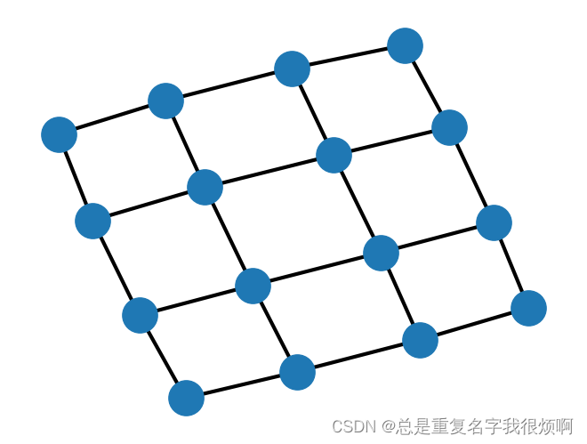
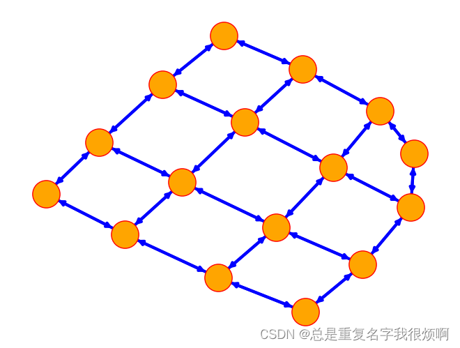
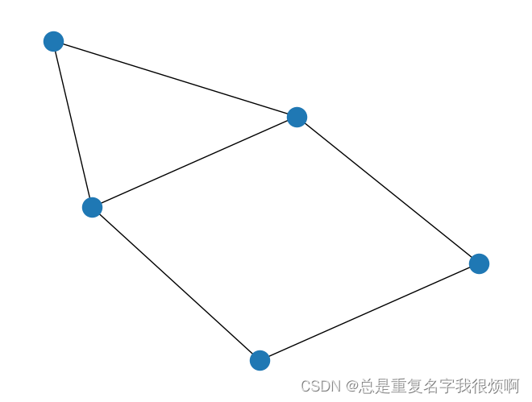
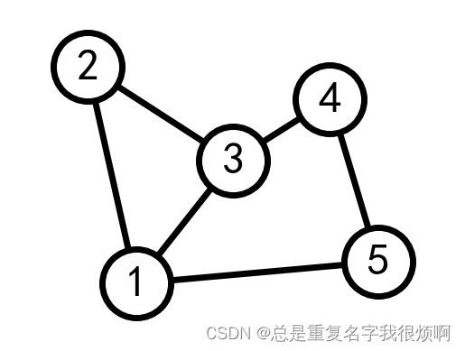
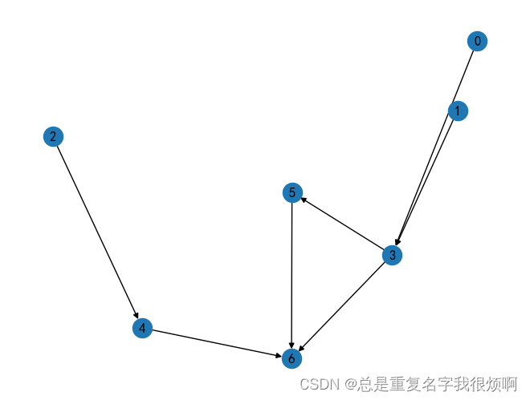
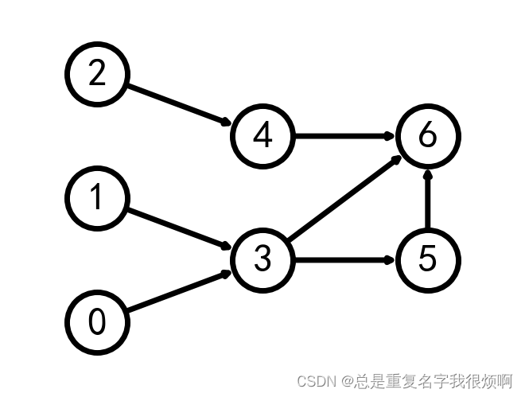
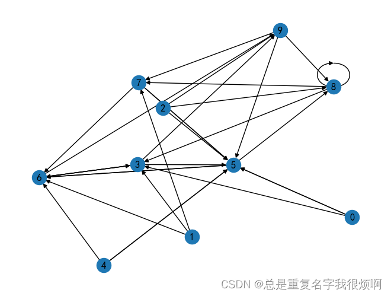
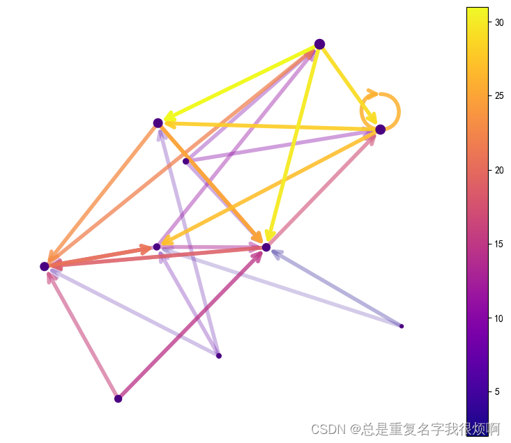

```python
# 创建4x4网络图
G = nx.grid_2d_graph(4,4)
```
## 原生可视化

```python
pos = nx.spring_layout(G, seed=123)
nx.draw(G, pos=pos)
```


```python
# 不显示节点 node_size=0
nx.draw(G, pos=pos, node_size=0)
```



## 高级设置

```python
# 无向图
nx.draw(
    G,
    node_color = 'orange', # 节点颜色
    edgecolors='red',      # 节点外边缘颜色
    edge_color = 'blue',    # edge颜色
    # edge_cmap=plt.cm.plasma, # 配色方案
    node_size = 800,
    with_labels = False,
    width =3,)
```



```python
# 有向图
nx.draw(
    G.to_directed(),
    node_color = 'orange', # 节点颜色
    edgecolors='red',      # 节点外边缘颜色
    edge_color = 'blue',    # edge颜色
    # edge_cmap=plt.cm.coolwarm, # 配色方案
    node_size = 800,
    with_labels = False,
    width =3,
)
```



## 设置每个节点的坐标（例如地铁坐标是有自己的分布位置的，想保留这种空间信息）

```python
# 无向图
G = nx.Graph()
G.add_edge(1,2)
G.add_edge(1,3)
G.add_edge(1,5)
G.add_edge(2,3)
G.add_edge(3,4)
G.add_edge(4,5)
nx.draw(G)
```



```python
pos = {1:(0,0), 2:(-1,0.3), 3:(2,0.17), 4:(4,0.255), 5:(5, 0.03)}

options = {
    'font_size':36,
    'node_size':3000,
    'node_color':'white',
    'edgecolors':'black',
    'linewidths':5,
    'width':5
}

nx.draw_networkx(G, pos=pos, **options)

ax = plt.gca()
ax.margins(0.20)
plt.axis('off')
plt.show()
```



```python
# 有向图
G = nx.DiGraph([(0,3), (1,3), (2,4), (3,5), (3,6), (4,6), (5,6)])
nx.draw(G, with_labels=True)
```



```python
# 可视化每一列包含的节点
left_nodes = [0, 1, 2]
middle_nodes = [3, 4]
right_nodes = [5, 6]

# 可视化每个节点坐标
pos = {n:(0, i) for i, n in enumerate(left_nodes)}
pos.update({n: (1, i+0.5) for i, n in enumerate(middle_nodes)})
pos.update({n: (2, i+0.5) for i, n in enumerate(right_nodes)})

nx.draw(G, pos=pos, with_labels=True, **options)

ax = plt.gca()
ax.margins(0.20)
plt.axis('off')
plt.show()
```



## 有向图代码美化模板（论文绘图专用）

```python
seed = 13648
G = nx.random_k_out_graph(10, 3, 0.5, seed=seed)
pos = nx.spring_layout(G, seed = seed)
nx.draw(G, pos, with_labels = True)
```
> 原图



> 美化过程

```python
node_sizes = [12 + 10 * i for i in range(len(G))]

M = G.number_of_edges()
edge_colors = range(2, M+2)

edge_alphas = [(5 + i) / (M + 4) for i in range(M)]

cmap = plt.cm.plasma

plt.figure(figsize=(10,8))

nodes = nx.draw_networkx_nodes(G, pos, node_size=node_sizes, node_color='indigo')

edges = nx.draw_networkx_edges(
    G,
    pos,
    node_size=node_sizes,
    arrowstyle='->',
    arrowsize =20,
    edge_color=edge_colors,
    edge_cmap = cmap,
    width = 4
)

for i in range(M):
    edges[i].set_alpha(edge_alphas[i])

pc = mpl.collections.PathCollection(edges, cmap=cmap)
pc.set_array(edge_colors)
plt.colorbar(pc)

ax = plt.gca()
ax.set_axis_off()
plt.show()
```

> 美化结果：


